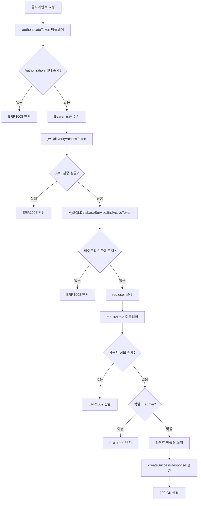

# Admin only resource

## 개요

이 API는 관리자 권한을 가진 사용자만 접근할 수 있는 보호된 리소스입니다. JWT 토큰 기반의 인증과 역할(role) 기반의 권한 검증을 통해 관리자만이 해당 리소스에 접근할 수 있도록 제한합니다. 현재는 예시 목적으로 구현되었으며, 관리자 페이지 접근 권한을 확인하고 기본적인 관리자 정보를 반환합니다.

## Request

### Endpoint

| Method | Path |
|--------|------|
| GET | /protected-example/admin |

### Path Parameters

| 파라미터 | 타입 | 필수 여부 | 설명 |
|----------|------|-----------|------|
| 없음 | - | - | - |

### Query Parameters

| 파라미터 | 타입 | 필수 여부 | 설명 |
|----------|------|-----------|------|
| 없음 | - | - | - |

### Request Headers

| 헤더 | 필수 여부 | 설명 |
|------|-----------|------|
| Authorization | 필수 | JWT 액세스 토큰을 포함하는 Bearer 토큰 헤더 (형식: "Bearer {token}") |
| Content-Type | 선택 | application/json (요청 본문이 없으므로 실제로는 불필요) |

### Request Body

| 파라미터 | 타입 | 필수 여부 | 설명 |
|----------|------|-----------|------|
| 없음 | - | - | 요청 본문이 필요하지 않음 |

### 인증 방식

이 API는 JWT(JSON Web Token) 기반의 Bearer 토큰 인증과 역할 기반 접근 제어(RBAC)를 사용합니다.

**인증 과정:**
1. **토큰 추출**: Authorization 헤더에서 "Bearer " 접두사를 제거하고 JWT 토큰을 추출
2. **JWT 검증**: JWT 서명, 만료 시간, 발급자(issuer), 대상(audience) 검증
3. **화이트리스트 검증**: 토큰이 데이터베이스의 활성 토큰 목록(whitelist)에 존재하는지 확인
4. **역할 검증**: 사용자의 역할이 'admin' 배열에 포함되어 있는지 확인

**토큰 요구사항:**
- 유효한 JWT 액세스 토큰
- 토큰이 만료되지 않아야 함
- 토큰이 데이터베이스 화이트리스트에 존재해야 함
- 사용자 역할이 'admin'이어야 함 (현재 구현에서는 req.user.role 필드 확인)

## Response

### Response Status

| HTTP Status | 설명 |
|-------------|------|
| 200 | 관리자 권한 확인 성공 및 리소스 접근 허용 |
| 401 | 인증 실패 (토큰 없음, 유효하지 않음, 만료됨) |
| 403 | 권한 없음 (관리자 역할이 없음) |
| 500 | 서버 내부 오류 |

### Response Headers

| 헤더 | 필수 여부 | 설명 |
|------|-----------|------|
| Content-Type | 필수 | application/json; charset=utf-8 |
| X-Powered-By | 선택 | Express 프레임워크 식별 헤더 |

### Response Body

**성공 응답 (200 OK):**
| 필드 | 타입 | 설명 |
|------|------|------|
| success | boolean | 요청 성공 여부 (항상 true) |
| message | string | 응답 메시지 ("관리자 권한이 확인되었습니다.") |
| data | object | 응답 데이터 객체 |
| data.message | string | 관리자 페이지 접근 메시지 ("관리자 페이지입니다.") |
| data.user | object | 인증된 사용자 정보 |
| data.user.userId | number | 사용자 ID |
| data.user.email | string | 사용자 이메일 |
| data.user.name | string | 사용자 이름 |

**오류 응답:**
| 필드 | 타입 | 설명 |
|------|------|------|
| success | boolean | 요청 성공 여부 (항상 false) |
| errorCode | string | 오류 코드 (ERR1008, ERR1009 등) |
| message | string | 오류 메시지 |
| statusCode | number | HTTP 상태 코드 |

### Error Code

| 코드 | 설명 |
|------|------|
| ERR1008 | 토큰 관련 오류 (토큰 없음, 유효하지 않음, 만료됨) |
| ERR1009 | 권한 없음 (관리자 역할이 없거나 접근 권한 부족) |
| ERR0000 | 일반 서버 오류 |
| ERR0001 | 알 수 없는 오류 |

### Hooks(Callbacks)

현재 이 API에서는 외부 시스템으로의 Hook 이벤트나 Callback을 발생시키지 않습니다. 모든 처리는 내부적으로 완료됩니다.

## Flow

### Flow Chart

### Sequence Diagram

### Class Diagram

## 추가 정보

### 보안 고려사항

1. **토큰 화이트리스트**: JWT 토큰의 서명 검증뿐만 아니라 데이터베이스의 활성 토큰 목록과 대조하여 추가 보안을 제공합니다.

2. **역할 기반 접근 제어**: 현재 구현에서는 `req.user.role` 필드를 확인하지만, 실제 운영 환경에서는 데이터베이스에서 사용자 역할을 조회하는 것이 권장됩니다.

3. **토큰 만료**: 액세스 토큰은 1시간 후 만료되므로 정기적인 토큰 갱신이 필요합니다.

### 현재 구현의 제한사항

1. **하드코딩된 역할 확인**: 사용자 역할이 토큰 페이로드에서만 확인되며, 실시간 데이터베이스 조회가 이루어지지 않습니다.

2. **예시 구현**: 현재는 데모 목적의 구현으로, 실제 관리자 기능은 포함되어 있지 않습니다.

### 확장 가능성

1. **실제 관리자 기능**: 사용자 관리, 시스템 설정, 로그 조회 등의 실제 관리자 기능으로 확장 가능합니다.

2. **세분화된 권한**: 'admin' 외에도 'moderator', 'editor' 등의 세분화된 역할과 권한 시스템으로 확장할 수 있습니다.

3. **감사 로그**: 관리자 액세스에 대한 로깅 및 감사 추적 기능을 추가할 수 있습니다.