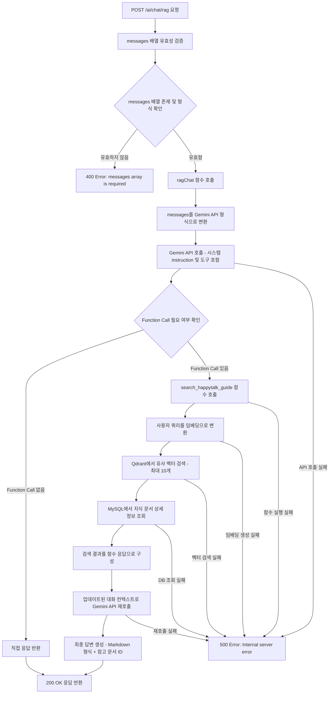
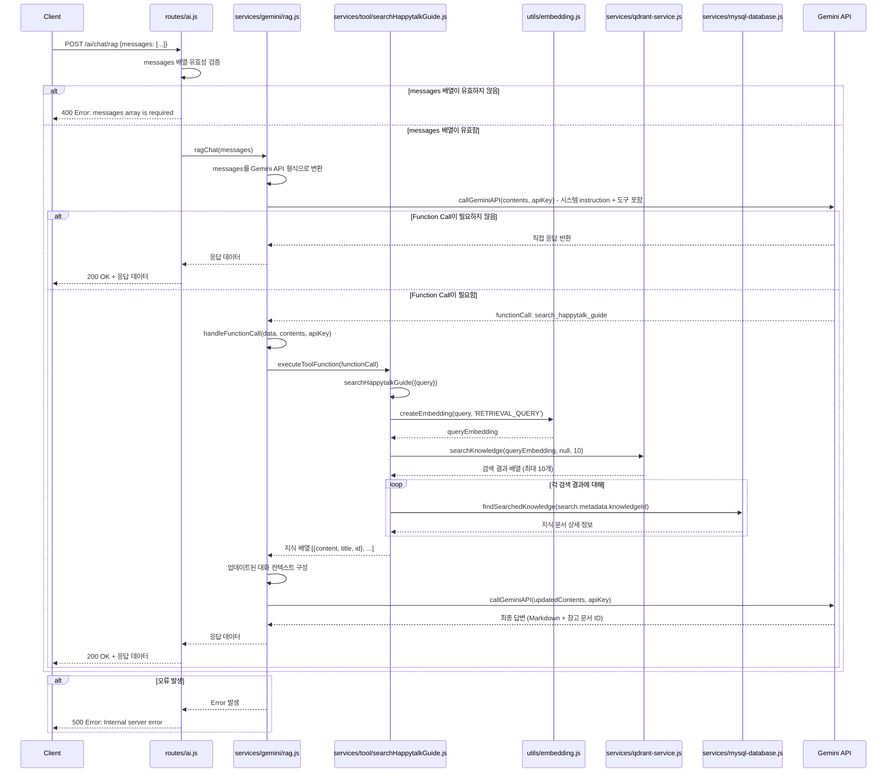
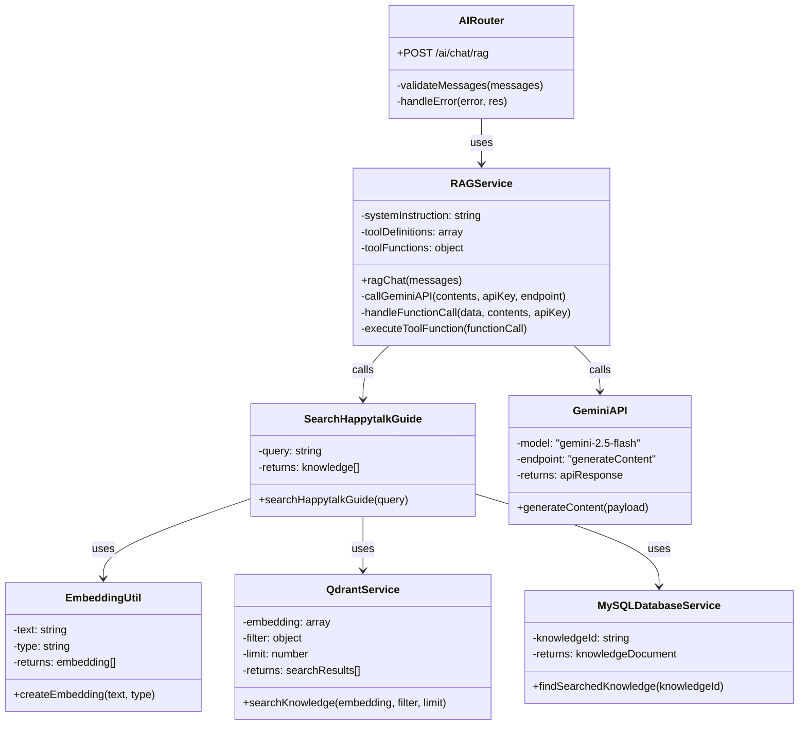

# Chat with RAG

## 개요
이 API는 RAG(Retrieval-Augmented Generation) 기반의 AI 채팅 서비스를 제공합니다. 사용자의 질문에 대해 Happytalk 솔루션 관련 지식 베이스를 검색하여 관련 문서를 찾고, 이를 바탕으로 Google Gemini AI가 정확하고 상세한 답변을 생성합니다. 특히 Happytalk 솔루션 사용법과 가이드에 특화되어 있으며, 최대 10개의 관련 문서를 참조하여 답변을 제공합니다.

## Request

### Endpoint
| Method | Path |
|--------|------|
| POST | /ai/chat/rag |

### Path Parameters
| 파라미터 | 타입 | 필수 여부 | 설명 |
|----------|------|-----------|------|
| 없음 | - | - | - |

### Query Parameters
| 파라미터 | 타입 | 필수 여부 | 설명 |
|----------|------|-----------|------|
| 없음 | - | - | - |

### Request Headers
| 헤더 | 필수 여부 | 설명 |
|------|-----------|------|
| Content-Type | 필수 | application/json |

### Request Body
| 파라미터 | 타입 | 필수 여부 | 설명 |
|----------|------|-----------|------|
| messages | Array | 필수 | 대화 메시지 배열. 각 메시지는 role(string)과 text(string) 속성을 포함해야 함 |
| messages[].role | String | 필수 | 메시지 역할. "user" 또는 "assistant" 값 가능 |
| messages[].text | String | 필수 | 메시지 내용 텍스트 |

### 인증 방식
이 API는 별도의 인증이 필요하지 않습니다. 공개 API로 제공되며, 누구나 Happytalk 솔루션 관련 정보를 조회할 수 있습니다.

## Response

### Response Status
| HTTP Status | 설명 |
|-------------|------|
| 200 | 성공적으로 RAG 기반 답변 생성 |
| 400 | 잘못된 요청 (messages 배열 누락 또는 잘못된 형식) |
| 500 | 서버 내부 오류 (Gemini API 호출 실패, 임베딩 생성 실패, 지식 검색 실패 등) |

### Response Headers
| 헤더 | 필수 여부 | 설명 |
|------|-----------|------|
| Content-Type | 필수 | application/json |

### Response Body
| 필드 | 타입 | 설명 |
|------|------|------|
| candidates | Array | Gemini AI 응답 후보 배열 |
| candidates[].content | Object | 응답 콘텐츠 객체 |
| candidates[].content.parts | Array | 응답 파트 배열 |
| candidates[].content.parts[].text | String | AI가 생성한 답변 텍스트 (Markdown 형식, 참고 문서 ID 포함) |
| candidates[].content.role | String | 응답 역할 ("model") |
| candidates[].finishReason | String | 응답 완료 이유 |
| candidates[].index | Number | 후보 인덱스 |
| candidates[].safetyRatings | Array | 안전성 평가 정보 |

### Error Code
| 코드 | 설명 |
|------|------|
| 400 | messages array is required - messages 배열이 필요함 |
| 500 | Internal server error - 서버 내부 오류 |
| 500 | API request failed with status XXX - Gemini API 요청 실패 |
| 500 | Error executing search_happytalk_guide - 지식 검색 함수 실행 오류 |
| 500 | Function search_happytalk_guide not found - 검색 함수를 찾을 수 없음 |

### Hooks(Callbacks)
이 API는 외부 시스템으로의 Hook 이벤트를 발생시키지 않습니다.

## Flow

### Flow Chart

### Sequence Diagram

### Class Diagram

## 추가 정보

### 시스템 Instruction
RAG 서비스는 다음과 같은 시스템 지시사항을 사용합니다:
- Happytalk 솔루션의 정보 제공을 위한 어시스턴트 역할
- 주어진 정보와 도구들을 적절히 사용하여 성심성의껏 답변 제공
- 참고한 문서의 ID 값을 응답에 포함
- 최대 10개의 문서 참조 가능
- Markdown 형식으로 답변 제공
- 답변 최하단에 참고 문서 표시

### 지원 도구
`search_happytalk_guide`: Happytalk 솔루션 사용 방법과 가이드 검색
- 파라미터: query (string) - 검색할 내용
- 반환: 관련 문서 배열 (최대 10개)
- 각 문서는 content, title, id 포함

### 벡터 검색 특징
- 임베딩 모델: Gemini Embedding
- 검색 타입: RETRIEVAL_QUERY
- 최대 검색 결과: 10개
- Qdrant 벡터 데이터베이스 사용
- 의미적 유사도 기반 검색

### 대화 컨텍스트 관리
- 사용자의 이전 대화 맥락을 고려한 검색 쿼리 생성
- Function Call 결과를 대화 히스토리에 포함
- 다중 턴 대화 지원

### 오류 처리
- Gemini API 호출 실패 시 상세 오류 메시지 제공
- 벡터 검색 실패 시 graceful degradation
- 지식 문서 조회 실패 시 빈 결과 처리
- 모든 오류는 콘솔에 로깅됨

### 성능 고려사항
- 임베딩 생성 시간: 평균 100-300ms
- 벡터 검색 시간: 평균 50-100ms
- Gemini API 호출 시간: 평균 1-3초
- 전체 응답 시간: 평균 2-5초