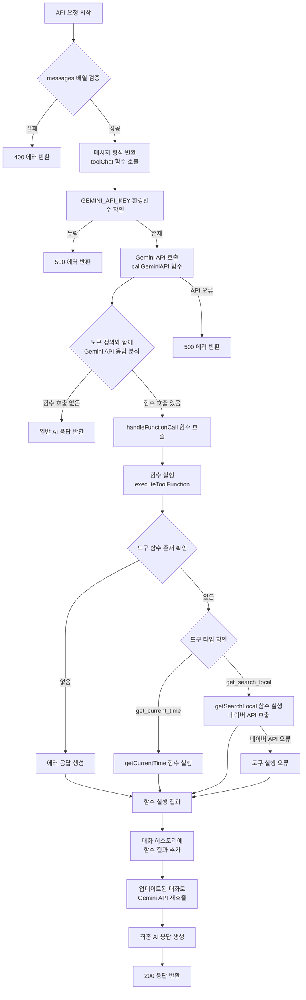
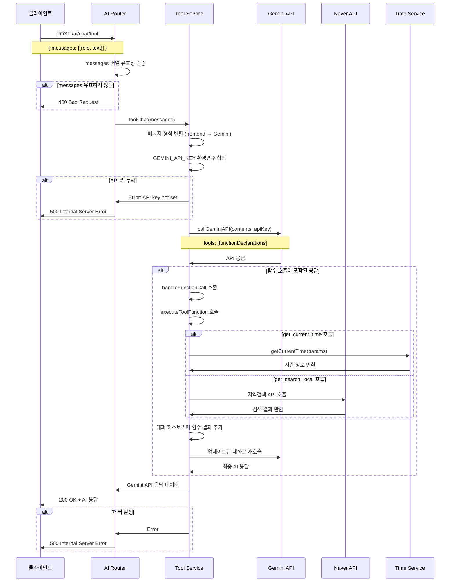
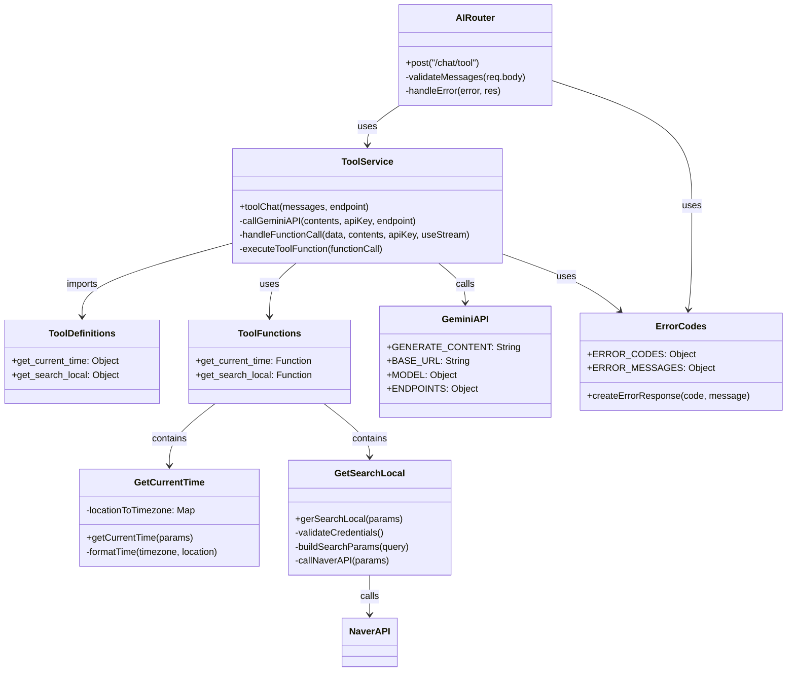

# Chat with function calling

## 개요

Google Gemini AI 모델을 활용한 대화형 AI 채팅 서비스로, 함수 호출(Function Calling) 기능을 지원합니다. 사용자의 메시지에 따라 AI가 특정 도구나 함수를 호출하여 실시간 정보를 제공할 수 있으며, 현재 시간 조회, 네이버 지역 검색 등의 기능을 제공합니다. 이 API는 단일 요청으로 다중 턴 대화를 처리하며, AI가 필요에 따라 도구를 호출한 후 그 결과를 바탕으로 최종 응답을 생성합니다.

## Request

### Endpoint

| Method | Path |
|--------|------|
| POST | /ai/chat/tool |

### Path Parameters

해당 API는 Path Parameter를 사용하지 않습니다.

| 파라미터 | 타입 | 필수 여부 | 설명 |
|----------|------|-----------|------|
| - | - | - | Path Parameter 없음 |

### Query Parameters

해당 API는 Query Parameter를 사용하지 않습니다.

| 파라미터 | 타입 | 필수 여부 | 설명 |
|----------|------|-----------|------|
| - | - | - | Query Parameter 없음 |

### Request Headers

| 헤더 | 필수 여부 | 설명 |
|------|-----------|------|
| Content-Type | 필수 | application/json |
| Authorization | 선택 | Bearer {access_token} (인증 미들웨어가 적용되지 않아 선택적) |

### Request Body

| 파라미터 | 타입 | 필수 여부 | 설명 |
|----------|------|-----------|------|
| messages | Array | 필수 | 대화 메시지 배열 |
| messages[].role | String | 필수 | 메시지 역할 ('user' 또는 'assistant') |
| messages[].text | String | 필수 | 메시지 내용 |

### 인증 방식

현재 이 API는 인증 미들웨어가 적용되지 않아 인증 없이도 호출 가능합니다. 하지만 Authorization 헤더를 포함하여 요청할 경우 JWT Bearer 토큰을 사용할 수 있습니다. JWT 토큰은 화이트리스트 방식으로 관리되며, 토큰의 유효성과 만료 시간을 검증합니다.

## Response

### Response Status

| HTTP Status | 설명 |
|-------------|------|
| 200 | 요청 성공 |
| 400 | 잘못된 요청 (messages 배열 누락 또는 형식 오류) |
| 500 | 서버 내부 오류 (Gemini API 호출 실패, 도구 실행 오류 등) |

### Response Headers

| 헤더 | 필수 여부 | 설명 |
|------|-----------|------|
| Content-Type | 필수 | application/json |
| Access-Control-Allow-Origin | 필수 | * (CORS 설정) |
| Access-Control-Allow-Methods | 필수 | GET, POST, PUT, DELETE, OPTIONS |
| Access-Control-Allow-Headers | 필수 | Origin, X-Requested-With, Content-Type, Accept, Authorization |

### Response Body

정상 응답 시 Gemini API의 응답 구조를 그대로 반환합니다.

| 필드 | 타입 | 설명 |
|------|------|------|
| candidates | Array | AI 응답 후보 배열 |
| candidates[].content | Object | 응답 내용 객체 |
| candidates[].content.role | String | 응답 역할 ('model') |
| candidates[].content.parts | Array | 응답 부분 배열 |
| candidates[].content.parts[].text | String | AI가 생성한 텍스트 응답 |
| candidates[].finishReason | String | 응답 완료 이유 |
| candidates[].safetyRatings | Array | 안전성 평가 배열 |
| usageMetadata | Object | 사용량 메타데이터 |
| usageMetadata.promptTokenCount | Number | 프롬프트 토큰 수 |
| usageMetadata.candidatesTokenCount | Number | 응답 토큰 수 |
| usageMetadata.totalTokenCount | Number | 총 토큰 수 |

오류 응답 시:

| 필드 | 타입 | 설명 |
|------|------|------|
| error | String | 오류 메시지 |

### Error code

| 코드 | 설명 |
|------|------|
| 400 | messages array is required - messages 파라미터가 누락되었거나 배열이 아님 |
| 500 | Internal server error - Gemini API 호출 실패, 환경변수 누락, 도구 실행 오류 등 |

### Hooks(Callbacks)

이 API는 외부 시스템으로의 Hook이나 Callback을 발생시키지 않습니다. 단, 내부적으로 함수 호출 시 다음과 같은 외부 API 호출이 발생할 수 있습니다:

#### get_search_local 도구 호출 시

**Request:**
- Method: GET
- URL: https://openapi.naver.com/v1/search/local.json
- Headers:
  - X-Naver-Client-Id: {NAVER_APPLICATION_CLIENT_ID}
  - X-Naver-Client-Secret: {NAVER_APPLICATION_CLIENT_SECRET}
- Query Parameters:
  - query: 검색어
  - display: 5 (고정값)
  - start: 1 (고정값)
  - sort: random (고정값)

## Flow

### Flow Chart

### Sequence Diagram

### Class Diagram

## 추가 정보

### 지원되는 도구 함수

#### 1. get_current_time
- **목적**: 특정 지역의 현재 시간 조회
- **파라미터**: location (도시명, 국가명, 또는 시간대)
- **지원 지역**: 전 세계 주요 도시 및 국가 (63개 지역 매핑)
- **응답 형식**: 한국어 형식의 시간 정보

#### 2. get_search_local
- **목적**: 네이버 지역 검색을 통한 장소/업체 정보 검색
- **파라미터**: query (검색어)
- **검색 옵션**: display=5, start=1, sort=random
- **필요 환경변수**: NAVER_APPLICATION_CLIENT_ID, NAVER_APPLICATION_CLIENT_SECRET

### 환경변수 요구사항

- `GEMINI_API_KEY`: Google Gemini AI API 키 (필수)
- `NAVER_APPLICATION_CLIENT_ID`: 네이버 개발자센터 클라이언트 ID (get_search_local 도구 사용 시 필요)
- `NAVER_APPLICATION_CLIENT_SECRET`: 네이버 개발자센터 클라이언트 시크릿 (get_search_local 도구 사용 시 필요)

### 함수 호출 처리 과정

1. 사용자 메시지 분석 후 함수 호출 필요성 판단
2. 함수 호출 시 해당 도구 실행
3. 도구 실행 결과를 대화 히스토리에 추가
4. 업데이트된 히스토리로 Gemini API 재호출
5. 최종 자연어 응답 생성

### 에러 처리 특징

- 도구 함수 실행 실패 시에도 에러 정보를 포함하여 대화 진행
- 네이버 API 호출 실패 시 구체적인 에러 메시지 반환
- Gemini API 호출 실패 시 상세한 오류 정보 로깅

### 성능 고려사항

- 함수 호출이 있는 경우 최소 2번의 Gemini API 호출 발생
- 네이버 API 호출 시 추가 네트워크 지연 발생 가능
- 토큰 사용량은 함수 호출 결과까지 포함하여 계산됨