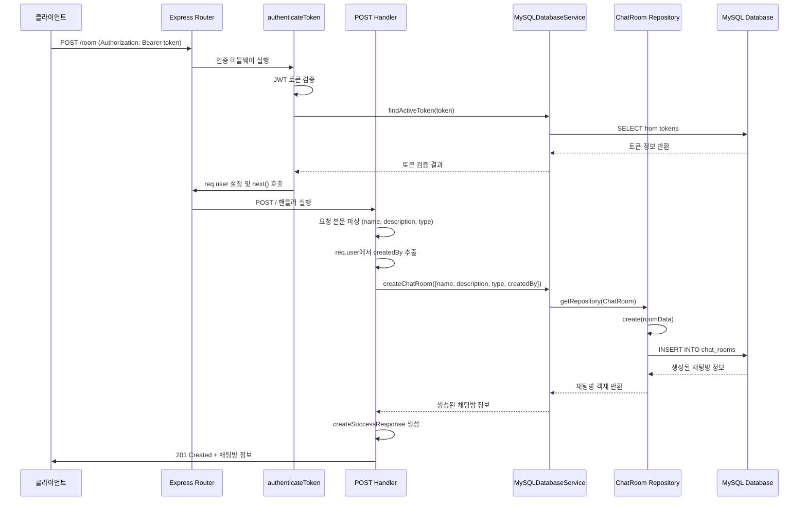
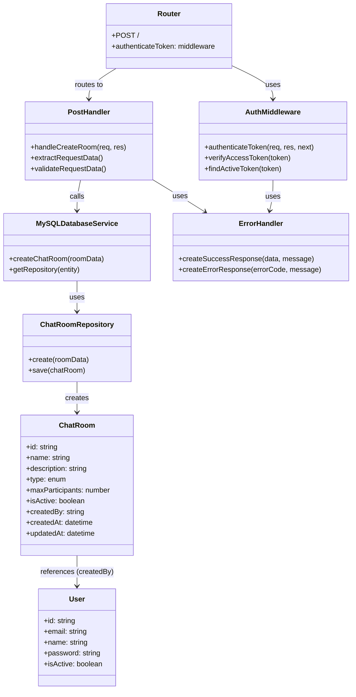

# 채팅방 생성 API

## 개요
사용자가 새로운 채팅방을 생성하는 API입니다. 인증된 사용자만이 채팅방을 생성할 수 있으며, 채팅방 유형(public, private, group)을 지정할 수 있습니다. 생성된 채팅방은 MySQL 데이터베이스에 저장되며, 생성자는 자동으로 채팅방의 소유자가 됩니다.

## Request

### Endpoint
| Method | Path |
|--------|------|
| POST | /room |

### Path Parameters
| 파라미터 | 타입 | 필수 여부 | 설명 |
|----------|------|-----------|------|
| - | - | - | 없음 |

### Query Parameters
| 파라미터 | 타입 | 필수 여부 | 설명 |
|----------|------|-----------|------|
| - | - | - | 없음 |

### Request Headers
| 헤더 | 필수 여부 | 설명 |
|------|-----------|------|
| Authorization | 필수 | Bearer 토큰 형식의 JWT 액세스 토큰 |
| Content-Type | 필수 | application/json |

### Request Body
| 파라미터 | 타입 | 필수 여부 | 설명 |
|----------|------|-----------|------|
| name | string | 필수 | 채팅방 이름 (최대 255자) |
| description | string | 선택 | 채팅방 설명 (텍스트 형식) |
| type | string | 선택 | 채팅방 유형 - 'public', 'private', 'group' 중 하나 (기본값: 'public') |

### 인증 방식
JWT Bearer 토큰을 사용한 인증이 필요합니다. Authorization 헤더에 "Bearer {access_token}" 형식으로 토큰을 포함해야 합니다. 토큰은 서버의 화이트리스트에 등록된 유효한 토큰이어야 하며, 만료되지 않은 상태여야 합니다. 인증 미들웨어(authenticateToken)에서 토큰 검증을 수행하고, 검증된 사용자 정보를 req.user 객체에 저장합니다.

## Response

### Response Status
| HTTP Status | 설명 |
|-------------|------|
| 201 | 채팅방 생성 성공 |
| 400 | 잘못된 요청 (필수 필드 누락, 유효하지 않은 데이터) |
| 401 | 인증 실패 (토큰 없음, 유효하지 않은 토큰, 만료된 토큰) |
| 403 | 권한 없음 |
| 500 | 서버 내부 오류 |

### Response Headers
| 헤더 | 필수 여부 | 설명 |
|------|-----------|------|
| Content-Type | 항상 | application/json |

### Response Body
**성공 응답 (201)**
| 필드 | 타입 | 설명 |
|------|------|------|
| success | boolean | 요청 성공 여부 (true) |
| message | string | 성공 메시지 ("채팅 방이 생성 되었습니다.") |
| data | object | 응답 데이터 |
| data.room | object | 생성된 채팅방 정보 |
| data.room.id | string | 채팅방 고유 ID (UUID) |
| data.room.name | string | 채팅방 이름 |
| data.room.description | string | 채팅방 설명 |
| data.room.type | string | 채팅방 유형 ('public', 'private', 'group') |
| data.room.maxParticipants | number | 최대 참가자 수 (기본값: null) |
| data.room.isActive | boolean | 활성 상태 (기본값: true) |
| data.room.createdBy | string | 생성자 사용자 ID (UUID) |
| data.room.createdAt | string | 생성 일시 (ISO 8601 형식) |
| data.room.updatedAt | string | 수정 일시 (ISO 8601 형식) |

**오류 응답**
| 필드 | 타입 | 설명 |
|------|------|------|
| success | boolean | 요청 성공 여부 (false) |
| errorCode | string | 오류 코드 |
| message | string | 오류 메시지 |
| statusCode | number | HTTP 상태 코드 |

### Error Code
| 코드 | 설명 |
|------|------|
| ERR1008 | 인증 토큰 관련 오류 (토큰 없음, 유효하지 않은 토큰, 만료된 토큰) |
| ERR1009 | 접근 권한 없음 |
| ERR3000 | 채팅방 생성 실패 |
| ERR0000 | 일반 서버 오류 |

### Hooks(Callbacks)
이 API는 외부 시스템으로의 hook 또는 callback 이벤트를 발생시키지 않습니다.

## Flow

### Flow Chart
```mermaid
flowchart TD
    A[클라이언트 요청] --> B[authenticateToken 미들웨어]
    B --> C{토큰 유효성 검사}
    C -->|유효하지 않음| D[401 Unauthorized 응답]
    C -->|유효함| E[req.user에 사용자 정보 저장]
    E --> F[POST / 핸들러 실행]
    F --> G[요청 본문에서 name, description, type 추출]
    G --> H[req.user에서 createdBy(사용자 ID) 추출]
    H --> I[MySQLDatabaseService.createChatRoom 호출]
    I --> J[ChatRoom 엔티티 생성 및 저장]
    J --> K{데이터베이스 저장 성공?}
    K -->|실패| L[500 Internal Server Error 응답]
    K -->|성공| M[createSuccessResponse로 응답 생성]
    M --> N[201 Created 응답 반환]
```

### Sequence Diagram


### Class Diagram


## 추가 정보

### 데이터베이스 제약조건
- 채팅방 ID는 UUID 형식으로 자동 생성됩니다
- 채팅방 이름은 필수 항목이며 최대 255자까지 허용됩니다
- 채팅방 유형은 'public', 'private', 'group' 중 하나여야 합니다
- 생성자 ID는 존재하는 사용자의 ID여야 합니다 (외래 키 제약)

### 보안 고려사항
- JWT 토큰은 화이트리스트 방식으로 관리되어 로그아웃 시 즉시 무효화됩니다
- 토큰 만료 시간은 액세스 토큰 기준 1시간입니다
- 모든 요청은 HTTPS를 통해 암호화되어야 합니다

### 성능 최적화
- ChatRoom 테이블에는 type과 createdBy 필드에 인덱스가 설정되어 있습니다
- 데이터베이스 연결은 TypeORM의 커넥션 풀을 통해 관리됩니다

### 확장 가능성
- 향후 채팅방 최대 참가자 수 제한 기능을 추가할 수 있습니다
- 채팅방 카테고리, 태그 등의 메타데이터 확장이 가능합니다
- 채팅방 참가자 초대, 권한 관리 등의 고급 기능 추가가 계획되어 있습니다