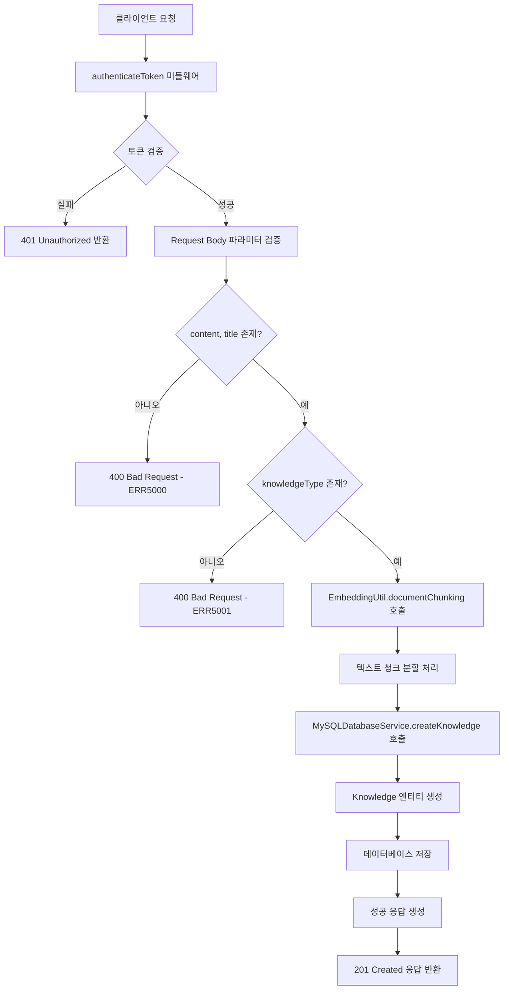
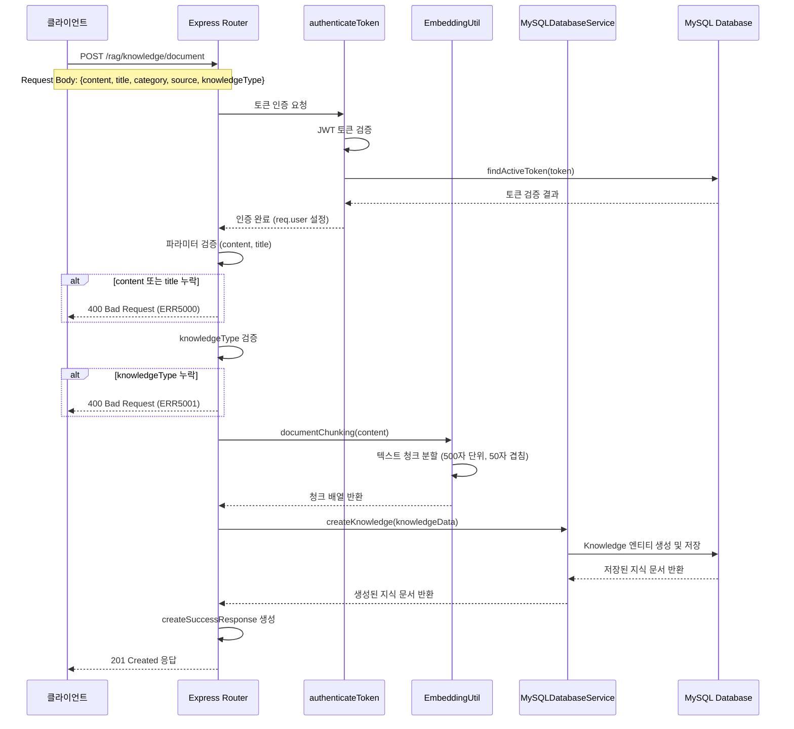
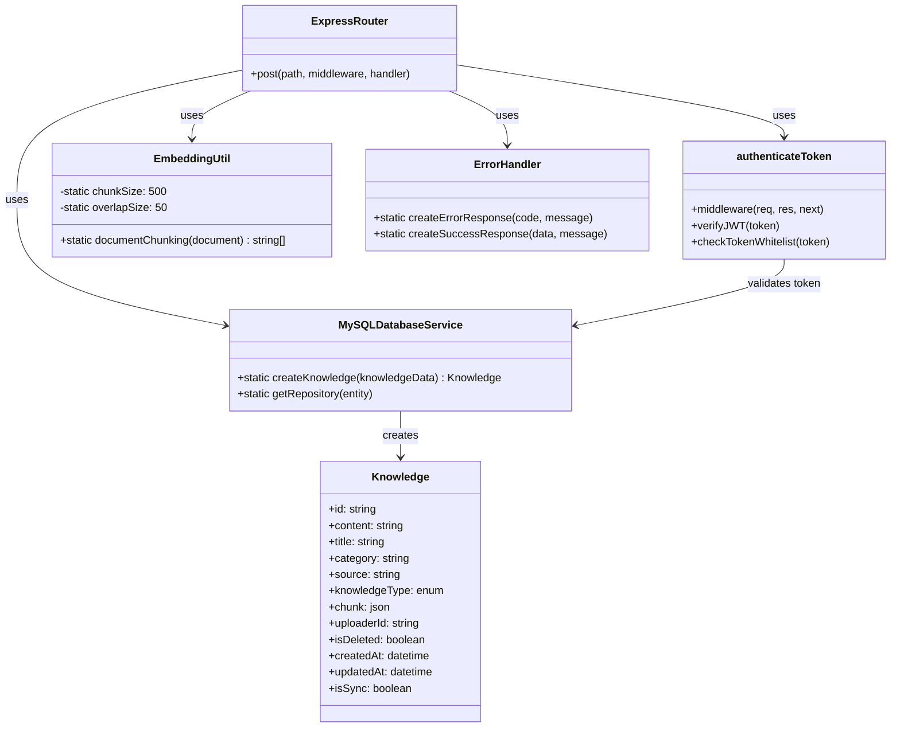

# 지식 문서 생성 API

## 개요
이 API는 사용자가 제공한 텍스트 내용을 기반으로 지식 문서를 생성하고 데이터베이스에 저장하는 기능을 제공합니다. 입력된 텍스트 내용은 자동으로 청크(chunk) 단위로 분할되어 효율적인 검색과 활용이 가능하도록 처리됩니다. 이 API는 RAG(Retrieval-Augmented Generation) 시스템의 지식 베이스 구축을 위한 핵심 기능으로 사용됩니다.

## Request

### Endpoint
| Method | Path |
|--------|------|
| POST | /rag/knowledge/document |

### Path Parameters
해당 API는 Path Parameters를 사용하지 않습니다.

### Query Parameters
해당 API는 Query Parameters를 사용하지 않습니다.

### Request Headers
| 헤더 | 필수 여부 | 설명 |
|------|----------|------|
| Authorization | 필수 | Bearer 토큰 형식의 JWT 인증 토큰 (예: Bearer eyJhbGciOiJIUzI1NiIsInR5cCI6IkpXVCJ9...) |
| Content-Type | 필수 | application/json |

### Request Body
| 파라미터 | 타입 | 필수 여부 | 설명 |
|----------|------|----------|------|
| content | string | 필수 | 지식 문서의 본문 내용. 텍스트 형태로 제공되며, 자동으로 청크 단위로 분할됩니다. |
| title | string | 필수 | 지식 문서의 제목. 최대 100자까지 지원됩니다. |
| category | string | 선택 | 지식 문서의 카테고리. 최대 20자까지 지원되며, 분류 목적으로 사용됩니다. |
| source | string | 선택 | 지식 문서의 출처 또는 소스. 최대 20자까지 지원됩니다. |
| knowledgeType | string | 필수 | 지식의 유형. 현재는 'text' 타입만 지원됩니다. |

### 인증 방식
이 API는 JWT(JSON Web Token) 기반의 Bearer 토큰 인증을 사용합니다. 클라이언트는 Authorization 헤더에 "Bearer {token}" 형식으로 유효한 액세스 토큰을 포함해야 합니다. 토큰은 데이터베이스의 화이트리스트와 비교하여 검증되며, 만료되거나 무효한 토큰의 경우 401 Unauthorized 응답을 반환합니다. 인증된 사용자의 정보는 지식 문서의 업로더(uploaderId)로 자동 설정됩니다.

## Response

### Response Status
| HTTP Status | 설명 |
|-------------|------|
| 201 | 지식 문서가 성공적으로 생성됨 |
| 400 | 잘못된 요청 (필수 필드 누락, 잘못된 파라미터 등) |
| 401 | 인증 실패 (토큰 없음, 만료된 토큰, 무효한 토큰) |
| 500 | 서버 내부 오류 |

### Response Headers
| 헤더 | 필수 여부 | 설명 |
|------|----------|------|
| Content-Type | 필수 | application/json |

### Response Body
| 필드 | 타입 | 설명 |
|------|------|------|
| success | boolean | 요청 성공 여부. 성공 시 true |
| message | string | 응답 메시지. 성공 시 "지식 생성이 완료 되었습니다." |
| data | object | 응답 데이터 객체 |
| data.knowledge | object | 생성된 지식 문서 정보 |
| data.knowledge.id | string | 생성된 지식 문서의 고유 ID (UUID 형식) |
| data.knowledge.content | string | 저장된 지식 문서의 본문 내용 |
| data.knowledge.title | string | 저장된 지식 문서의 제목 |
| data.knowledge.category | string | 저장된 지식 문서의 카테고리 (선택적) |
| data.knowledge.source | string | 저장된 지식 문서의 출처 (선택적) |
| data.knowledge.knowledgeType | string | 지식 문서의 유형 |
| data.knowledge.chunk | array | 청크 단위로 분할된 텍스트 배열 |
| data.knowledge.uploaderId | string | 업로더의 사용자 ID |
| data.knowledge.isDeleted | boolean | 삭제 여부 (기본값: false) |
| data.knowledge.createdAt | string | 생성 일시 (ISO 8601 형식) |
| data.knowledge.updatedAt | string | 수정 일시 (ISO 8601 형식) |
| data.knowledge.isSync | boolean | 동기화 여부 (기본값: false) |

### Error Code
| 코드 | 설명 |
|------|------|
| ERR5000 | 필수 필드 누락 (content 또는 title이 없음) |
| ERR5001 | 학습 타입이 정의되지 않음 (knowledgeType이 없음) |
| ERR1008 | 인증 토큰 관련 오류 (토큰 없음, 만료, 무효) |
| ERR0000 | 일반 서버 오류 |

### Hooks(Callbacks)
이 API는 외부 시스템으로의 Hook 이벤트를 발생시키지 않습니다.

## Flow

### Flow Chart

### Sequence Diagram

### Class Diagram

## 추가 정보

### 텍스트 청킹 알고리즘
- **청크 크기**: 500자 단위로 분할
- **겹침 크기**: 인접한 청크 간 50자씩 겹침 (컨텍스트 보존)
- **이동 간격**: 450자씩 이동 (500 - 50)
- **마지막 청크 처리**: 50자 미만인 경우 이전 청크와 병합

### 데이터베이스 스키마 세부사항
- **문자셋**: UTF-8 (utf8mb4_unicode_ci) 지원으로 이모지 및 다국어 처리
- **인덱스**: uploaderId와 createdAt에 인덱스 설정으로 성능 최적화
- **관계**: User 엔티티와 Many-to-One 관계 (uploader)

### 보안 고려사항
- JWT 토큰 화이트리스트 검증으로 이중 보안
- 사용자별 지식 문서 격리 (uploaderId 기반)
- SQL Injection 방지를 위한 TypeORM ORM 사용

### 성능 최적화
- 청크 단위 분할로 효율적인 검색 지원
- 데이터베이스 인덱스를 통한 빠른 조회
- JSON 타입을 이용한 청크 데이터 저장으로 유연성 확보