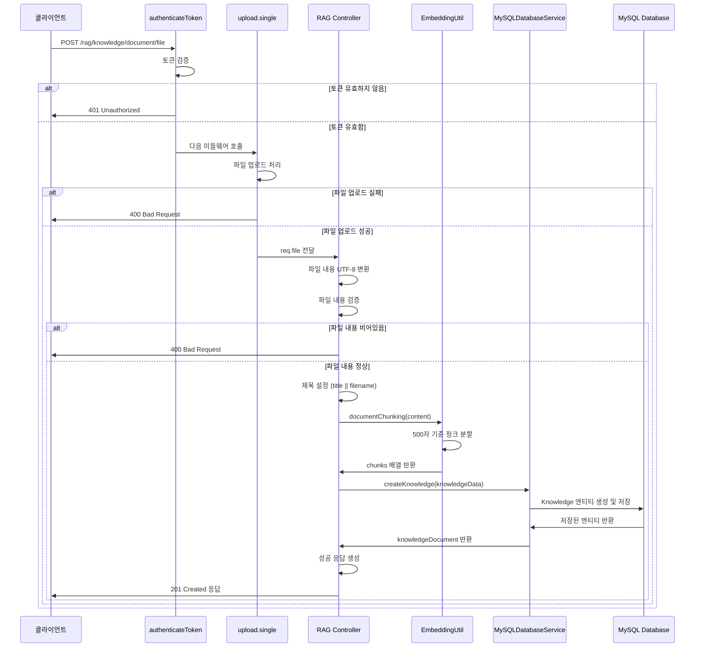

# Create Knowledge from File

## 개요
파일 업로드를 통해 지식 문서를 생성하는 API입니다. 텍스트 파일(.txt)을 업로드하면 내용을 분석하여 청크 단위로 분할하고, 사용자의 지식 베이스에 저장합니다. 업로드된 파일의 내용은 UTF-8 인코딩으로 읽어들이며, 500자 기준으로 청크를 분할하여 임베딩 벡터 생성에 적합한 형태로 가공합니다. 인증된 사용자만 접근 가능하며, 생성된 지식 문서는 RAG(Retrieval-Augmented Generation) 시스템에서 활용됩니다.

## Request

### Endpoint
| Method | Path |
|--------|------|
| POST | /rag/knowledge/document/file |

### Path Parameters
해당 없음

### Query Parameters
해당 없음

### Request Headers
| 헤더 | 필수 여부 | 설명 |
|------|-----------|------|
| Authorization | 필수 | Bearer 토큰 형식의 JWT 액세스 토큰 |
| Content-Type | 필수 | multipart/form-data (파일 업로드를 위한 필수 헤더) |

### Request Body
| 파라미터 | 타입 | 필수 여부 | 설명 |
|----------|------|-----------|------|
| file | File | 필수 | 업로드할 텍스트 파일 (.txt 형식만 지원, 최대 10MB) |
| title | String | 선택 | 지식 문서의 제목 (미제공 시 파일명 사용, 확장자 제거) |
| category | String | 선택 | 지식 문서의 카테고리 (기본값: 'file') |
| source | String | 선택 | 지식 문서의 출처 (기본값: 'file_upload') |
| knowledgeType | String | 선택 | 지식 타입 (기본값: 'text', 현재 'text'만 지원) |

### 인증 방식
JWT Bearer 토큰을 사용한 인증이 필요합니다. Authorization 헤더에 "Bearer {access_token}" 형식으로 전달해야 합니다. 토큰은 사용자 로그인 시 발급받으며, 만료된 토큰의 경우 401 Unauthorized 응답을 받습니다. 토큰에서 추출된 사용자 ID는 지식 문서의 업로더로 설정됩니다.

## Response

### Response Status
| HTTP Status | 설명 |
|-------------|------|
| 201 | 지식 문서 생성 성공 |
| 400 | 잘못된 요청 (파일 미업로드, 빈 파일, 지원하지 않는 파일 형식) |
| 401 | 인증 실패 (토큰 없음 또는 만료) |
| 413 | 파일 크기 초과 (10MB 초과) |
| 500 | 서버 내부 오류 |

### Response Headers
| 헤더 | 필수 여부 | 설명 |
|------|-----------|------|
| Content-Type | 필수 | application/json |

### Response Body
| 필드 | 타입 | 설명 |
|------|------|------|
| success | Boolean | 요청 성공 여부 (true) |
| message | String | 성공 메시지 |
| data | Object | 응답 데이터 객체 |
| data.knowledge | Object | 생성된 지식 문서 정보 |
| data.knowledge.id | String | 지식 문서 고유 ID (UUID) |
| data.knowledge.content | String | 지식 문서 전체 내용 |
| data.knowledge.title | String | 지식 문서 제목 |
| data.knowledge.category | String | 지식 문서 카테고리 |
| data.knowledge.source | String | 지식 문서 출처 |
| data.knowledge.knowledgeType | String | 지식 타입 |
| data.knowledge.uploaderId | String | 업로더 사용자 ID |
| data.knowledge.chunk | Array | 청크 분할된 문서 배열 |
| data.knowledge.isDeleted | Boolean | 삭제 여부 |
| data.knowledge.createdAt | String | 생성 시간 (ISO 8601) |
| data.knowledge.updatedAt | String | 수정 시간 (ISO 8601) |
| data.knowledge.isSync | Boolean | 동기화 여부 |
| data.fileName | String | 원본 파일명 |
| data.fileSize | Number | 파일 크기 (바이트) |
| data.chunkCount | Number | 생성된 청크 개수 |

### Error Code
| 코드 | 설명 |
|------|------|
| ERR5000 | 파일이 업로드되지 않았습니다 / 파일 내용이 비어있습니다 / 텍스트 파일(.txt)만 업로드 가능합니다 / 파일 처리 중 오류가 발생했습니다 |
| ERR1008 | 유효하지 않은 토큰입니다 |

### Hooks(Callbacks)
해당 없음

## Flow

### Flow Chart
```mermaid
flowchart TD
    A[클라이언트 요청] --> B[authenticateToken 미들웨어]
    B --> C{토큰 유효성 검사}
    C -->|유효하지 않음| D[401 Unauthorized 응답]
    C -->|유효함| E[upload.single('file') 미들웨어]
    E --> F{파일 업로드 검사}
    F -->|파일 없음| G[400 Bad Request - 파일 미업로드]
    F -->|파일 형식 오류| H[400 Bad Request - 텍스트 파일만 지원]
    F -->|파일 크기 초과| I[413 Payload Too Large]
    F -->|정상| J[파일 내용 UTF-8 변환]
    J --> K{파일 내용 검사}
    K -->|빈 내용| L[400 Bad Request - 파일 내용 비어있음]
    K -->|정상| M[제목 설정]
    M --> N[EmbeddingUtil.documentChunking 호출]
    N --> O[MySQLDatabaseService.createKnowledge 호출]
    O --> P[Knowledge 엔티티 생성]
    P --> Q[데이터베이스 저장]
    Q --> R[성공 응답 생성]
    R --> S[201 Created 응답]
    
    style A fill:#e1f5fe
    style S fill:#e8f5e8
    style D fill:#ffebee
    style G fill:#ffebee
    style H fill:#ffebee
    style I fill:#ffebee
    style L fill:#ffebee
```

### Sequence Diagram


### Class Diagram
```mermaid
classDiagram
    class RAGController {
        +post() async
        -validateFile(req.file) boolean
        -processFileContent(buffer) string
        -generateTitle(title, filename) string
    }
    
    class AuthMiddleware {
        +authenticateToken() middleware
        -verifyJWT(token) object
        -extractUserId(decoded) string
    }
    
    class UploadMiddleware {
        +single(fieldname) middleware
        -fileFilter(file) boolean
        -storage: memoryStorage
        -limits: {fileSize: 10MB}
    }
    
    class EmbeddingUtil {
        +documentChunking(document) string[]
        -chunkSize: 500
        -overlapSize: 50
        -stepSize: 450
    }
    
    class MySQLDatabaseService {
        +createKnowledge(knowledgeData) Knowledge
        -getRepository() Repository
        -create(data) Entity
        -save(entity) Entity
    }
    
    class Knowledge {
        +id: string
        +content: string
        +title: string
        +category: string
        +source: string
        +knowledgeType: enum
        +chunk: json
        +uploaderId: string
        +isDeleted: boolean
        +createdAt: datetime
        +updatedAt: datetime
        +isSync: boolean
    }
    
    class ErrorHandler {
        +createErrorResponse(code, message) object
        +createSuccessResponse(data, message) object
    }
    
    RAGController --> AuthMiddleware: uses
    RAGController --> UploadMiddleware: uses
    RAGController --> EmbeddingUtil: uses
    RAGController --> MySQLDatabaseService: uses
    RAGController --> ErrorHandler: uses
    MySQLDatabaseService --> Knowledge: creates
```

## 추가 정보

### 파일 업로드 제한사항
- **지원 파일 형식**: .txt 파일만 지원 (MIME 타입: text/plain)
- **최대 파일 크기**: 10MB
- **인코딩**: UTF-8 인코딩으로 자동 변환
- **저장 방식**: 메모리 저장 (multer.memoryStorage), 디스크에 저장하지 않음

### 문서 청킹 알고리즘
- **청크 크기**: 500자 기준
- **오버랩 크기**: 50자 (인접 청크 간 겹치는 부분)
- **이동 크기**: 450자 (chunkSize - overlapSize)
- **처리 방식**: 공백 문자 정리 후 분할, 마지막 청크가 50자 미만일 경우 이전 청크와 병합

### 데이터베이스 저장 구조
- **테이블**: knowledge
- **ID 생성**: UUID 자동 생성
- **청크 저장**: JSON 형태로 chunk 필드에 배열 저장
- **인덱스**: uploaderId, createdAt 필드에 인덱스 설정
- **관계**: User 엔티티와 Many-to-One 관계 (uploaderId)

### 보안 고려사항
- JWT 토큰 기반 인증으로 사용자별 접근 제어
- 파일 형식 검증을 통한 악성 파일 업로드 차단
- 파일 크기 제한을 통한 서버 리소스 보호
- 메모리 저장 방식으로 임시 파일 생성 방지

### 성능 최적화
- 메모리 기반 파일 처리로 디스크 I/O 최소화
- 청크 분할을 통한 효율적인 임베딩 벡터 생성 준비
- 인덱스 활용을 통한 빠른 데이터 조회 지원