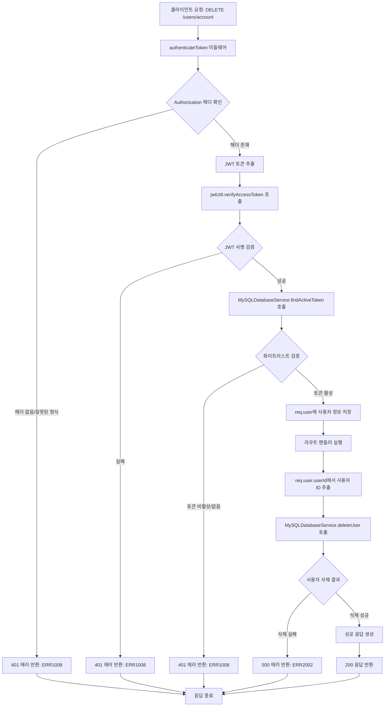
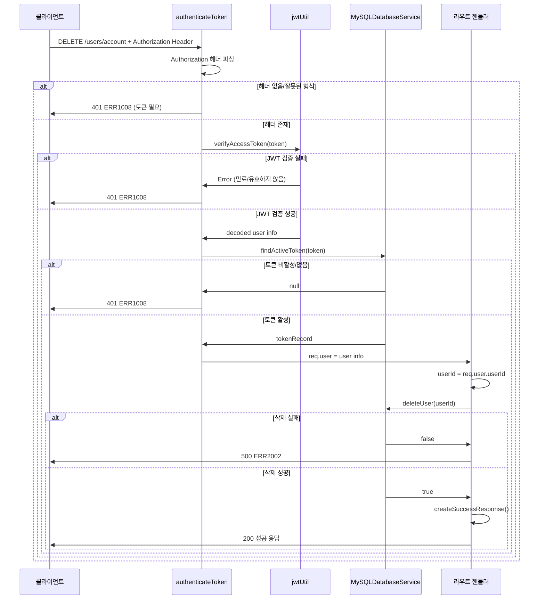
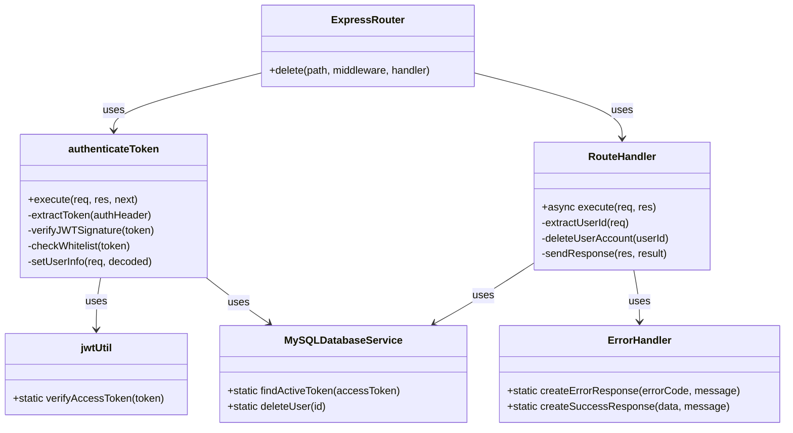

# 사용자 계정 삭제 API

## 개요

이 API는 인증된 사용자의 계정을 완전히 삭제하는 기능을 제공합니다. 사용자는 유효한 JWT 액세스 토큰을 제공하여 자신의 계정을 삭제할 수 있으며, 삭제 과정에서 해당 사용자와 관련된 모든 데이터가 데이터베이스에서 제거됩니다. 이는 회원 탈퇴 기능으로 사용되며, 삭제된 계정은 복구할 수 없습니다.

## Request

### Endpoint

| Method | Path |
|--------|------|
| DELETE | /users/account |

### Path Parameters

해당 API는 Path Parameters를 사용하지 않습니다.

| 파라미터 | 타입 | 필수 여부 | 설명 |
|----------|------|-----------|------|
| - | - | - | Path Parameters 없음 |

### Query Parameters

해당 API는 Query Parameters를 사용하지 않습니다.

| 파라미터 | 타입 | 필수 여부 | 설명 |
|----------|------|-----------|------|
| - | - | - | Query Parameters 없음 |

### Request Headers

| 헤더 | 필수 여부 | 설명 |
|------|-----------|------|
| Authorization | 필수 | Bearer 토큰 형식의 JWT 액세스 토큰. 형식: "Bearer {access_token}" |
| Content-Type | 선택 | application/json (요청 본문이 없으므로 생략 가능) |

### Request Body

해당 API는 Request Body를 사용하지 않습니다.

| 파라미터 | 타입 | 필수 여부 | 설명 |
|----------|------|-----------|------|
| - | - | - | Request Body 없음 |

### 인증 방식

이 API는 JWT 기반 인증을 사용합니다. 클라이언트는 Authorization 헤더에 "Bearer {access_token}" 형식으로 유효한 JWT 액세스 토큰을 포함해야 합니다. 인증 프로세스는 다음과 같습니다:

1. **토큰 추출**: Authorization 헤더에서 "Bearer " 접두사를 제거하고 토큰을 추출합니다.
2. **JWT 서명 검증**: JWT 라이브러리를 사용하여 토큰의 서명과 만료 시간을 검증합니다.
3. **화이트리스트 검증**: 데이터베이스의 Token 테이블에서 해당 토큰이 활성 상태인지 확인합니다.
4. **사용자 정보 추출**: 검증된 토큰에서 사용자 ID, 이메일, 이름 정보를 추출하여 요청 객체에 저장합니다.

인증에 실패하면 401 Unauthorized 응답이 반환됩니다.

## Response

### Response Status

| HTTP Status | 설명 |
|-------------|------|
| 200 | 사용자 계정 삭제 성공 |
| 401 | 인증 실패 (토큰 누락, 만료, 유효하지 않음) |
| 500 | 서버 내부 오류 (사용자 삭제 실패) |

### Response Headers

| 헤더 | 필수 여부 | 설명 |
|------|-----------|------|
| Content-Type | 필수 | application/json; charset=utf-8 |
| Content-Length | 필수 | 응답 본문의 바이트 크기 |

### Response Body

#### 성공 응답 (200)

| 필드 | 타입 | 설명 |
|------|------|------|
| success | boolean | 요청 성공 여부 (항상 true) |
| message | string | 성공 메시지 ("회원 탈퇴가 완료되었습니다.") |

#### 실패 응답 (401, 500)

| 필드 | 타입 | 설명 |
|------|------|------|
| success | boolean | 요청 성공 여부 (항상 false) |
| errorCode | string | 에러 코드 (ERR1008, ERR2002) |
| message | string | 에러 메시지 |
| statusCode | number | HTTP 상태 코드 |

### Error Code

| 코드 | 설명 |
|------|------|
| ERR1008 | 인증 토큰 관련 오류 (토큰 누락, 만료, 유효하지 않음) |
| ERR2002 | 사용자 삭제 실패 (데이터베이스 오류 또는 사용자가 존재하지 않음) |

### Hooks(Callbacks)

해당 API는 외부 시스템으로의 Hooks 또는 Callbacks를 발생시키지 않습니다.

| 파라미터 | 타입 | 필수 여부 | 설명 |
|----------|------|-----------|------|
| - | - | - | Hooks 없음 |

## Flow

### Flow Chart

### Sequence Diagram

### Class Diagram

## Flow 상세 설명

### 1. 인증 단계 (authenticateToken 미들웨어)

1. **토큰 추출**: `req.headers.authorization`에서 "Bearer " 접두사를 확인하고 JWT 토큰을 추출합니다.
2. **JWT 검증**: `jwtUtil.verifyAccessToken(token)` 함수를 호출하여 토큰의 서명과 만료 시간을 검증합니다.
3. **화이트리스트 검증**: `MySQLDatabaseService.findActiveToken(token)` 함수를 호출하여 데이터베이스에서 토큰이 활성 상태인지 확인합니다.
4. **사용자 정보 설정**: 검증이 완료되면 `req.user` 객체에 사용자 정보를 저장합니다.

### 2. 계정 삭제 단계 (라우트 핸들러)

1. **사용자 ID 추출**: `req.user.userId`에서 삭제할 사용자의 ID를 가져옵니다.
2. **데이터베이스 삭제**: `MySQLDatabaseService.deleteUser(userId)` 함수를 호출하여 사용자 계정을 삭제합니다.
3. **결과 처리**: 삭제 결과에 따라 성공 또는 실패 응답을 생성합니다.

### 3. 응답 생성 단계

- **성공 시**: `createSuccessResponse(null, '회원 탈퇴가 완료되었습니다.')` 함수로 200 응답을 생성합니다.
- **실패 시**: `createErrorResponse(ERROR_CODES.ERR2002)` 함수로 500 응답을 생성합니다.

### 호출되는 주요 함수들

- `authenticateToken`: 인증 미들웨어 (`middleware/auth.js:11`)
- `jwtUtil.verifyAccessToken`: JWT 토큰 검증 (`utils/jwt.js`)
- `MySQLDatabaseService.findActiveToken`: 토큰 화이트리스트 확인 (`services/mysql-database.js:255`)
- `MySQLDatabaseService.deleteUser`: 사용자 삭제 (`services/mysql-database.js:67`)
- `createErrorResponse`: 에러 응답 생성 (`constants/errorCodes.js:116`)
- `createSuccessResponse`: 성공 응답 생성 (`constants/errorCodes.js:126`)

## 추가 정보

### 보안 고려사항

1. **인증 필수**: 이 API는 인증된 사용자만 접근할 수 있으며, 다른 사용자의 계정을 삭제할 수 없습니다.
2. **토큰 화이트리스트**: JWT 토큰의 서명 검증뿐만 아니라 데이터베이스의 화이트리스트도 확인하여 이중 보안을 제공합니다.
3. **복구 불가능**: 삭제된 계정은 복구할 수 없으므로 클라이언트에서 사용자에게 충분한 경고를 제공해야 합니다.

### 데이터베이스 영향

- 사용자 계정 삭제 시 TypeORM의 `delete` 메소드를 사용하여 User 테이블에서 해당 레코드를 완전히 제거합니다.
- Foreign Key 제약조건에 따라 관련된 다른 테이블의 데이터도 함께 삭제되거나 업데이트될 수 있습니다.

### 클라이언트 고려사항

1. **확인 대화상자**: 사용자가 실수로 계정을 삭제하지 않도록 확인 대화상자를 표시해야 합니다.
2. **토큰 관리**: 계정 삭제 후 클라이언트는 저장된 모든 토큰을 삭제하고 로그아웃 상태로 전환해야 합니다.
3. **에러 처리**: 네트워크 오류나 서버 오류에 대한 적절한 에러 처리를 구현해야 합니다.

### 성능 고려사항

- 사용자 계정 삭제는 일반적으로 자주 발생하지 않는 작업이므로 성능상 큰 영향은 없습니다.
- 대용량 사용자 데이터를 가진 시스템에서는 관련 데이터의 연쇄 삭제로 인한 성능 저하를 고려해야 할 수 있습니다.