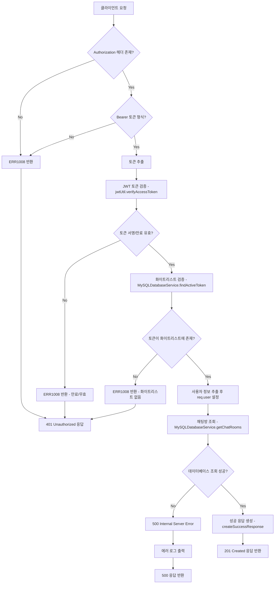
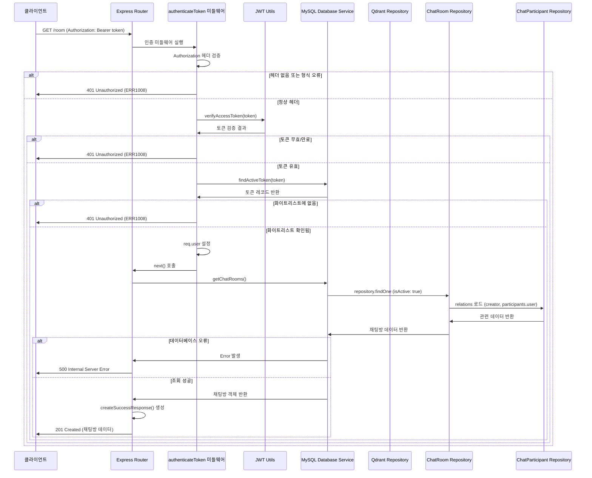
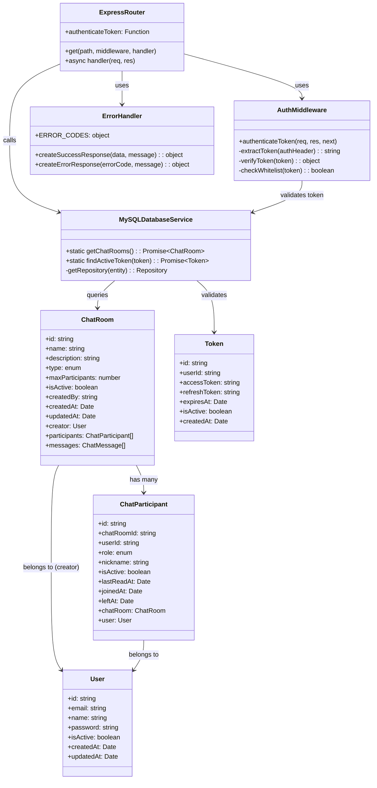

# 채팅방 목록 조회

## 개요

인증된 사용자가 시스템에 등록된 모든 활성 채팅방의 목록을 조회하는 API입니다. 이 API는 JWT 토큰을 통한 인증이 필요하며, 채팅방의 기본 정보와 생성자, 참여자 정보를 포함하여 반환합니다. 채팅방 타입(public, private, group)에 관계없이 활성 상태인 모든 채팅방을 조회할 수 있습니다.

## Request

### Endpoint

| Method | Path |
|--------|------|
| GET | /room |

### Path Parameters

| 파라미터 | 타입 | 필수 여부 | 설명 |
|----------|------|-----------|------|
| N/A | N/A | N/A | 경로 파라미터 없음 |

### Query Parameters

| 파라미터 | 타입 | 필수 여부 | 설명 |
|----------|------|-----------|------|
| N/A | N/A | N/A | 쿼리 파라미터 없음 |

### Request Headers

| 헤더 | 필수 여부 | 설명 |
|------|-----------|------|
| Authorization | 필수 | Bearer 토큰 형식의 JWT 액세스 토큰 (예: "Bearer eyJhbGciOiJIUzI1NiIsInR5cCI6IkpXVCJ9...") |
| Content-Type | 선택 | application/json (요청 본문이 없으므로 생략 가능) |

### Request Body

| 파라미터 | 타입 | 필수 여부 | 설명 |
|----------|------|-----------|------|
| N/A | N/A | N/A | 요청 본문 없음 |

### 인증 방식

이 API는 JWT(JSON Web Token) 기반의 Bearer 토큰 인증을 사용합니다. 클라이언트는 Authorization 헤더에 "Bearer {토큰}" 형식으로 유효한 액세스 토큰을 포함해야 합니다. 

인증 과정:
1. 클라이언트가 Authorization 헤더에 Bearer 토큰을 포함하여 요청
2. 서버에서 JWT 토큰의 서명과 만료 시간을 검증
3. 토큰이 화이트리스트(데이터베이스의 tokens 테이블)에 등록되어 있는지 확인
4. 검증이 완료되면 토큰에서 사용자 정보(userId, email, name)를 추출하여 req.user 객체에 저장
5. 인증에 실패하면 401 Unauthorized 응답을 반환

## Response

### Response Status

| HTTP Status | 설명 |
|-------------|------|
| 201 | Created - 요청이 성공적으로 처리되었습니다 (실제로는 조회 작업이므로 200 OK가 더 적절하지만, 코드에서 201을 반환) |
| 401 | Unauthorized - 인증 토큰이 없거나 유효하지 않음 |
| 500 | Internal Server Error - 서버 내부 오류 발생 |

### Response Headers

| 헤더 | 필수 여부 | 설명 |
|------|-----------|------|
| Content-Type | 필수 | application/json; charset=utf-8 |
| X-Powered-By | 선택 | Express 프레임워크 정보 |

### Response Body

| 필드 | 타입 | 설명 |
|------|------|------|
| success | boolean | 요청 성공 여부 (항상 true) |
| message | string | 응답 메시지 ("요청이 성공적으로 처리되었습니다.") |
| data | object | 응답 데이터 객체 |
| data.rooms | object | 채팅방 정보 객체 (주의: 배열이 아닌 단일 객체 반환) |
| data.rooms.id | string | 채팅방 고유 식별자 (UUID 형식) |
| data.rooms.name | string | 채팅방 이름 |
| data.rooms.description | string \| null | 채팅방 설명 |
| data.rooms.type | string | 채팅방 타입 ("public", "private", "group") |
| data.rooms.maxParticipants | number \| null | 최대 참여자 수 (제한이 없으면 null) |
| data.rooms.isActive | boolean | 채팅방 활성 상태 |
| data.rooms.createdBy | string | 채팅방 생성자 사용자 ID |
| data.rooms.createdAt | string | 채팅방 생성 일시 (ISO 8601 형식) |
| data.rooms.updatedAt | string | 채팅방 마지막 수정 일시 (ISO 8601 형식) |
| data.rooms.creator | object | 채팅방 생성자 정보 |
| data.rooms.creator.id | string | 생성자 사용자 ID |
| data.rooms.creator.email | string | 생성자 이메일 |
| data.rooms.creator.name | string | 생성자 이름 |
| data.rooms.participants | array | 채팅방 참여자 목록 |
| data.rooms.participants[].id | string | 참여자 관계 ID |
| data.rooms.participants[].role | string | 참여자 역할 ("admin", "moderator", "member") |
| data.rooms.participants[].nickname | string \| null | 참여자 닉네임 |
| data.rooms.participants[].isActive | boolean | 참여자 활성 상태 |
| data.rooms.participants[].lastReadAt | string \| null | 마지막 읽기 시간 |
| data.rooms.participants[].joinedAt | string | 참여 시간 |
| data.rooms.participants[].leftAt | string \| null | 퇴장 시간 |
| data.rooms.participants[].user | object | 참여자 사용자 정보 |
| data.rooms.participants[].user.id | string | 참여자 사용자 ID |
| data.rooms.participants[].user.email | string | 참여자 이메일 |
| data.rooms.participants[].user.name | string | 참여자 이름 |

### Error Code

| 코드 | 설명 |
|------|------|
| ERR1008 | 유효하지 않은 토큰 - 토큰이 없거나, 형식이 잘못되었거나, 만료되었거나, 화이트리스트에 없음 |
| ERR0000 | 일반 서버 오류 - 데이터베이스 연결 실패, 쿼리 실행 오류 등 |

### Hooks(Callbacks)

| Hook Type | Description |
|-----------|-------------|
| N/A | 이 API는 외부 시스템으로의 Hook 이벤트를 발생시키지 않습니다 |

## Flow

### Flow Chart

### Sequence Diagram

### Class Diagram

## 텍스트 설명

1. **요청 접수**: 클라이언트가 GET /room 엔드포인트로 요청을 보내며, Authorization 헤더에 Bearer 토큰을 포함합니다.

2. **인증 과정**: 
   - `authenticateToken` 미들웨어가 실행되어 Authorization 헤더를 검증합니다 (middleware/auth.js:11-58)
   - Bearer 토큰 형식인지 확인하고 토큰을 추출합니다 (middleware/auth.js:16-21)
   - `jwtUtil.verifyAccessToken`으로 JWT 토큰의 서명과 만료시간을 검증합니다 (middleware/auth.js:24)
   - `MySQLDatabaseService.findActiveToken`으로 토큰이 화이트리스트에 존재하는지 확인합니다 (middleware/auth.js:27-31)
   - 모든 검증이 통과하면 토큰에서 사용자 정보를 추출하여 `req.user`에 저장합니다 (middleware/auth.js:34-38)

3. **데이터 조회**: 
   - 인증이 완료되면 메인 핸들러 함수가 실행됩니다 (routes/room.js:26-39)
   - `MySQLDatabaseService.getChatRooms()` 메서드를 호출하여 채팅방 데이터를 조회합니다 (routes/room.js:28)
   - 이 메서드는 내부적으로 `chatRoomRepository.findOne()`을 호출하여 `isActive: true` 조건으로 활성 채팅방을 조회합니다 (services/mysql-database.js:103-114)
   - 조회 시 `relations: ['creator', 'participants', 'participants.user']`를 포함하여 생성자와 참여자 정보도 함께 가져옵니다

4. **응답 생성**: 
   - 조회가 성공하면 `createSuccessResponse` 함수를 사용하여 표준화된 성공 응답을 생성합니다 (routes/room.js:29-32)
   - 응답 데이터는 `{ rooms: chatRooms }` 형태로 감싸서 반환됩니다
   - HTTP 상태 코드 201과 함께 JSON 응답을 전송합니다 (routes/room.js:34)

5. **에러 처리**: 
   - 인증 실패 시 401 Unauthorized와 함께 ERR1008 에러 코드를 반환합니다
   - 데이터베이스 조회 중 오류 발생 시 500 Internal Server Error를 반환하고 에러 로그를 출력합니다 (routes/room.js:35-38)

## 추가 정보

### 주의사항

1. **데이터베이스 쿼리 이슈**: 현재 `getChatRooms()` 메서드는 `findOne()`을 사용하여 단일 채팅방만 반환합니다. 실제로는 `find()`를 사용하여 모든 활성 채팅방을 조회해야 할 것으로 보입니다.

2. **HTTP 상태 코드**: 조회 API임에도 불구하고 201 Created를 반환하고 있습니다. 일반적으로는 200 OK가 더 적절합니다.

3. **토큰 화이트리스트**: 시스템은 JWT 토큰뿐만 아니라 데이터베이스의 토큰 화이트리스트도 함께 검증하는 이중 보안 구조를 가지고 있습니다.

### 데이터베이스 스키마 정보

- **ChatRoom 테이블**: UUID 기본키, 이름, 설명, 타입(public/private/group), 최대 참여자 수, 활성 상태, 생성자 정보 포함
- **ChatParticipant 테이블**: 채팅방과 사용자 간의 다대다 관계를 관리하며, 역할, 닉네임, 참여/퇴장 시간 등을 추적
- **User 테이블**: 기본 사용자 정보 저장
- **Token 테이블**: JWT 토큰 화이트리스트 관리

### 성능 고려사항

- 채팅방 조회 시 creator, participants, participants.user 관계를 모두 eager loading하므로 데이터량이 많을 경우 성능에 영향을 줄 수 있습니다.
- 적절한 인덱스가 설정되어 있어 조회 성능을 최적화합니다 (IDX_CHAT_ROOM_TYPE, IDX_CHAT_ROOM_CREATED_BY 등).