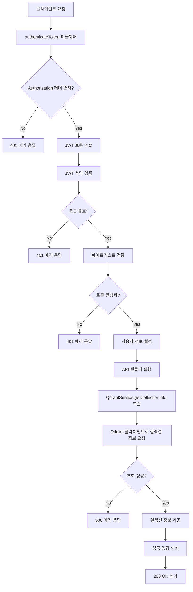
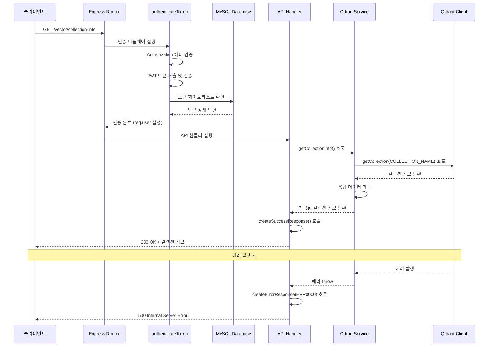
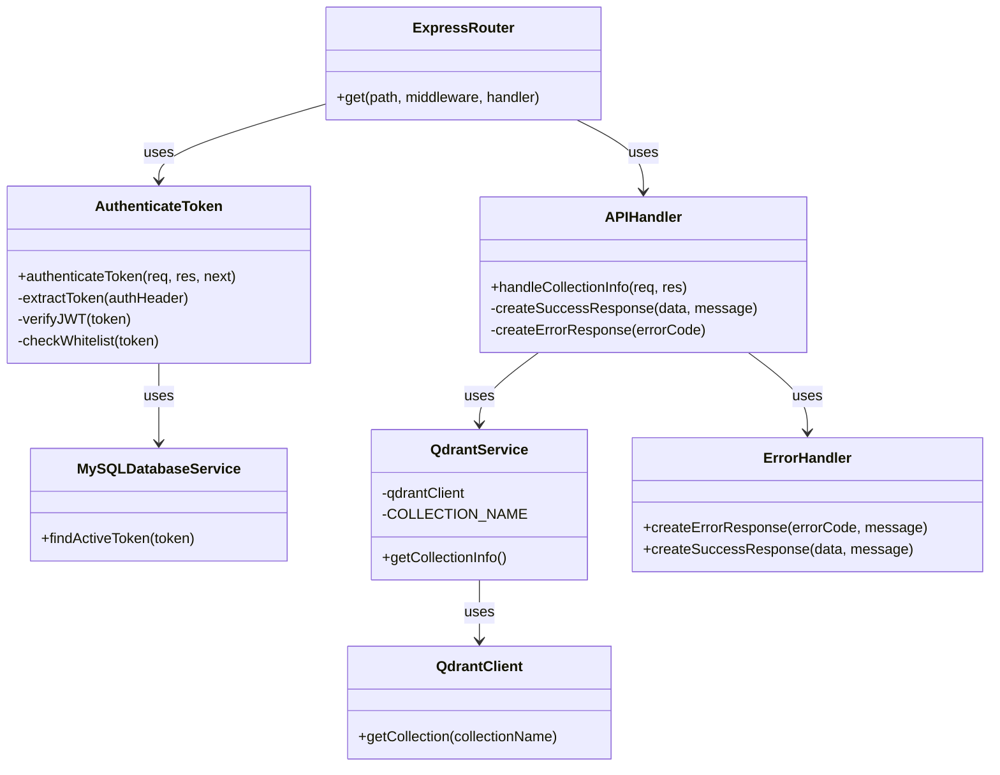

# Get Collection Info API

## 개요

벡터 데이터베이스(Qdrant) 컬렉션의 상태 정보를 조회하는 API입니다. 컬렉션에 저장된 벡터의 총 개수, 포인트 개수, 인덱싱된 벡터 개수 및 컬렉션의 현재 상태를 제공합니다. 이 API는 시스템 관리 및 모니터링 목적으로 사용되며, 벡터 데이터베이스의 현재 상태를 실시간으로 확인할 수 있습니다.

## Request

### Endpoint

| Method | Path |
|--------|------|
| GET | /vector/collection-info |

### Path Parameters

해당 API는 Path Parameter를 사용하지 않습니다.

| 파라미터 | 타입 | 필수 여부 | 설명 |
|---------|------|----------|------|
| - | - | - | Path Parameter 없음 |

### Query Parameters

해당 API는 Query Parameter를 사용하지 않습니다.

| 파라미터 | 타입 | 필수 여부 | 설명 |
|---------|------|----------|------|
| - | - | - | Query Parameter 없음 |

### Request Headers

| 헤더 | 필수 여부 | 설명 |
|------|----------|------|
| Authorization | 필수 | Bearer {access_token} 형태의 JWT 인증 토큰 |
| Content-Type | 선택 | application/json (필수는 아니지만 권장) |

### Request Body

해당 API는 Request Body를 사용하지 않습니다.

| 파라미터 | 타입 | 필수 여부 | 설명 |
|---------|------|----------|------|
| - | - | - | Request Body 없음 |

### 인증 방식

이 API는 JWT 기반 인증을 사용합니다. `authenticateToken` 미들웨어를 통해 인증을 처리하며, 다음과 같은 과정을 거칩니다:

1. **토큰 추출**: `Authorization` 헤더에서 `Bearer ` 접두사를 제거하고 JWT 토큰을 추출합니다.
2. **토큰 검증**: JWT 서명을 검증하여 토큰의 유효성을 확인합니다.
3. **화이트리스트 검증**: 데이터베이스의 토큰 화이트리스트에서 해당 토큰이 활성 상태인지 확인합니다.
4. **사용자 정보 설정**: 검증이 완료되면 `req.user` 객체에 사용자 정보(userId, email, name)를 설정합니다.

인증이 실패할 경우 401 Unauthorized 상태코드와 함께 에러 응답을 반환합니다.

## Response

### Response Status

| HTTP Status | 설명 |
|-------------|------|
| 200 | 컬렉션 정보 조회 성공 |
| 401 | 인증 실패 (토큰 없음, 유효하지 않음, 만료됨) |
| 403 | 접근 권한 없음 |
| 500 | 서버 내부 오류 |

### Response Headers

| 헤더 | 필수 여부 | 설명 |
|------|----------|------|
| Content-Type | 필수 | application/json |

### Response Body

성공 응답:

| 필드 | 타입 | 설명 |
|------|------|------|
| success | boolean | 요청 성공 여부 (항상 true) |
| message | string | 응답 메시지 ("컬렉션 정보 조회 성공") |
| data | object | 컬렉션 정보 객체 |
| data.vectorsCount | number | 컬렉션에 저장된 전체 벡터의 개수 |
| data.pointsCount | number | 컬렉션에 저장된 전체 포인트의 개수 |
| data.indexedVectorsCount | number | 인덱싱이 완료된 벡터의 개수 |
| data.status | string | 컬렉션의 현재 상태 (예: "green", "yellow", "red") |

오류 응답:

| 필드 | 타입 | 설명 |
|------|------|------|
| success | boolean | 요청 성공 여부 (항상 false) |
| errorCode | string | 에러 코드 |
| message | string | 에러 메시지 |

### Error Code

| 코드 | 설명 |
|------|------|
| ERR1008 | 토큰 관련 오류 (없음, 유효하지 않음, 만료됨) |
| ERR1009 | 접근 권한 없음 |
| ERR0000 | 일반 서버 오류 (컬렉션 정보 조회 실패) |

### Hooks(Callbacks)

해당 API는 외부 시스템으로의 Hook이나 Callback을 발생시키지 않습니다.

| 항목 | 내용 |
|------|------|
| Hook 발생 여부 | 없음 |

## Flow

### Flow Chart

### Sequence Diagram

### Class Diagram

## Flow 상세 설명

### 1. 인증 단계 (routes/vector.js:138)
- 클라이언트로부터 GET 요청을 받으면 `authenticateToken` 미들웨어가 먼저 실행됩니다.
- 미들웨어는 `Authorization` 헤더에서 JWT 토큰을 추출하고 검증합니다.
- 검증된 토큰을 데이터베이스의 화이트리스트와 대조하여 활성 상태를 확인합니다.

### 2. API 핸들러 실행 (routes/vector.js:139-153)
- 인증이 완료되면 API 핸들러가 실행됩니다.
- `QdrantService.getCollectionInfo()` 메서드를 호출하여 컬렉션 정보를 조회합니다.

### 3. 벡터 데이터베이스 조회 (services/qdrant-service.js:190-203)
- `QdrantService.getCollectionInfo()` 메서드는 Qdrant 클라이언트의 `getCollection()` 메서드를 호출합니다.
- 조회된 원시 데이터를 API 스펙에 맞게 가공합니다 (vectorsCount, pointsCount, indexedVectorsCount, status).

### 4. 응답 생성 및 반환
- 성공 시 `createSuccessResponse()` 함수를 사용하여 표준화된 성공 응답을 생성합니다.
- 실패 시 `createErrorResponse()` 함수를 사용하여 에러 응답을 생성합니다.

## 추가 정보

### 보안 고려사항
- 이 API는 시스템의 내부 상태 정보를 노출하므로 반드시 인증이 필요합니다.
- JWT 토큰의 화이트리스트 검증을 통해 이중 보안을 제공합니다.
- 토큰이 만료되거나 무효화된 경우 즉시 접근이 차단됩니다.

### 성능 고려사항
- 컬렉션 정보 조회는 Qdrant 데이터베이스에 직접 쿼리하므로 빈번한 호출 시 성능에 영향을 줄 수 있습니다.
- 모니터링 목적으로 사용 시 적절한 호출 간격을 유지하는 것이 권장됩니다.

### 사용 사례
- 시스템 관리자가 벡터 데이터베이스의 상태를 모니터링할 때
- 데이터 인덱싱 진행 상황을 확인할 때
- 시스템 용량 계획 수립을 위한 현황 파악 시
- 벡터 데이터베이스의 건강 상태 체크 시

### 관련 설정
- Qdrant 데이터베이스 연결 설정: `config/qdrant.js`
- 컬렉션명 설정: `COLLECTION_NAME` 상수 (기본값: 'ai_chat_embeddings')
- JWT 인증 설정: `utils/jwt.js`
- 에러 코드 정의: `constants/errorCodes.js`