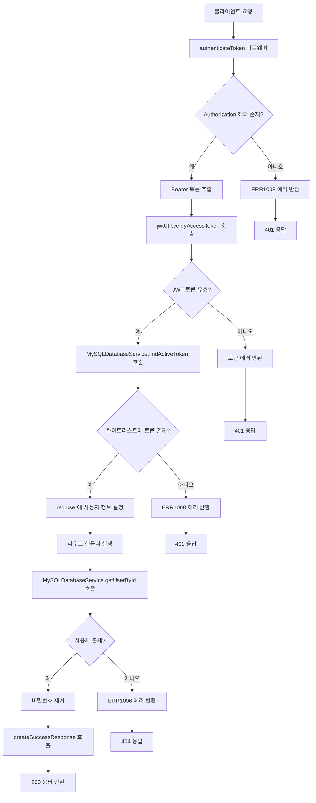
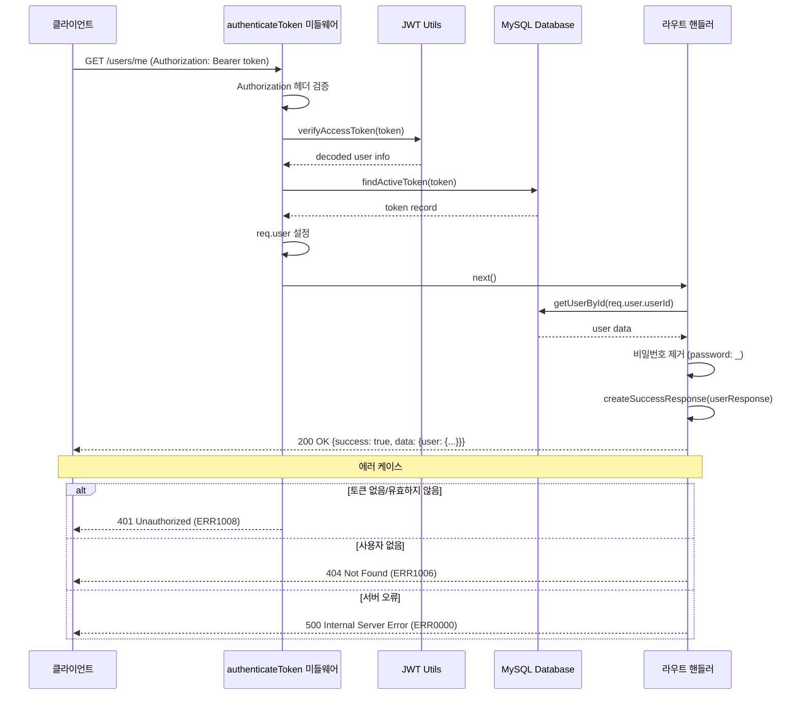
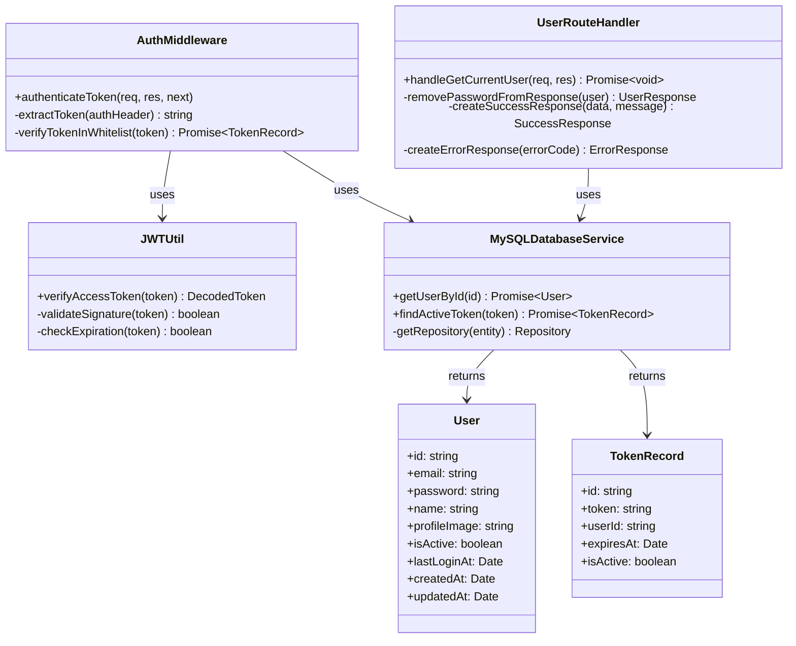

# 현재 사용자 정보 조회 API

## 개요

인증된 사용자의 현재 정보를 조회하는 API입니다. JWT 토큰을 통해 인증된 사용자의 상세 정보를 반환하며, 보안을 위해 비밀번호는 응답에서 제외됩니다. 이 API는 사용자가 자신의 프로필 정보를 확인하거나 프론트엔드에서 사용자 인증 상태를 확인할 때 사용됩니다.

## Request

### Endpoint

| Method | Path |
|---|---|
| GET | /users/me |

### Path Parameters

| 파라미터 | 타입 | 필수 여부 | 설명 |
|---|---|---|---|
| - | - | - | 경로 파라미터 없음 |

### Query Parameters

| 파라미터 | 타입 | 필수 여부 | 설명 |
|---|---|---|---|
| - | - | - | 쿼리 파라미터 없음 |

### Request Headers

| 헤더 | 필수 여부 | 설명 |
|---|---|---|
| Authorization | 필수 | Bearer 토큰 형식의 JWT 액세스 토큰 (예: "Bearer eyJhbGciOiJIUzI1NiIsInR5cCI6IkpXVCJ9...") |
| Content-Type | 권장 | application/json |

### Request Body

| 파라미터 | 타입 | 필수 여부 | 설명 |
|---|---|---|---|
| - | - | - | 요청 본문 없음 |

### 인증 방식

이 API는 JWT (JSON Web Token) 기반의 Bearer 토큰 인증을 사용합니다.

1. **토큰 형식**: Authorization 헤더에 "Bearer {token}" 형식으로 전송
2. **토큰 검증 과정**:
   - JWT 서명 유효성 검증 (`jwtUtil.verifyAccessToken`)
   - 데이터베이스 화이트리스트 검증 (`MySQLDatabaseService.findActiveToken`)
   - 토큰 만료 시간 확인
3. **토큰 정보**: 토큰에는 사용자 ID, 이메일, 이름 정보가 포함됨
4. **인증 실패 시**: ERR1008 에러 코드와 함께 401 Unauthorized 응답

## Response

### Response Status

| HTTP Status | 설명 |
|---|---|
| 200 | 성공적으로 사용자 정보를 조회함 |
| 401 | 인증 실패 (토큰 누락, 만료, 유효하지 않음) |
| 404 | 사용자를 찾을 수 없음 |
| 500 | 서버 내부 오류 |

### Response Headers

| 헤더 | 필수 여부 | 설명 |
|---|---|---|
| Content-Type | 필수 | application/json |

### Response Body

#### 성공 응답 (200 OK)

| 필드 | 타입 | 설명 |
|---|---|---|
| success | boolean | 요청 성공 여부 (항상 true) |
| message | string | 응답 메시지 ("사용자 정보를 조회했습니다.") |
| data | object | 응답 데이터 객체 |
| data.user | object | 사용자 정보 객체 |
| data.user.id | string | 사용자 고유 식별자 (UUID 형식) |
| data.user.email | string | 사용자 이메일 주소 |
| data.user.name | string | 사용자 이름 |
| data.user.profileImage | string \| null | 프로필 이미지 URL (선택적) |
| data.user.isActive | boolean | 사용자 활성 상태 |
| data.user.lastLoginAt | string \| null | 마지막 로그인 시간 (ISO 8601 형식) |
| data.user.createdAt | string | 계정 생성 시간 (ISO 8601 형식) |
| data.user.updatedAt | string | 계정 정보 마지막 수정 시간 (ISO 8601 형식) |

#### 실패 응답

| 필드 | 타입 | 설명 |
|---|---|---|
| success | boolean | 요청 성공 여부 (항상 false) |
| errorCode | string | 에러 코드 |
| message | string | 에러 메시지 |
| statusCode | number | HTTP 상태 코드 |

### Error Code

| 코드 | 설명 |
|---|---|
| ERR1008 | 토큰 관련 오류 (토큰 누락, 만료, 유효하지 않음, 화이트리스트에 없음) |
| ERR1006 | 사용자를 찾을 수 없음 (토큰은 유효하지만 해당 사용자가 데이터베이스에 존재하지 않음) |
| ERR0000 | 서버 내부 오류 (데이터베이스 연결 실패, 예상치 못한 에러 등) |

### Hooks(Callbacks)

이 API는 외부 시스템으로 훅 이벤트를 발생시키지 않습니다.

## Flow

### Flow Chart

### Sequence Diagram

### Class Diagram

## 추가 정보

### 보안 고려사항

1. **비밀번호 제거**: 응답에서 사용자의 비밀번호는 자동으로 제거됩니다 (`const { password: _, ...userResponse } = user`)
2. **토큰 화이트리스트**: JWT 검증 외에 데이터베이스 화이트리스트를 통한 추가 검증 수행
3. **토큰 만료**: 액세스 토큰의 만료 시간은 1시간으로 설정됨

### 성능 최적화

1. **인덱스 활용**: User 엔티티의 기본 키 인덱스를 통한 빠른 조회
2. **캐싱 고려사항**: 자주 조회되는 사용자 정보의 경우 Redis 캐싱 도입 검토 가능

### 데이터베이스 스키마

- **테이블**: users
- **기본 키**: id (UUID, varchar(36))
- **인덱스**: IDX_USER_EMAIL, IDX_USER_CREATED_AT
- **관계**: Token 테이블과 userId로 연결

### 에러 처리 패턴

모든 에러는 `createErrorResponse` 함수를 통해 표준화된 형태로 반환되며, 각 에러 코드는 적절한 HTTP 상태 코드와 매핑됩니다.

### 토큰 관리

- **액세스 토큰**: 1시간 유효
- **리프레시 토큰**: 7일 유효
- **토큰 정리**: 6시간마다 만료된 토큰 자동 정리 (`tokenCleanup.js`)