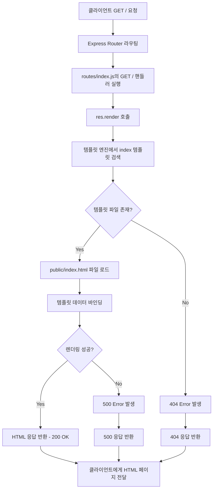
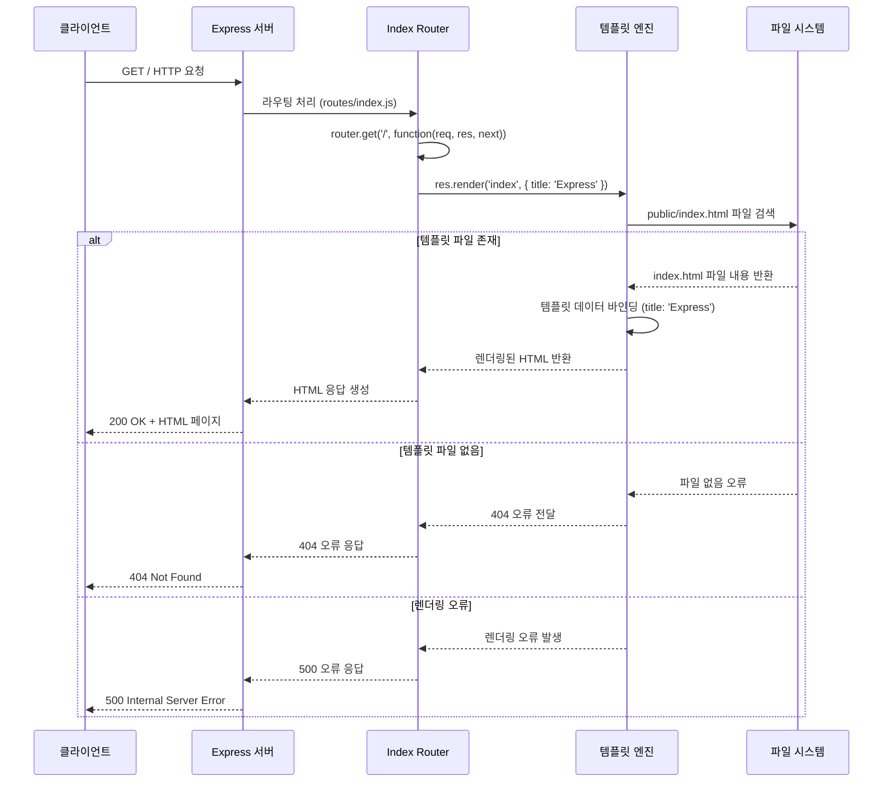
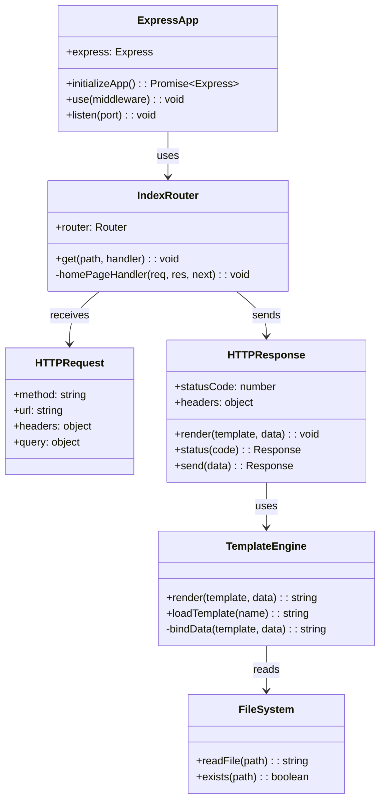

# Home Page API

## 개요

Home Page API는 Express.js 애플리케이션의 루트 경로(/)에 대한 GET 요청을 처리하는 기본 웹페이지 제공 API입니다. 이 API는 정적 HTML 페이지를 렌더링하여 클라이언트에게 응답으로 제공하며, 애플리케이션의 초기 진입점 역할을 수행합니다. Express 기본 템플릿을 사용하여 간단한 환영 메시지를 포함한 홈페이지를 표시합니다.

## Request

### Endpoint

| Method | Path |
|--------|------|
| GET    | /    |

### Path Parameters

| 파라미터 | 타입 | 필수 여부 | 설명 |
|----------|------|-----------|------|
| 없음     | -    | -         | -    |

### Query Parameters

| 파라미터 | 타입 | 필수 여부 | 설명 |
|----------|------|-----------|------|
| 없음     | -    | -         | -    |

### Request Headers

| 헤더          | 필수 여부 | 설명                                    |
|---------------|-----------|----------------------------------------|
| Accept        | 선택      | 클라이언트가 수용 가능한 미디어 타입 지정 |
| User-Agent    | 선택      | 클라이언트 정보                         |
| Cache-Control | 선택      | 캐시 제어 정책                          |

### Request Body

| 파라미터 | 타입 | 필수 여부 | 설명 |
|----------|------|-----------|------|
| 없음     | -    | -         | -    |

### 인증 방식

이 API는 인증이 필요하지 않은 공개 엔드포인트입니다. 별도의 인증 토큰이나 사용자 로그인 없이 누구나 접근할 수 있습니다.

## Response

### Response Status

| HTTP Status | 설명                              |
|-------------|-----------------------------------|
| 200         | 성공적으로 홈페이지를 반환        |
| 404         | 템플릿 파일을 찾을 수 없음        |
| 500         | 서버 내부 오류 (템플릿 렌더링 실패) |

### Response Headers

| 헤더                  | 필수 여부 | 설명                        |
|----------------------|-----------|----------------------------|
| Content-Type         | 필수      | text/html; charset=utf-8   |
| Content-Length       | 필수      | 응답 본문의 크기            |
| X-Powered-By         | 선택      | Express                    |
| Access-Control-Allow-Origin | 필수 | * (CORS 설정에 의해 자동 추가) |
| Access-Control-Allow-Methods | 필수 | GET, POST, PUT, DELETE, OPTIONS |
| Access-Control-Allow-Headers | 필수 | Origin, X-Requested-With, Content-Type, Accept, Authorization |

### Response Body

| 필드 | 타입   | 설명                                              |
|------|--------|---------------------------------------------------|
| HTML | string | 렌더링된 HTML 페이지 전체 내용 (title: "Express") |

### Error Code

| 코드 | 설명                                                    |
|------|---------------------------------------------------------|
| 200  | 정상적으로 홈페이지 HTML이 반환됨                       |
| 404  | 템플릿 파일(index.html)이 존재하지 않음                 |
| 500  | 서버 내부 오류 - 템플릿 렌더링 과정에서 오류 발생       |

### Hooks(Callbacks)

이 API는 외부 시스템으로의 Hook이나 Callback을 발생시키지 않습니다. 단순한 정적 페이지 렌더링만을 수행합니다.

## Flow

### Flow Chart

### Sequence Diagram

### Class Diagram

## 상세 흐름 설명

1. **요청 수신**: 클라이언트가 GET / 요청을 Express 서버로 전송합니다.

2. **라우팅 처리**: Express 애플리케이션의 미들웨어 체인을 통해 요청이 처리되며, `app.use('/', indexRouter)`에 의해 Index Router로 라우팅됩니다.

3. **핸들러 실행**: `routes/index.js:5-7`의 `router.get('/', function(req, res, next))` 핸들러 함수가 실행됩니다.

4. **템플릿 렌더링**: `res.render('index', { title: 'Express' })` 호출을 통해 템플릿 엔진이 'index' 템플릿을 렌더링합니다.

5. **파일 시스템 접근**: 템플릿 엔진이 `public/index.html` 파일을 검색하고 로드합니다.

6. **데이터 바인딩**: 템플릿에 `{ title: 'Express' }` 데이터를 바인딩하여 최종 HTML을 생성합니다.

7. **응답 전송**: 생성된 HTML이 HTTP 200 OK 상태코드와 함께 클라이언트에게 전송됩니다.

## 추가 정보

### 템플릿 시스템
- Express의 기본 템플릿 엔진을 사용하며, 별도의 뷰 엔진 설정이 없어 정적 HTML 파일(`public/index.html`)을 직접 제공합니다.
- 템플릿 데이터로 `{ title: 'Express' }`가 전달되지만, 실제 HTML 파일은 정적 파일이므로 동적 바인딩은 발생하지 않습니다.

### CORS 설정
- `app.js:42-52`에서 모든 origin에 대해 CORS가 활성화되어 있어, 크로스 오리진 요청이 허용됩니다.

### 정적 파일 서빙
- `app.js:58`에서 `express.static(path.join(__dirname, 'public'))`을 통해 public 디렉토리의 정적 파일들이 제공됩니다.

### 의존성
- Express.js 프레임워크 (version ~4.16.1)
- 추가적인 템플릿 엔진 의존성 없음

### 성능 고려사항
- 정적 HTML 파일이므로 캐싱이 가능합니다.
- CDN을 통한 배포 시 성능 향상을 기대할 수 있습니다.
- 파일 시스템 I/O가 발생하므로, 고부하 상황에서는 메모리 캐싱을 고려할 수 있습니다.