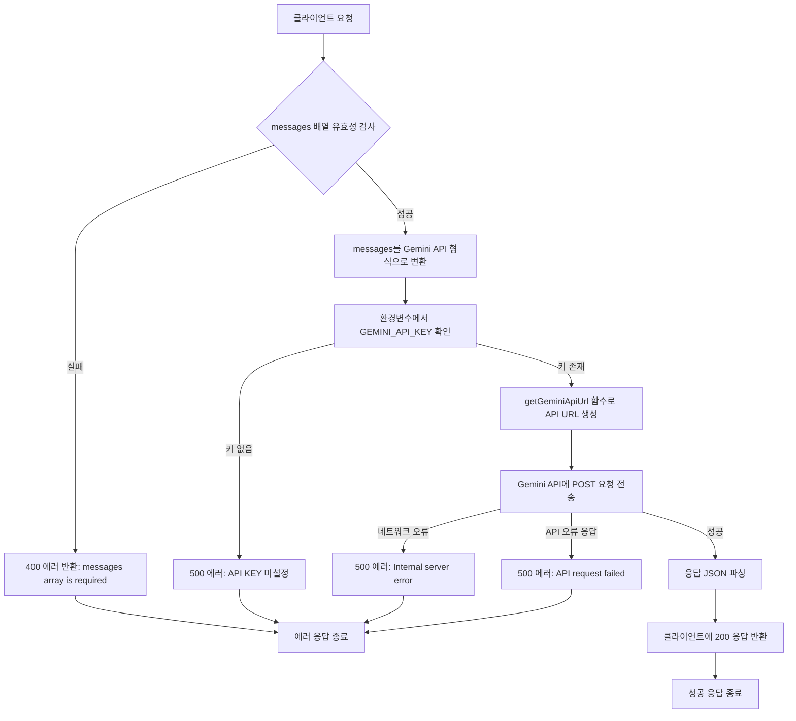
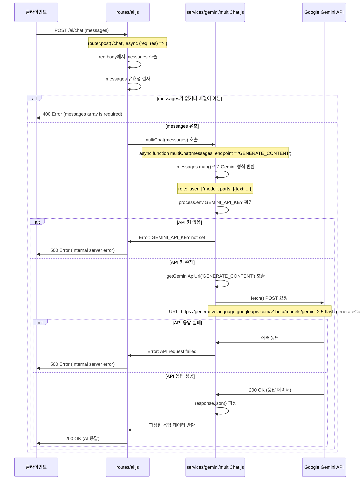
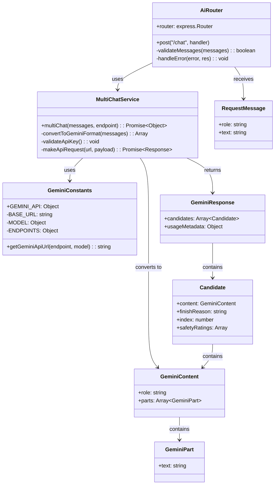

# Multi-turn Gemini chat

## 개요

Multi-turn Gemini chat API는 Google Gemini AI 모델을 사용하여 다중 턴 대화를 수행하는 API입니다. 이 API는 사용자로부터 메시지 배열을 받아서 Gemini AI 모델에 전달하고, AI의 응답을 클라이언트에게 반환합니다. 메시지 배열을 통해 대화의 컨텍스트를 유지하면서 연속적인 대화가 가능하며, 각 메시지는 사용자 또는 모델의 역할과 텍스트 내용을 포함합니다. 내부적으로는 frontend 형식의 메시지를 Gemini API 형식으로 변환하여 처리합니다.

## Request

### Endpoint

| Method | Path |
|--------|------|
| POST | /ai/chat |

### Path Parameters

이 API는 Path Parameter를 사용하지 않습니다.

| 파라미터 | 타입 | 필수 여부 | 설명 |
|----------|------|-----------|------|
| - | - | - | Path Parameter 없음 |

### Query Parameters

이 API는 Query Parameter를 사용하지 않습니다.

| 파라미터 | 타입 | 필수 여부 | 설명 |
|----------|------|-----------|------|
| - | - | - | Query Parameter 없음 |

### Request Headers

| 헤더 | 필수 여부 | 설명 |
|------|-----------|------|
| Content-Type | 예 | application/json 형식으로 요청 본문을 전송 |
| Authorization | 아니오 | 현재 인증이 적용되지 않음 (인증 미들웨어 미적용) |

### Request Body

| 파라미터 | 타입 | 필수 여부 | 설명 |
|----------|------|-----------|------|
| messages | Array | 예 | 대화 메시지 배열. 각 메시지는 role과 text 속성을 포함 |
| messages[].role | String | 예 | 메시지 발신자 역할 ('user' 또는 'assistant'/'model') |
| messages[].text | String | 예 | 메시지 텍스트 내용 |

**Request Body 예시:**
```json
{
  "messages": [
    {
      "role": "user",
      "text": "안녕하세요. 오늘 날씨는 어떤가요?"
    },
    {
      "role": "assistant",
      "text": "안녕하세요! 죄송하지만 저는 실시간 날씨 정보에 접근할 수 없습니다."
    },
    {
      "role": "user",
      "text": "그렇다면 일반적인 날씨 정보를 알려주세요."
    }
  ]
}
```

### 인증 방식

현재 이 API는 인증이 적용되지 않았습니다. routes/ai.js에서 authenticateToken 미들웨어가 적용되지 않아 누구나 접근 가능한 공개 API입니다. 프로덕션 환경에서는 보안을 위해 인증 미들웨어 적용을 고려해야 합니다.

## Response

### Response Status

| HTTP Status | 설명 |
|-------------|------|
| 200 | 성공적으로 AI 응답을 생성하여 반환 |
| 400 | 잘못된 요청 (messages 배열이 누락되거나 유효하지 않음) |
| 500 | 서버 내부 오류 (Gemini API 호출 실패, 네트워크 오류 등) |

### Response Headers

| 헤더 | 필수 여부 | 설명 |
|------|-----------|------|
| Content-Type | 예 | application/json |
| Access-Control-Allow-Origin | 예 | CORS 설정으로 모든 origin 허용 (*) |
| Access-Control-Allow-Methods | 예 | 허용된 HTTP 메서드 목록 |
| Access-Control-Allow-Headers | 예 | 허용된 요청 헤더 목록 |

### Response Body

성공 시 (200):
| 필드 | 타입 | 설명 |
|------|------|------|
| candidates | Array | Gemini API에서 반환된 응답 후보들 |
| candidates[].content | Object | 응답 내용 객체 |
| candidates[].content.parts | Array | 응답 텍스트 파트들 |
| candidates[].content.parts[].text | String | AI가 생성한 응답 텍스트 |
| candidates[].content.role | String | 응답자 역할 (일반적으로 'model') |
| candidates[].finishReason | String | 응답 종료 이유 |
| candidates[].index | Number | 후보 인덱스 |
| candidates[].safetyRatings | Array | 안전성 평가 결과 |
| usageMetadata | Object | API 사용량 메타데이터 |

실패 시 (400):
| 필드 | 타입 | 설명 |
|------|------|------|
| error | String | 오류 메시지 ('messages array is required') |

실패 시 (500):
| 필드 | 타입 | 설명 |
|------|------|------|
| error | String | 오류 메시지 ('Internal server error') |

**Response Body 예시 (성공):**
```json
{
  "candidates": [
    {
      "content": {
        "parts": [
          {
            "text": "일반적인 날씨 패턴에 대해 말씀드리면, 계절에 따라 다양한 기상 현상이 나타납니다..."
          }
        ],
        "role": "model"
      },
      "finishReason": "STOP",
      "index": 0,
      "safetyRatings": [...]
    }
  ],
  "usageMetadata": {
    "promptTokenCount": 15,
    "candidatesTokenCount": 142,
    "totalTokenCount": 157
  }
}
```

### Error code

| 코드 | 설명 |
|------|------|
| 400 | messages array is required - 필수 messages 배열이 누락되거나 유효하지 않음 |
| 500 | Internal server error - Gemini API 호출 실패, 네트워크 오류, 환경변수 누락 등 |
| 500 | GEMINI_API_KEY environment variable is not set - Gemini API 키 환경변수 미설정 |
| 500 | API request failed with status XXX - Gemini API 서버에서 오류 응답 반환 |

### Hooks(Callbacks)

이 API는 외부 시스템으로의 hook이나 callback 이벤트를 발생시키지 않습니다. 단순히 Gemini API를 호출하고 응답을 반환하는 구조입니다.

## Flow

### Flow Chart



### Sequence Diagram



### Class Diagram



## 세부 처리 흐름 설명

1. **요청 수신 및 검증** (routes/ai.js:7-13)
   - Express 라우터가 POST /ai/chat 요청을 수신
   - req.body에서 messages 배열을 추출
   - messages가 존재하고 배열인지 유효성 검사 수행

2. **메시지 형식 변환** (services/gemini/multiChat.js:5-12)
   - frontend 형식의 메시지를 Gemini API 형식으로 변환
   - role: 'user' → 'user', 'assistant'/'model' → 'model'
   - 각 메시지를 {role, parts: [{text}]} 형식으로 변환

3. **API 키 검증** (services/gemini/multiChat.js:14-18)
   - 환경변수에서 GEMINI_API_KEY 확인
   - 키가 없으면 에러 발생

4. **API URL 생성** (constants/gemini.js:11-15)
   - getGeminiApiUrl 함수로 Gemini API 엔드포인트 URL 생성
   - 기본값: gemini-2.5-flash 모델의 generateContent 엔드포인트

5. **Gemini API 호출** (services/gemini/multiChat.js:21-30)
   - fetch를 사용하여 POST 요청 전송
   - x-goog-api-key 헤더에 API 키 포함
   - contents 배열을 요청 본문에 포함

6. **응답 처리** (services/gemini/multiChat.js:32-41)
   - API 응답 상태 확인
   - 성공 시 JSON 파싱하여 반환
   - 실패 시 에러 발생

7. **최종 응답** (routes/ai.js:15-21)
   - multiChat 함수의 결과를 클라이언트에 JSON으로 반환
   - 에러 발생 시 500 상태코드와 함께 에러 메시지 반환

## 추가 정보

### 사용된 Gemini 모델 정보
- **모델명**: gemini-2.5-flash
- **엔드포인트**: generateContent
- **API 버전**: v1beta
- **기본 URL**: https://generativelanguage.googleapis.com/v1beta/models

### 환경 변수 요구사항
- **GEMINI_API_KEY**: Google Gemini API 인증을 위한 API 키 (필수)

### 로깅 및 디버깅
- 요청 메시지와 응답 결과가 콘솔에 로그로 출력됩니다
- 에러 발생 시 상세한 에러 정보가 콘솔에 기록됩니다

### 보안 고려사항
- 현재 인증이 적용되지 않아 누구나 API를 호출할 수 있습니다
- 프로덕션 환경에서는 인증 미들웨어 적용을 권장합니다
- API 키는 환경변수로 관리되어 소스코드에 하드코딩되지 않습니다

### 성능 및 제한사항
- Gemini API의 요청/응답 크기 제한을 준수해야 합니다
- 네트워크 타임아웃이 발생할 수 있으므로 적절한 에러 처리가 필요합니다
- 토큰 사용량은 usageMetadata를 통해 확인할 수 있습니다

### CORS 설정
- 모든 origin에서의 접근이 허용됩니다 (Access-Control-Allow-Origin: *)
- POST 메서드와 필수 헤더들이 허용됩니다
- OPTIONS preflight 요청을 지원합니다