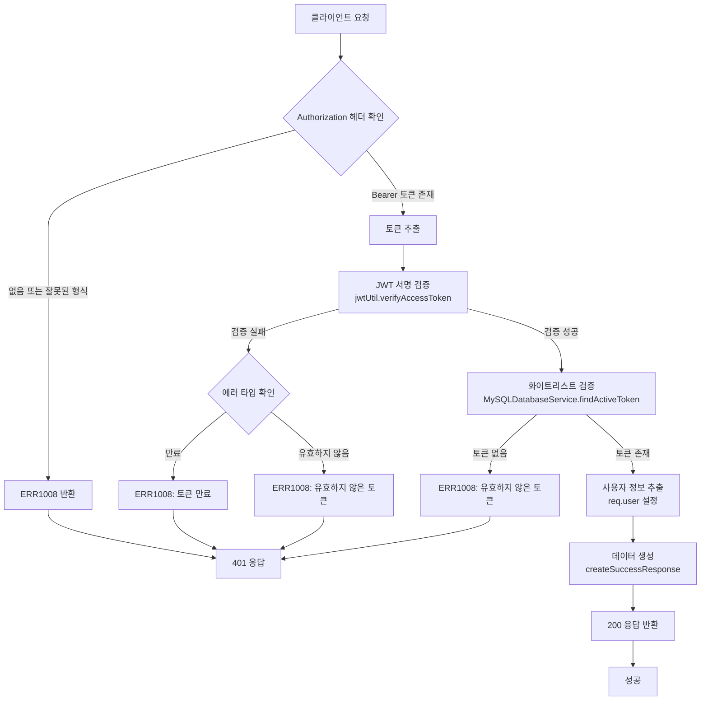
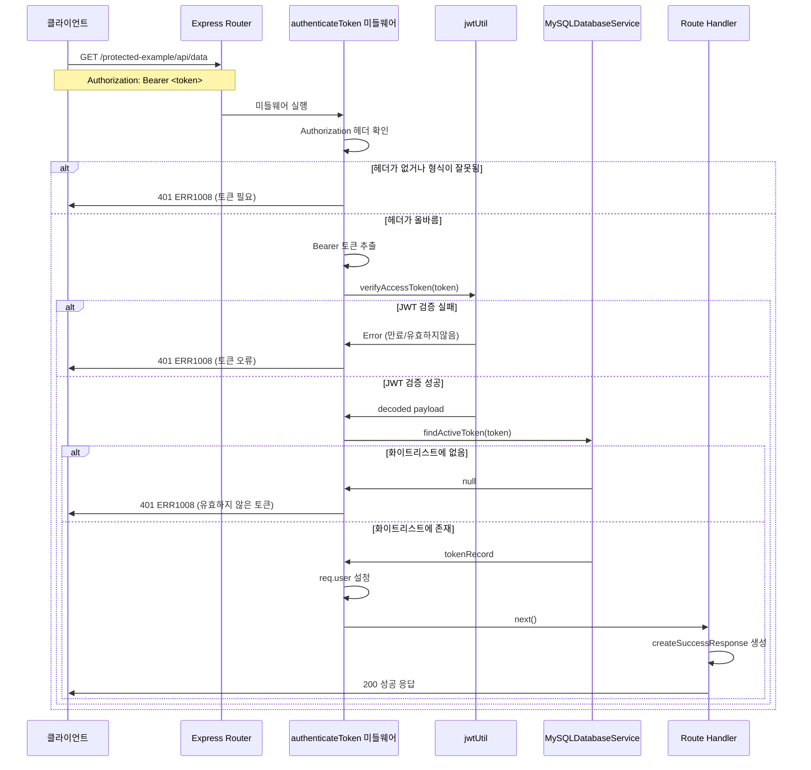
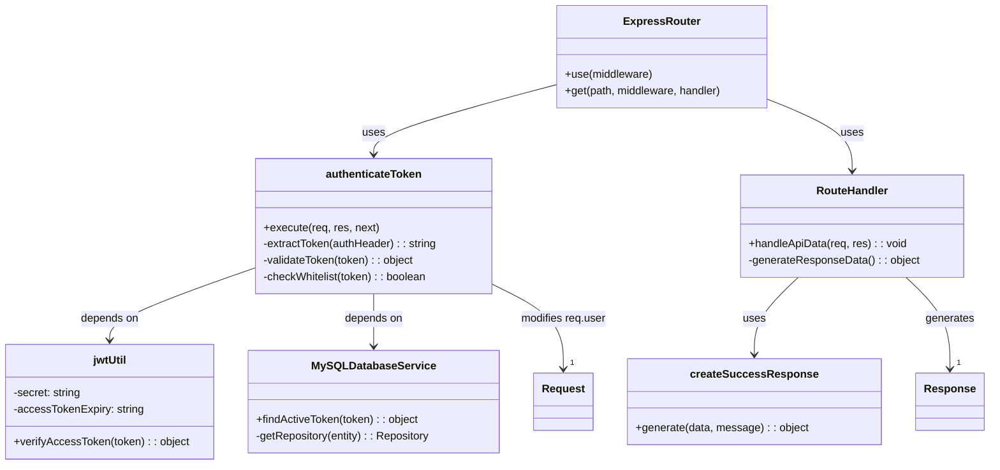

# Protected API Data

## 개요

Protected API Data는 인증된 사용자만 접근할 수 있는 보호된 데이터 조회 API입니다. JWT 토큰 기반 인증을 통해 사용자 검증을 수행하며, 검증된 사용자에게 샘플 데이터 목록과 사용자 ID를 제공합니다. 이 API는 인증 미들웨어의 동작 예시를 보여주는 샘플 엔드포인트로 구현되어 있습니다.

## Request

### Endpoint

| Method | Path |
|--------|------|
| GET | /protected-example/api/data |

### Path Parameters

| 파라미터 | 타입 | 필수 여부 | 설명 |
|----------|------|-----------|------|
| 없음 | - | - | - |

### Query Parameters

| 파라미터 | 타입 | 필수 여부 | 설명 |
|----------|------|-----------|------|
| 없음 | - | - | - |

### Request Headers

| 헤더 | 필수 여부 | 설명 |
|------|-----------|------|
| Authorization | 필수 | Bearer {access_token} 형식의 JWT 토큰 |
| Content-Type | 선택 | application/json (기본값) |

### Request Body

| 파라미터 | 타입 | 필수 여부 | 설명 |
|----------|------|-----------|------|
| 없음 | - | - | - |

### 인증 방식

JWT(JSON Web Token) 기반 Bearer Token 인증을 사용합니다.

1. **토큰 형식**: `Authorization: Bearer <access_token>`
2. **토큰 검증 과정**:
   - Authorization 헤더에서 Bearer 토큰 추출
   - JWT 서명 검증 (`jwtUtil.verifyAccessToken`)
   - 토큰 화이트리스트 검증 (`MySQLDatabaseService.findActiveToken`)
   - 토큰 만료 시간 확인
3. **토큰 유효성**:
   - 토큰은 1시간 유효 (access token)
   - 화이트리스트에 등록된 활성 토큰만 허용
   - 만료되거나 무효한 토큰은 401 에러 반환

## Response

### Response Status

| HTTP Status | 설명 |
|-------------|------|
| 200 | 성공적으로 데이터를 조회함 |
| 401 | 인증 토큰이 없거나 유효하지 않음 |
| 403 | 접근 권한이 없음 |
| 500 | 서버 내부 오류 |

### Response Headers

| 헤더 | 필수 여부 | 설명 |
|------|-----------|------|
| Content-Type | 필수 | application/json |

### Response Body

#### 성공 응답 (200)

| 필드 | 타입 | 설명 |
|------|------|------|
| success | boolean | 요청 성공 여부 (true) |
| message | string | 응답 메시지 ("데이터를 조회했습니다.") |
| data | object | 응답 데이터 객체 |
| data.data | array | 샘플 데이터 배열 ["item1", "item2", "item3"] |
| data.userId | number | 인증된 사용자의 ID |

#### 에러 응답

| 필드 | 타입 | 설명 |
|------|------|------|
| success | boolean | 요청 성공 여부 (false) |
| errorCode | string | 에러 코드 |
| message | string | 에러 메시지 |
| statusCode | number | HTTP 상태 코드 |

### Error Code

| 코드 | 설명 |
|------|------|
| ERR1008 | 인증 토큰이 필요합니다 / 유효하지 않은 토큰입니다 / 토큰이 만료되었습니다 |
| ERR1009 | 접근 권한이 없습니다 |
| ERR0000 | 서버 오류가 발생했습니다 |
| ERR0001 | 알 수 없는 오류가 발생했습니다 |

### Hooks(Callbacks)

| Hook 타입 | 설명 |
|-----------|------|
| 없음 | 이 API는 외부 시스템으로의 콜백이나 웹훅을 발생시키지 않습니다 |

## Flow

### Flow Chart

### Sequence Diagram

### Class Diagram

### 상세 Flow 설명

1. **요청 수신 단계**:
   - 클라이언트가 `GET /protected-example/api/data` 요청을 전송
   - Express 라우터가 요청을 수신하고 `router.use('/api/*', authenticateToken)` 미들웨어 실행

2. **인증 검증 단계**:
   - `authenticateToken` 미들웨어가 실행됨 (`middleware/auth.js:11`)
   - Authorization 헤더에서 Bearer 토큰 추출 (`middleware/auth.js:14-21`)
   - `jwtUtil.verifyAccessToken(token)` 호출하여 JWT 서명 검증 (`middleware/auth.js:24`)

3. **화이트리스트 검증 단계**:
   - `MySQLDatabaseService.findActiveToken(token)` 호출 (`middleware/auth.js:27`)
   - 데이터베이스에서 토큰이 활성 상태인지 확인
   - 토큰이 유효하면 `req.user` 객체에 사용자 정보 설정 (`middleware/auth.js:34-38`)

4. **응답 생성 단계**:
   - 라우트 핸들러 실행 (`routes/protected-example.js:47`)
   - `createSuccessResponse` 함수로 성공 응답 생성 (`routes/protected-example.js:49-55`)
   - 샘플 데이터와 사용자 ID를 포함한 응답 반환

5. **에러 처리**:
   - 각 단계에서 실패 시 해당하는 에러 코드와 메시지로 401 응답 반환
   - JWT 만료, 유효하지 않은 토큰, 화이트리스트 없음 등의 상황별 처리

## 추가 정보

### 보안 고려사항

1. **이중 검증 구조**: JWT 서명 검증과 데이터베이스 화이트리스트 검증을 모두 수행하여 보안성 강화
2. **토큰 만료 관리**: Access Token은 1시간 유효하며, 만료 시 재발급 필요
3. **토큰 무효화**: 로그아웃 시 화이트리스트에서 제거하여 토큰 무효화 가능

### 개발 시 주의사항

1. **미들웨어 순서**: `/api/*` 경로에 대해 `authenticateToken` 미들웨어가 자동 적용됨
2. **사용자 정보 접근**: 핸들러에서 `req.user`를 통해 인증된 사용자 정보 접근 가능
3. **토큰 형식**: Authorization 헤더는 반드시 `Bearer ` 접두사 포함 필요

### 확장 가능성

1. **데이터 동적화**: 현재는 하드코딩된 샘플 데이터이지만, 실제 비즈니스 로직으로 대체 가능
2. **권한 세분화**: `requireRole` 미들웨어를 추가하여 역할 기반 접근 제어 구현 가능
3. **로깅 및 모니터링**: 인증 실패 로그 기록 및 보안 이벤트 모니터링 추가 가능