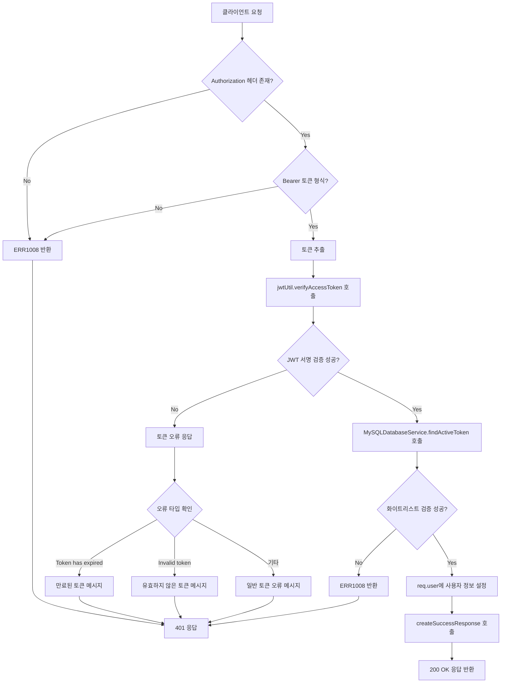
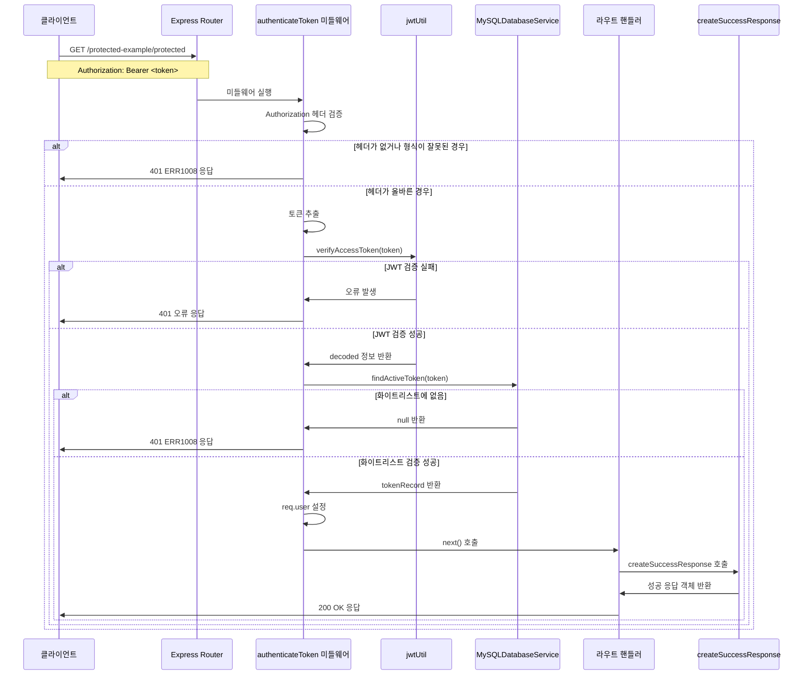
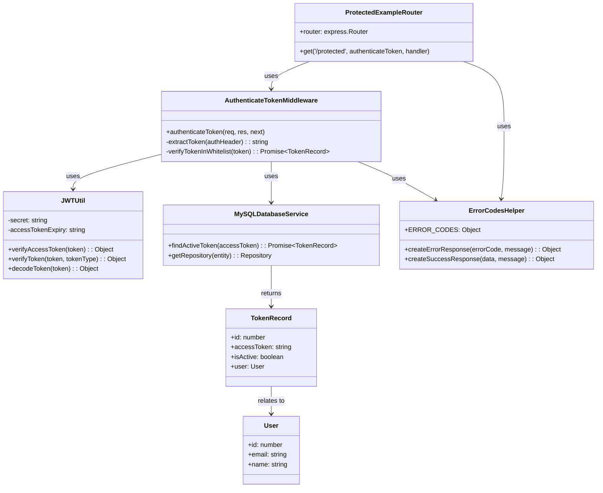

# Protected Resource Access

## 개요

이 API는 JWT 토큰 기반 인증이 필요한 보호된 리소스에 접근하기 위한 엔드포인트입니다. 유효한 JWT 액세스 토큰을 가진 인증된 사용자만이 해당 리소스에 접근할 수 있으며, 인증이 성공하면 현재 로그인한 사용자의 정보와 함께 성공 메시지를 반환합니다. 이 API는 주로 인증 시스템의 테스트 및 예시 목적으로 사용되며, 실제 프로덕션 환경에서는 보호가 필요한 실제 리소스나 기능을 제공하는 엔드포인트의 기반이 됩니다.

## Request

### Endpoint

| Method | Path |
|--------|------|
| GET | /protected-example/protected |

### Path Parameters

| 파라미터 | 타입 | 필수 여부 | 설명 |
|----------|------|-----------|------|
| - | - | - | 이 API는 경로 매개변수를 사용하지 않습니다. |

### Query Parameters

| 파라미터 | 타입 | 필수 여부 | 설명 |
|----------|------|-----------|------|
| - | - | - | 이 API는 쿼리 매개변수를 사용하지 않습니다. |

### Request Headers

| 헤더 | 필수 여부 | 설명 |
|------|-----------|------|
| Authorization | 필수 | Bearer 토큰 형식의 JWT 액세스 토큰 (예: "Bearer eyJhbGciOiJIUzI1NiIsInR5cCI6IkpXVCJ9...") |
| Content-Type | 선택 | application/json (GET 요청이므로 일반적으로 불필요) |

### Request Body

| 파라미터 | 타입 | 필수 여부 | 설명 |
|----------|------|-----------|------|
| - | - | - | GET 요청이므로 요청 본문이 없습니다. |

### 인증 방식

이 API는 JWT(JSON Web Token) 기반의 Bearer 토큰 인증을 사용합니다. 인증 프로세스는 다음과 같습니다:

1. **토큰 추출**: Authorization 헤더에서 "Bearer " 접두사를 제거하고 JWT 토큰을 추출합니다.
2. **토큰 서명 검증**: JWT 라이브러리를 사용하여 토큰의 서명을 검증하고 만료 시간을 확인합니다.
3. **화이트리스트 검증**: 데이터베이스의 Token 테이블에서 해당 토큰이 활성 상태(isActive: true)인지 확인합니다.
4. **사용자 정보 추가**: 검증이 완료되면 요청 객체(req.user)에 사용자 정보(userId, email, name)를 추가합니다.

토큰의 유효성 검사에서 실패할 경우 401 Unauthorized 또는 관련 오류 코드가 반환됩니다.

## Response

### Response Status

| HTTP Status | 설명 |
|-------------|------|
| 200 | 인증 성공 및 보호된 리소스 접근 성공 |
| 401 | 인증 실패 (토큰 없음, 유효하지 않은 토큰, 만료된 토큰) |
| 403 | 권한 없음 (토큰은 유효하지만 접근 권한 부족) |
| 500 | 서버 내부 오류 |

### Response Headers

| 헤더 | 필수 여부 | 설명 |
|------|-----------|------|
| Content-Type | 항상 | application/json; charset=utf-8 |
| X-Powered-By | 선택 | Express (Express.js 기본 헤더) |

### Response Body

| 필드 | 타입 | 설명 |
|------|------|------|
| success | boolean | 요청 성공 여부 (항상 true) |
| message | string | 성공 메시지 ("인증된 사용자만 접근 가능합니다.") |
| data | object | 응답 데이터 객체 |
| data.message | string | 보호된 리소스 접근 확인 메시지 ("보호된 리소스에 접근했습니다.") |
| data.user | object | 현재 인증된 사용자의 정보 |
| data.user.userId | number | 사용자의 고유 ID |
| data.user.email | string | 사용자의 이메일 주소 |
| data.user.name | string | 사용자의 이름 |

### Error Code

| 코드 | 설명 |
|------|------|
| ERR1008 | 토큰 관련 오류 (토큰 없음, 유효하지 않은 토큰, 만료된 토큰, 화이트리스트에 없는 토큰) |
| ERR0000 | 일반적인 서버 오류 |
| ERR0001 | 알 수 없는 오류 |

### Hooks(Callbacks)

이 API는 외부 시스템으로의 훅 이벤트를 발생시키지 않습니다. 단순히 인증 검증 후 사용자 정보를 반환하는 역할만 수행합니다.

## Flow

### Flow Chart

### Sequence Diagram

### Class Diagram

## 텍스트 흐름 설명

1. **요청 수신**: 클라이언트가 GET /protected-example/protected 엔드포인트로 요청을 보냅니다.

2. **미들웨어 실행**: Express 라우터가 `authenticateToken` 미들웨어를 실행합니다.

3. **헤더 검증**: 미들웨어가 `req.headers.authorization`에서 Authorization 헤더를 확인하고, "Bearer " 형식인지 검증합니다.

4. **토큰 추출**: Authorization 헤더에서 "Bearer " 접두사를 제거하여 JWT 토큰을 추출합니다(`authHeader.split(' ')[1]`).

5. **JWT 검증**: `jwtUtil.verifyAccessToken(token)` 함수를 호출하여 토큰의 서명과 만료 시간을 검증합니다.

6. **화이트리스트 검증**: `MySQLDatabaseService.findActiveToken(token)` 함수를 호출하여 데이터베이스에서 토큰이 활성 상태인지 확인합니다.

7. **사용자 정보 설정**: 모든 검증이 성공하면 `req.user` 객체에 디코딩된 사용자 정보(userId, email, name)를 설정합니다.

8. **라우트 핸들러 실행**: `next()` 함수를 호출하여 실제 라우트 핸들러로 제어를 넘깁니다.

9. **응답 생성**: 라우트 핸들러에서 `createSuccessResponse()` 함수를 호출하여 성공 응답 객체를 생성합니다.

10. **응답 반환**: 200 상태 코드와 함께 성공 응답을 클라이언트에게 반환합니다.

### 오류 처리 흐름

- **인증 실패 시**: 각 단계에서 검증이 실패하면 `createErrorResponse()` 함수를 사용하여 적절한 오류 코드(주로 ERR1008)와 메시지를 포함한 401 응답을 반환합니다.
- **서버 오류 시**: 예상치 못한 오류가 발생하면 ERR0000 코드와 함께 500 응답을 반환합니다.

## 추가 정보

### 보안 고려사항

1. **이중 검증**: JWT 서명 검증과 데이터베이스 화이트리스트 검증을 모두 수행하여 보안을 강화합니다.
2. **토큰 만료**: JWT 자체의 만료 시간과 데이터베이스의 활성 상태를 모두 확인합니다.
3. **오류 메시지**: 보안상 구체적인 실패 이유를 노출하지 않고 일관된 오류 메시지를 반환합니다.

### 사용 사례

1. **인증 테스트**: 클라이언트 애플리케이션에서 인증 시스템이 올바르게 작동하는지 테스트할 때 사용
2. **권한 확인**: 사용자가 로그인 상태인지 확인하고 사용자 정보를 가져올 때 사용
3. **개발 예시**: 다른 보호된 API를 개발할 때 참고할 수 있는 인증 패턴 예시

### 의존성

- **Express.js**: 웹 프레임워크
- **jsonwebtoken**: JWT 토큰 처리
- **TypeORM**: 데이터베이스 ORM
- **MySQL**: 데이터베이스
- **crypto**: 암호화 유틸리티

### 환경 변수

- `JWT_SECRET`: JWT 토큰 서명에 사용되는 비밀 키
- 데이터베이스 연결 관련 환경 변수들 (DB_HOST, DB_PORT, DB_USER, DB_PASSWORD, DB_NAME)