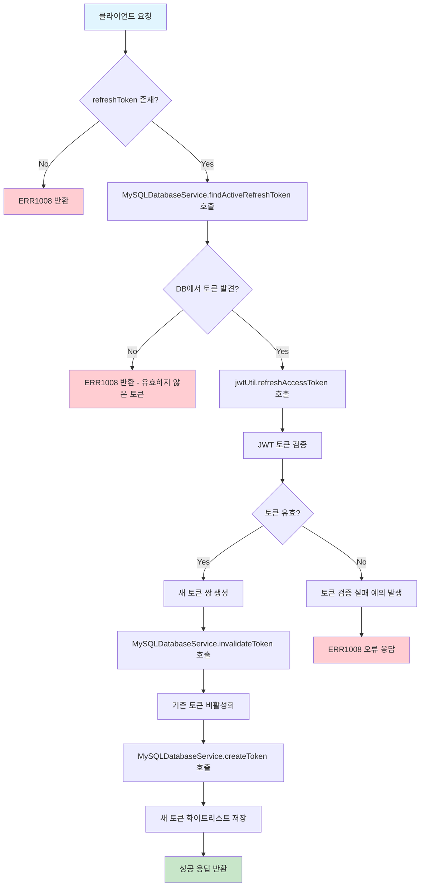
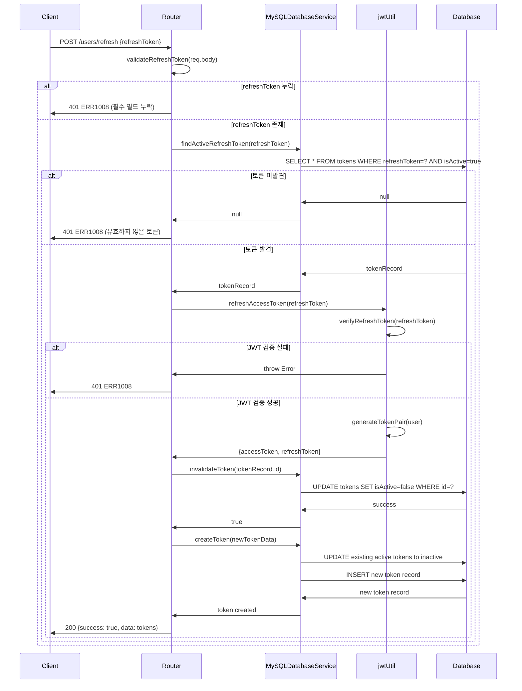
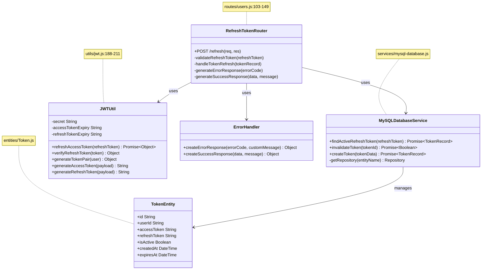

# 액세스 토큰 갱신 API

## 개요

이 API는 클라이언트가 만료된 액세스 토큰을 갱신하기 위해 사용됩니다. 클라이언트는 유효한 리프레시 토큰을 제공하여 새로운 액세스 토큰과 리프레시 토큰 쌍을 받을 수 있습니다. 기존 토큰은 보안상의 이유로 즉시 무효화되며, 새로운 토큰 쌍이 데이터베이스의 화이트리스트에 저장됩니다. 이 API는 토큰 기반 인증 시스템에서 사용자 세션의 연속성을 보장하는 핵심적인 역할을 합니다.

## Request

### Endpoint

| 항목 | 값 |
|------|-----|
| Method | POST |
| Path | /users/refresh |

### Path Parameters

| 파라미터 | 타입 | 필수 여부 | 설명 |
|----------|------|-----------|------|
| 없음 | - | - | - |

### Query Parameters

| 파라미터 | 타입 | 필수 여부 | 설명 |
|----------|------|-----------|------|
| 없음 | - | - | - |

### Request Headers

| 헤더 | 필수 여부 | 설명 |
|------|-----------|------|
| Content-Type | 필수 | application/json 형식으로 요청 본문을 전송해야 함 |

### Request Body

| 파라미터 | 타입 | 필수 여부 | 설명 |
|----------|------|-----------|------|
| refreshToken | String | 필수 | 유효한 리프레시 토큰. JWT 형식이며 최대 500자까지 허용됨. 데이터베이스의 화이트리스트에 존재하고 활성 상태여야 함 |

### 인증 방식

이 API는 별도의 인증 헤더를 요구하지 않습니다. 대신 요청 본문에 포함된 `refreshToken`을 통해 인증을 수행합니다. 리프레시 토큰은 JWT 형식으로 다음과 같은 검증 과정을 거칩니다:

1. **JWT 서명 검증**: JWT_SECRET을 사용하여 토큰의 서명을 검증
2. **토큰 타입 확인**: 토큰의 type 필드가 'refresh'인지 확인
3. **만료 시간 검증**: 토큰이 아직 만료되지 않았는지 확인
4. **화이트리스트 검증**: 데이터베이스에서 해당 토큰이 활성 상태로 존재하는지 확인
5. **발급자/대상 검증**: issuer가 'ai-web-chatting', audience가 'ai-web-chatting-users'인지 확인

## Response

### Response Status

| HTTP Status | 설명 |
|-------------|------|
| 200 | 토큰 갱신 성공 |
| 401 | 유효하지 않은 리프레시 토큰 (ERR1008) |
| 500 | 서버 내부 오류 |

### Response Headers

| 헤더 | 필수 여부 | 설명 |
|------|-----------|------|
| Content-Type | 필수 | application/json; charset=utf-8 |

### Response Body

**성공 응답 (200 OK)**

| 필드 | 타입 | 설명 |
|------|------|------|
| success | Boolean | 항상 true |
| message | String | 성공 메시지: "토큰이 갱신되었습니다." |
| data | Object | 새로 발급된 토큰 정보 |
| data.accessToken | String | 새로운 액세스 토큰 (JWT 형식, 1시간 유효) |
| data.refreshToken | String | 새로운 리프레시 토큰 (JWT 형식, 5시간 유효) |

**오류 응답**

| 필드 | 타입 | 설명 |
|------|------|------|
| success | Boolean | 항상 false |
| errorCode | String | 오류 코드 |
| message | String | 오류 메시지 |
| statusCode | Number | HTTP 상태 코드 |

### Error Code

| 코드 | 설명 |
|------|------|
| ERR1008 | 유효하지 않은 토큰입니다. (리프레시 토큰이 누락되었거나, 만료되었거나, 화이트리스트에 없는 경우) |
| ERR0000 | 서버 오류가 발생했습니다. (예상치 못한 내부 오류) |

### Hooks(Callbacks)

이 API는 외부 시스템으로의 hook 이벤트를 발생시키지 않습니다.

## Flow

### Flow Chart

### Sequence Diagram

### Class Diagram

## 추가 정보

### 보안 고려사항

1. **토큰 순환 정책**: 새로운 토큰 쌍을 발급할 때 기존 토큰은 즉시 무효화되어 토큰 재사용 공격을 방지합니다.

2. **화이트리스트 관리**: 모든 유효한 토큰은 데이터베이스에 저장되며, 서버가 재시작되어도 토큰 상태가 유지됩니다.

3. **토큰 만료 시간**: 
   - 액세스 토큰: 1시간
   - 리프레시 토큰: 5시간
   - 데이터베이스 레코드 만료: 5시간

### 데이터베이스 스키마

**tokens 테이블 구조**
- `id`: UUID 기본키
- `userId`: 사용자 ID (외래키)
- `accessToken`: 액세스 토큰 (고유 인덱스)
- `refreshToken`: 리프레시 토큰 (고유 인덱스)
- `isActive`: 활성 상태 (인덱스)
- `createdAt`: 생성 시간
- `expiresAt`: 만료 시간

### 토큰 정리 메커니즘

시스템은 6시간마다 만료된 토큰을 자동으로 정리하는 백그라운드 작업을 수행합니다.

### 에러 처리 전략

모든 예외는 try-catch 블록으로 처리되며, 예상치 못한 오류는 ERR1008로 표준화되어 클라이언트에게 일관된 형태로 전달됩니다.

### 성능 최적화

- 토큰 조회 시 `refreshToken`과 `isActive` 필드에 대한 복합 인덱스 사용
- 데이터베이스 연결 풀링을 통한 연결 최적화
- TypeORM의 Repository 패턴을 통한 효율적인 쿼리 실행