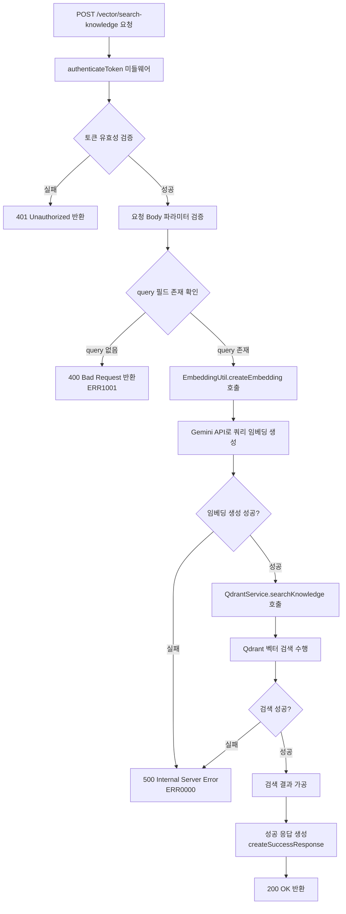
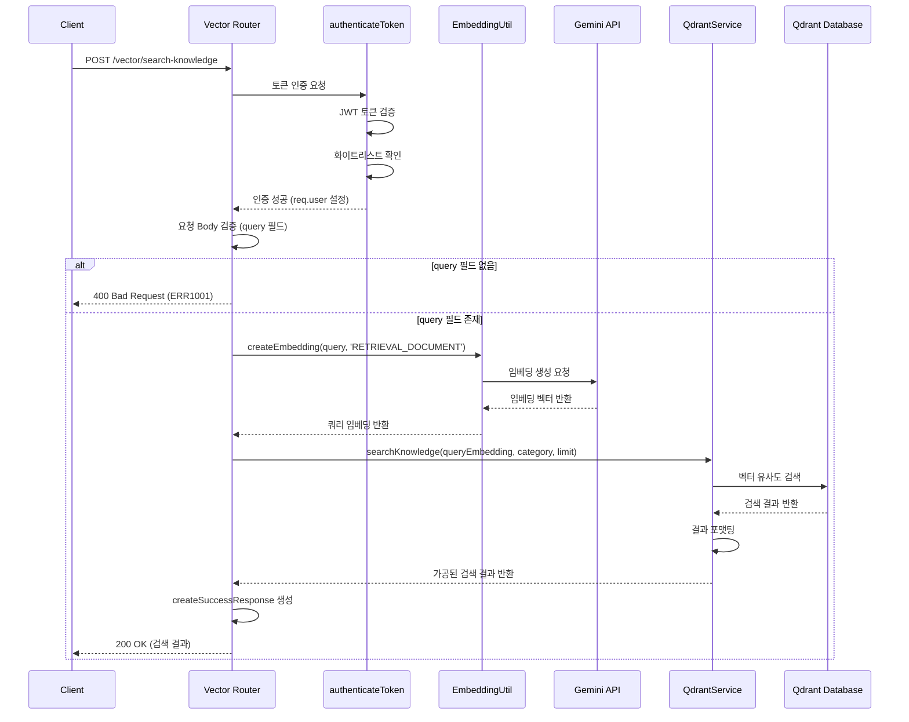
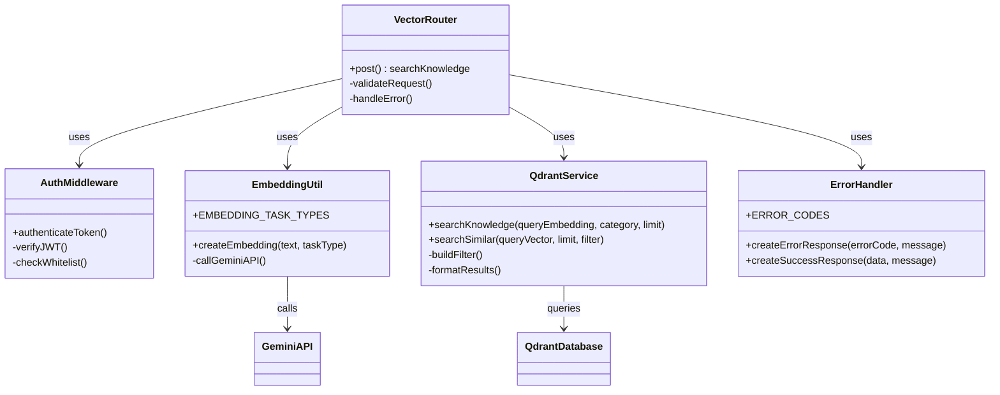

# Knowledge Base Search API

## 개요

지식 베이스에서 관련 문서를 검색하는 API입니다. 사용자가 입력한 검색 쿼리를 Gemini AI의 임베딩 모델을 사용하여 벡터로 변환한 후, Qdrant 벡터 데이터베이스에서 유사도 기반 검색을 수행합니다. 카테고리별 필터링을 지원하며, 검색 결과는 유사도 점수와 함께 반환됩니다. RAG(Retrieval-Augmented Generation) 시스템의 핵심 구성 요소로 활용됩니다.

## Request

### Endpoint

| Method | Path |
|---|---|
| POST | /vector/search-knowledge |

### Path Parameters

이 API는 Path Parameter를 사용하지 않습니다.

| 파라미터 | 타입 | 필수 여부 | 설명 |
|---|---|---|---|
| - | - | - | Path Parameter 없음 |

### Query Parameters

이 API는 Query Parameter를 사용하지 않습니다.

| 파라미터 | 타입 | 필수 여부 | 설명 |
|---|---|---|---|
| - | - | - | Query Parameter 없음 |

### Request Headers

| 헤더 | 필수 여부 | 설명 |
|---|---|---|
| Authorization | 필수 | JWT 액세스 토큰 (Bearer {token} 형식) |
| Content-Type | 필수 | application/json |

### Request Body

| 파라미터 | 타입 | 필수 여부 | 설명 |
|---|---|---|---|
| query | string | 필수 | 검색할 쿼리 텍스트 |
| category | string | 선택 | 검색할 카테고리 필터 (미제공 시 전체 카테고리 검색) |
| limit | number | 선택 | 검색 결과 개수 제한 (기본값: 3) |

### 인증 방식

JWT 토큰 기반 인증을 사용합니다. 요청 시 Authorization 헤더에 "Bearer {액세스_토큰}" 형식으로 전송해야 합니다. 인증 미들웨어(authenticateToken)에서 다음 단계를 수행합니다:

1. Authorization 헤더 검증 및 토큰 추출
2. JWT 서명 검증을 통한 토큰 유효성 확인
3. 데이터베이스의 토큰 화이트리스트에서 활성 토큰 여부 확인
4. 검증 성공 시 사용자 정보를 req.user 객체에 설정

## Response

### Response Status

| HTTP Status | 설명 |
|---|---|
| 200 | 지식 검색 성공 |
| 400 | 잘못된 요청 (검색 쿼리 누락) |
| 401 | 인증 실패 (토큰 없음, 만료, 유효하지 않음) |
| 500 | 서버 내부 오류 |

### Response Headers

| 헤더 | 필수 여부 | 설명 |
|---|---|---|
| Content-Type | 필수 | application/json |

### Response Body

| 필드 | 타입 | 설명 |
|---|---|---|
| success | boolean | 응답 성공 여부 |
| message | string | 응답 메시지 |
| data | object | 검색 결과 데이터 |
| data.query | string | 검색에 사용된 쿼리 |
| data.results | array | 검색 결과 배열 |
| data.results[].content | string | 문서 내용 |
| data.results[].title | string | 문서 제목 |
| data.results[].score | number | 유사도 점수 (0-1 사이) |
| data.results[].metadata | object | 문서 메타데이터 |
| data.count | number | 검색된 결과 개수 |
| errorCode | string | 오류 발생 시 에러 코드 |

### Error Code

| 코드 | 설명 |
|---|---|
| ERR1001 | 검색 쿼리가 필요합니다 |
| ERR1008 | 유효하지 않은 토큰입니다 |
| ERR0000 | 서버 오류가 발생했습니다 |

### Hooks(Callbacks)

이 API는 외부 시스템으로의 Hook 이벤트를 발생시키지 않습니다.

| 항목 | 내용 |
|---|---|
| Hook 발생 | 없음 |

## Flow

### Flow Chart

### Sequence Diagram

### Class Diagram

## 추가 정보

### 임베딩 모델 정보
- **사용 모델**: Google Gemini embedding-exp-03-07
- **벡터 차원**: 1536차원
- **태스크 타입**: RETRIEVAL_DOCUMENT (문서 검색용)

### 검색 메커니즘
- **유사도 측정**: 코사인 유사도 기반
- **검색 엔진**: Qdrant 벡터 데이터베이스
- **필터링**: 카테고리별 필터 지원
- **결과 정렬**: 유사도 점수 기준 내림차순

### 카테고리 필터링
- category 파라미터 제공 시: 해당 카테고리 내에서만 검색
- category 파라미터 미제공 시: 전체 카테고리에서 검색
- 필터 구조: `{ must: [{ key: 'category', match: { value: category } }] }`

### 성능 고려사항
- Gemini API 호출로 인한 지연시간 발생 가능
- 임베딩 벡터 캐싱을 통한 성능 최적화 검토 필요
- Qdrant 인덱스 최적화를 통한 검색 속도 향상

### 보안 고려사항
- JWT 토큰 기반 인증으로 접근 제어
- 토큰 화이트리스트를 통한 추가 보안 계층
- 검색 쿼리 길이 제한 및 입력 검증 필요

### 연관 API
- `POST /vector/store-knowledge`: 지식 베이스 문서 저장
- `POST /ai/chat/tool`: RAG 기반 채팅에서 이 API 활용
- `POST /vector/search-similar`: 일반 메시지 유사도 검색