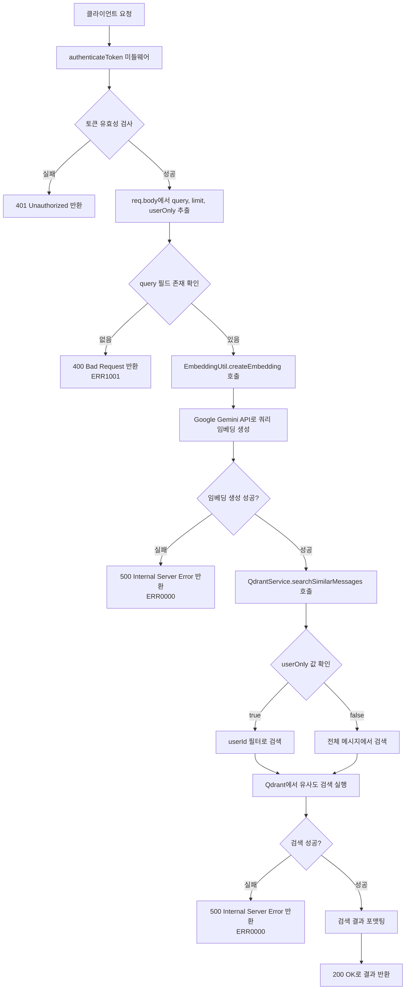
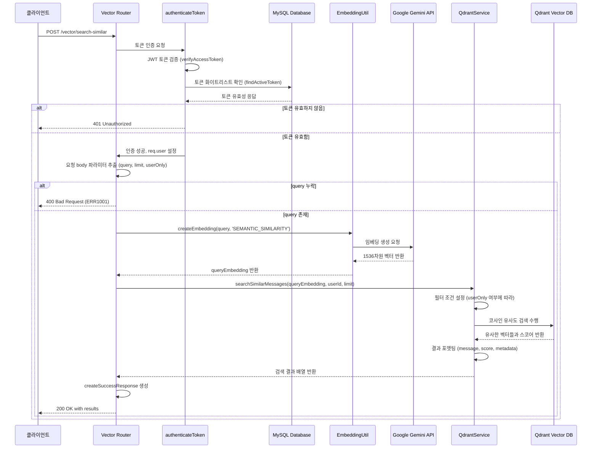

# 유사 메시지 검색 API

## 개요

이 API는 사용자가 입력한 검색 쿼리와 의미적으로 유사한 채팅 메시지들을 벡터 데이터베이스(Qdrant)에서 검색하여 반환하는 기능을 제공합니다. Google Gemini 임베딩 모델을 사용하여 검색 쿼리를 벡터로 변환한 후, 이전에 저장된 채팅 메시지들의 임베딩 벡터와 코사인 유사도를 계산하여 가장 유사한 메시지들을 찾아 반환합니다. 선택적으로 특정 사용자의 메시지만 검색하도록 필터링할 수 있습니다.

## Request

### Endpoint

| Method | Path |
|--------|------|
| POST | /vector/search-similar |

### Path Parameters

| 파라미터 | 타입 | 필수 여부 | 설명 |
|---------|------|----------|------|
| 없음 | - | - | - |

### Query Parameters

| 파라미터 | 타입 | 필수 여부 | 설명 |
|---------|------|----------|------|
| 없음 | - | - | - |

### Request Headers

| 헤더 | 필수 여부 | 설명 |
|------|----------|------|
| Authorization | 필수 | Bearer {JWT_ACCESS_TOKEN} 형식의 인증 토큰 |
| Content-Type | 필수 | application/json |

### Request Body

| 파라미터 | 타입 | 필수 여부 | 설명 |
|---------|------|----------|------|
| query | string | 필수 | 검색할 쿼리 텍스트 |
| limit | number | 선택 | 반환할 결과의 최대 개수 (기본값: 5) |
| userOnly | boolean | 선택 | true인 경우 요청자의 메시지만 검색, false인 경우 전체 메시지 검색 (기본값: false) |

### 인증 방식

이 API는 JWT 기반 Bearer 토큰 인증을 사용합니다. 요청 시 Authorization 헤더에 `Bearer {access_token}` 형식으로 유효한 액세스 토큰을 포함해야 합니다. 토큰은 다음과 같이 검증됩니다:

1. JWT 서명 검증을 통한 토큰 유효성 확인
2. 데이터베이스의 토큰 화이트리스트를 통한 토큰 활성 상태 확인
3. 토큰에서 추출한 사용자 정보(userId, email, name)를 요청 컨텍스트에 설정

## Response

### Response Status

| HTTP Status | 설명 |
|------------|------|
| 200 | 검색 성공 |
| 400 | 잘못된 요청 (검색 쿼리 누락) |
| 401 | 인증 실패 (토큰 없음, 만료, 유효하지 않음) |
| 403 | 권한 없음 |
| 500 | 서버 내부 오류 |

### Response Headers

| 헤더 | 필수 여부 | 설명 |
|------|----------|------|
| Content-Type | 필수 | application/json |

### Response Body

| 필드 | 타입 | 설명 |
|------|------|------|
| success | boolean | 요청 성공 여부 (true: 성공, false: 실패) |
| message | string | 응답 메시지 |
| data | object | 검색 결과 데이터 |
| data.query | string | 검색에 사용된 쿼리 텍스트 |
| data.results | array | 검색 결과 배열 |
| data.results[].message | string | 유사한 메시지 내용 |
| data.results[].score | number | 유사도 점수 (0~1, 1에 가까울수록 유사) |
| data.results[].metadata | object | 메시지 메타데이터 |
| data.results[].metadata.userId | string | 메시지 작성자 ID |
| data.results[].metadata.roomId | string | 채팅방 ID |
| data.results[].metadata.role | string | 메시지 역할 (user, assistant 등) |
| data.results[].metadata.createdAt | string | 메시지 생성 시간 (ISO 8601 형식) |
| data.count | number | 반환된 결과의 개수 |
| errorCode | string | 오류 발생 시 오류 코드 |

### Error Code

| 코드 | 설명 |
|------|------|
| ERR0000 | 서버 오류가 발생했습니다 |
| ERR1001 | 검색 쿼리가 필요합니다 |
| ERR1008 | 유효하지 않은 토큰입니다 |

### Hooks(Callbacks)

이 API는 외부 시스템으로 이벤트를 발생시키지 않습니다.

## Flow

### Flow Chart



### Sequence Diagram



### Class Diagram

```mermaid
classDiagram
    class VectorRouter {
        +router: express.Router
        +post("/search-similar", authenticateToken, handler)
        -handler(req, res): Promise~void~
    }

    class AuthenticateToken {
        +authenticateToken(req, res, next): Promise~void~
        -verifyAccessToken(token): Object
        -findActiveToken(token): Promise~Object~
    }

    class EmbeddingUtil {
        +createEmbedding(text, taskType): Promise~Array~number~~
        -embeddingModel: string
        -EMBEDDING_TASK_TYPES: Object
    }

    class QdrantService {
        +searchSimilarMessages(queryEmbedding, userId, limit): Promise~Array~
        +searchSimilar(queryVector, limit, filter): Promise~Array~
        -mapResults(results): Array
    }

    class QdrantClient {
        +search(collection, params): Promise~Array~
        -collection: string
        -vectorSize: number
    }

    class ErrorHandler {
        +createErrorResponse(code, message): Object
        +createSuccessResponse(data, message): Object
        +ERROR_CODES: Object
    }

    VectorRouter --> AuthenticateToken : uses
    VectorRouter --> EmbeddingUtil : uses
    VectorRouter --> QdrantService : uses
    VectorRouter --> ErrorHandler : uses
    QdrantService --> QdrantClient : uses
    EmbeddingUtil --> "Google Gemini API" : calls
    AuthenticateToken --> "MySQL Database" : queries
```

## 추가 정보

### 벡터 검색 알고리즘
- **임베딩 모델**: Google Gemini `gemini-embedding-exp-03-07`
- **벡터 차원**: 1536차원
- **유사도 측정**: 코사인 유사도 (Cosine Similarity)
- **검색 방식**: Approximate Nearest Neighbor (ANN) 검색

### 성능 고려사항
- 임베딩 생성은 외부 API 호출로 인한 지연 시간이 발생할 수 있습니다
- Qdrant 벡터 검색은 인덱싱된 데이터에 대해 빠른 검색 성능을 제공합니다
- 기본 검색 결과 제한은 5개이며, 필요에 따라 조정 가능합니다

### 보안 고려사항
- JWT 토큰 기반 인증으로 사용자 식별 및 권한 확인
- userOnly 플래그를 통해 개인 메시지 접근 제어
- 토큰 화이트리스트를 통한 추가 보안 계층

### 데이터 형식
- 저장된 메시지는 `type: 'chat_message'`로 분류되어 관리
- 메타데이터에는 사용자 정보, 채팅방 정보, 생성 시간 등이 포함
- 검색 결과는 유사도 점수 순으로 정렬되어 반환

### 에러 처리
- Google Gemini API 호출 실패 시 서버 오류로 처리
- Qdrant 검색 실패 시 서버 오류로 처리
- 모든 예외는 적절한 HTTP 상태 코드와 에러 메시지로 반환

### 확장 가능성
- 추가 필터링 옵션 (채팅방별, 시간 범위별 등) 확장 가능
- 다양한 임베딩 태스크 유형 지원 가능
- 검색 결과 랭킹 알고리즘 개선 가능