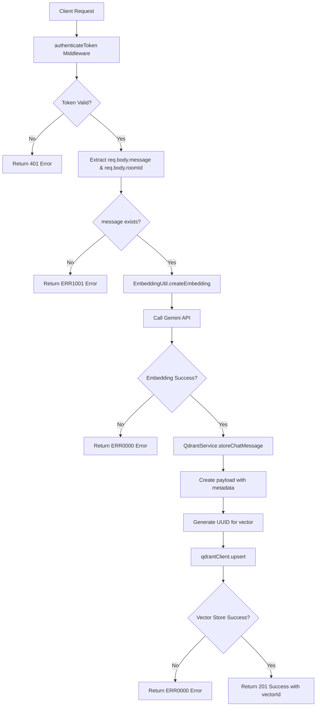
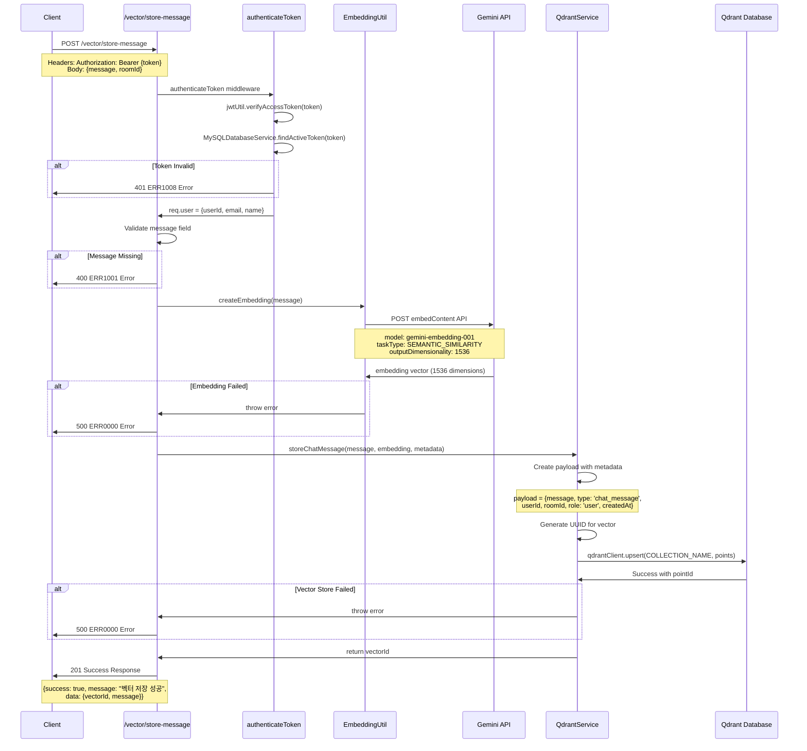
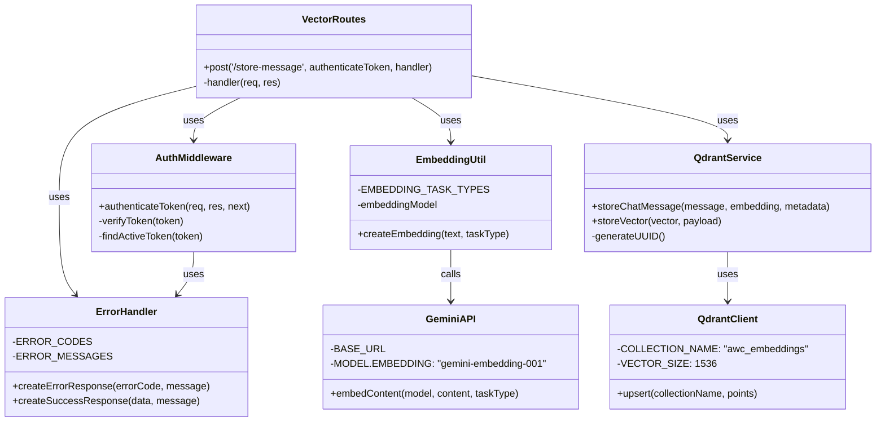

# Store Message in Vector DB

## 개요

이 API는 채팅 메시지를 벡터 데이터베이스(Qdrant)에 저장하는 기능을 제공합니다. 입력된 메시지는 Google Gemini 임베딩 모델을 통해 1536차원의 벡터로 변환되어 Qdrant 벡터 데이터베이스에 저장됩니다. 저장된 벡터는 유사도 기반 검색, RAG(Retrieval-Augmented Generation) 기능, 의미적 검색 등에 활용됩니다. 인증된 사용자만 접근 가능하며, 메시지와 함께 사용자 정보, 채팅방 정보 등의 메타데이터가 함께 저장됩니다.

## Request

### Endpoint

| Method | Path |
|--------|------|
| POST | /vector/store-message |

### Path Parameters

이 API는 path parameter를 사용하지 않습니다.

| 파라미터 | 타입 | 필수 여부 | 설명 |
|---------|------|-----------|------|
| - | - | - | - |

### Query Parameters

이 API는 query parameter를 사용하지 않습니다.

| 파라미터 | 타입 | 필수 여부 | 설명 |
|---------|------|-----------|------|
| - | - | - | - |

### Request Headers

| 헤더 | 필수 여부 | 설명 |
|------|-----------|------|
| Authorization | 필수 | Bearer 토큰 방식의 JWT 액세스 토큰 |
| Content-Type | 필수 | application/json |

### Request Body

| 파라미터 | 타입 | 필수 여부 | 설명 |
|---------|------|-----------|------|
| message | string | 필수 | 벡터 데이터베이스에 저장할 채팅 메시지 내용 |
| roomId | string | 선택 | 메시지가 속한 채팅방의 ID (메타데이터로 저장) |

### 인증 방식

이 API는 JWT 기반 인증을 사용합니다. 클라이언트는 `Authorization` 헤더에 `Bearer {access_token}` 형식으로 유효한 JWT 액세스 토큰을 포함해야 합니다. 

인증 과정:
1. JWT 토큰 서명 검증
2. 토큰 화이트리스트 검증 (MySQL 데이터베이스의 Token 테이블에서 활성 상태 확인)
3. 토큰에서 사용자 정보 추출 (userId, email, name)
4. 인증 성공 시 req.user 객체에 사용자 정보 설정

## Response

### Response Status

| HTTP Status | 설명 |
|-------------|------|
| 201 | 메시지가 성공적으로 벡터 DB에 저장됨 |
| 400 | 잘못된 요청 (메시지 누락 등) |
| 401 | 인증 실패 (토큰 없음, 만료, 유효하지 않음) |
| 500 | 서버 내부 오류 (임베딩 생성 실패, 벡터 DB 저장 실패 등) |

### Response Headers

| 헤더 | 필수 여부 | 설명 |
|------|-----------|------|
| Content-Type | 필수 | application/json |

### Response Body

#### 성공 응답 (201)

| 필드 | 타입 | 설명 |
|------|------|------|
| success | boolean | 항상 true |
| message | string | 성공 메시지 ("벡터 저장 성공") |
| data | object | 응답 데이터 객체 |
| data.vectorId | string | 생성된 벡터 포인트의 UUID |
| data.message | string | 상세 성공 메시지 ("메시지가 벡터 DB에 저장되었습니다.") |

#### 실패 응답

| 필드 | 타입 | 설명 |
|------|------|------|
| success | boolean | 항상 false |
| errorCode | string | 에러 코드 (ERR1001, ERR1008, ERR0000 등) |
| message | string | 에러 메시지 |
| statusCode | number | HTTP 상태 코드 |

### Error Code

| 코드 | 설명 |
|------|------|
| ERR1001 | 메시지가 필요합니다 (400) |
| ERR1008 | 인증 토큰 오류 (토큰 없음, 만료, 유효하지 않음) (401) |
| ERR0000 | 일반 서버 오류 (임베딩 생성 실패, 벡터 DB 저장 실패 등) (500) |

### Hooks(Callbacks)

이 API는 외부 시스템으로의 hook 이벤트를 발생시키지 않습니다.

## Flow

### Flow Chart



### Sequence Diagram



### Class Diagram



## 추가 정보

### 벡터 저장 구조

저장되는 벡터 데이터의 구조는 다음과 같습니다:

```json
{
  "id": "생성된 UUID",
  "vector": [1536개의 float 값 배열],
  "payload": {
    "message": "원본 메시지 텍스트",
    "type": "chat_message",
    "userId": "인증된 사용자 ID",
    "roomId": "채팅방 ID (선택적)",
    "userName": "사용자 이름",
    "role": "user",
    "createdAt": "ISO 8601 형식의 생성 시간"
  }
}
```

### 임베딩 모델 상세 정보

- **모델**: `gemini-embedding-001`
- **벡터 차원**: 1536
- **테스크 유형**: `SEMANTIC_SIMILARITY`
- **거리 측정**: Cosine Similarity
- **API 엔드포인트**: `https://generativelanguage.googleapis.com/v1beta/models/gemini-embedding-001:embedContent`

### Qdrant 컬렉션 정보

- **컬렉션명**: `awc_embeddings`
- **벡터 크기**: 1536
- **거리 함수**: Cosine
- **인덱싱**: `room_id`, `user_id`, `type` 필드에 대한 페이로드 인덱싱

### 성능 및 제한사항

- 임베딩 생성은 Google Gemini API 호출로 인해 네트워크 지연이 발생할 수 있습니다
- 벡터 저장은 Qdrant 클라이언트의 `wait: true` 옵션으로 동기적으로 처리됩니다
- 메시지 길이에 대한 명시적 제한은 없으나, Gemini API의 토큰 제한을 고려해야 합니다
- 벡터 데이터베이스 용량 및 검색 성능을 위해 주기적인 관리가 필요할 수 있습니다

### 관련 API

- `POST /vector/search-similar`: 저장된 벡터를 기반으로 유사한 메시지 검색
- `POST /vector/search-knowledge`: 지식 베이스에서 관련 문서 검색
- `GET /vector/collection-info`: Qdrant 컬렉션 정보 조회