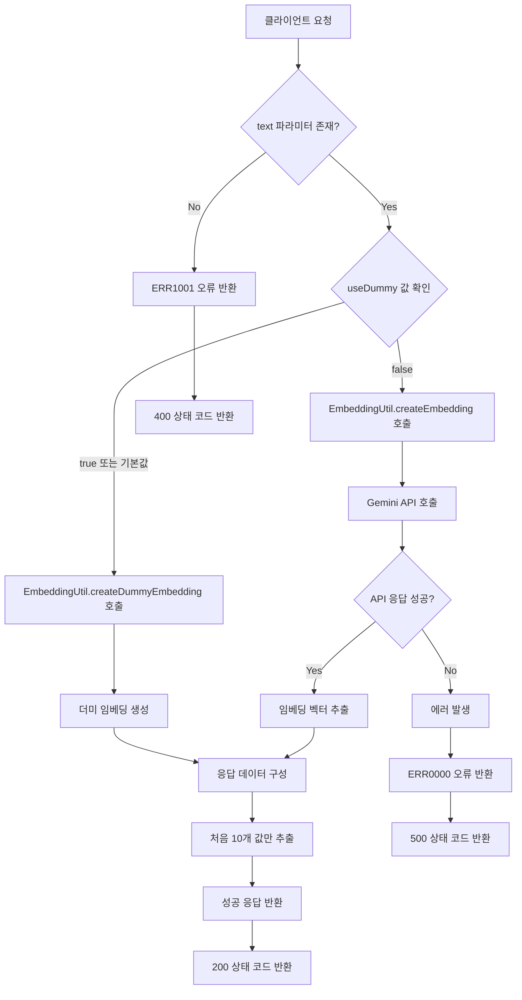
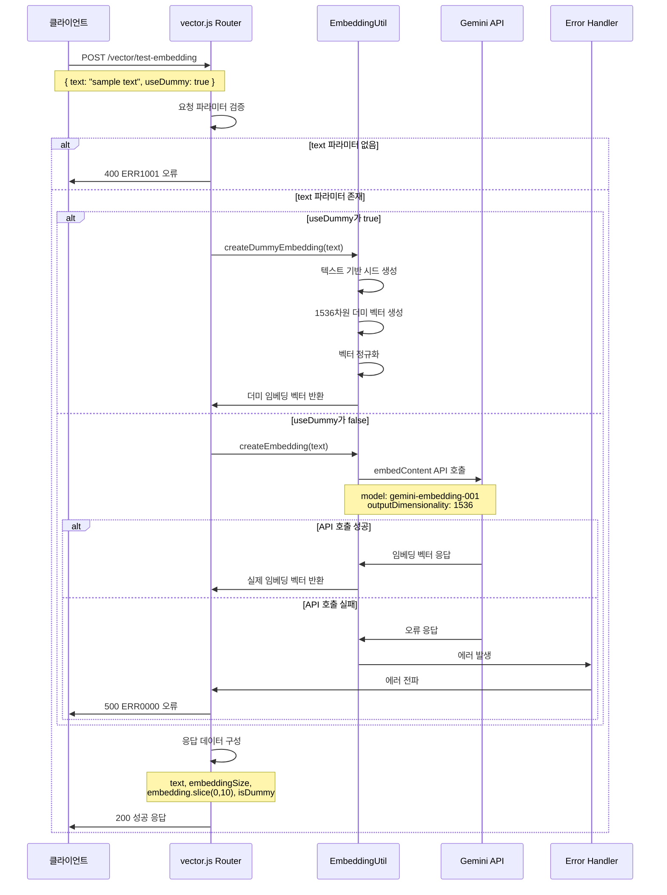
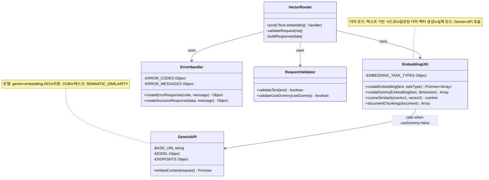

# Test Embedding Generation

## 개요

이 API는 개발 및 테스트 목적으로 텍스트의 임베딩 벡터를 생성하는 기능을 제공합니다. 실제 Google Gemini Embedding API를 사용하거나 테스트용 더미 임베딩을 생성할 수 있는 옵션을 제공하여 개발자가 임베딩 기능을 테스트하고 검증할 수 있도록 합니다. 이 API는 벡터 데이터베이스 저장이나 유사도 검색 기능을 구현하기 전에 임베딩 생성 과정을 확인하고 디버깅하는 데 사용됩니다.

## Request

### Endpoint

| Method | Path |
|--------|------|
| POST | /vector/test-embedding |

### Path Parameters

| 파라미터 | 타입 | 필수 여부 | 설명 |
|----------|------|-----------|------|
| 없음 | - | - | - |

### Query Parameters

| 파라미터 | 타입 | 필수 여부 | 설명 |
|----------|------|-----------|------|
| 없음 | - | - | - |

### Request Headers

| 헤더 | 필수 여부 | 설명 |
|------|-----------|------|
| Content-Type | 필수 | application/json |

### Request Body

| 파라미터 | 타입 | 필수 여부 | 설명 |
|----------|------|-----------|------|
| text | string | 필수 | 임베딩을 생성할 텍스트 입력 |
| useDummy | boolean | 선택 | true: 더미 임베딩 사용 (기본값), false: 실제 Gemini API 사용 |

### 인증 방식

이 API는 인증이 필요하지 않습니다. 개발 및 테스트 목적으로 설계되었으며, 누구나 접근할 수 있습니다. 실제 프로덕션 환경에서는 적절한 인증 메커니즘을 추가하는 것을 권장합니다.

## Response

### Response Status

| HTTP Status | 설명 |
|-------------|------|
| 200 | 임베딩 생성 성공 |
| 400 | 잘못된 요청 (필수 필드 누락) |
| 500 | 서버 내부 오류 |

### Response Headers

| 헤더 | 필수 여부 | 설명 |
|------|-----------|------|
| Content-Type | 필수 | application/json |

### Response Body

| 필드 | 타입 | 설명 |
|------|------|------|
| success | boolean | 요청 성공 여부 |
| message | string | 응답 메시지 |
| data | object | 임베딩 결과 데이터 |
| data.text | string | 입력된 텍스트 |
| data.embeddingSize | number | 생성된 임베딩 벡터의 차원수 (1536) |
| data.embedding | array\<number\> | 임베딩 벡터의 처음 10개 값 (디스플레이용) |
| data.isDummy | boolean | 더미 임베딩 사용 여부 |

### Error Code

| 코드 | 설명 |
|------|------|
| ERR1001 | 텍스트가 필요합니다 |
| ERR0000 | 일반 서버 오류 |

### Hooks(Callbacks)

이 API는 외부 시스템으로의 hook 이벤트를 발생시키지 않습니다.

## Flow

### Flow Chart



### Sequence Diagram



### Class Diagram



## Flow 상세 설명

1. **요청 수신 및 파라미터 검증**
   - `routes/vector.js:159`의 라우터 핸들러가 POST 요청을 수신합니다
   - `req.body`에서 `text`와 `useDummy` 파라미터를 추출합니다
   - `text` 파라미터가 없으면 ERR1001 오류를 반환합니다

2. **임베딩 생성 방식 결정**
   - `useDummy` 값에 따라 임베딩 생성 방식을 결정합니다
   - 기본값은 `true`로 설정되어 더미 임베딩을 사용합니다

3. **더미 임베딩 생성 (useDummy=true)**
   - `EmbeddingUtil.createDummyEmbedding(text)` 함수를 호출합니다
   - `utils/embedding.js:82-96`에서 텍스트를 기반으로 시드를 생성합니다
   - 1536차원의 일관된 더미 벡터를 생성하고 정규화합니다

4. **실제 임베딩 생성 (useDummy=false)**
   - `EmbeddingUtil.createEmbedding(text)` 함수를 호출합니다
   - `utils/embedding.js:23-56`에서 Google Gemini API에 요청을 보냅니다
   - API 엔드포인트: `https://generativelanguage.googleapis.com/v1beta/models/gemini-embedding-001:embedContent`
   - 1536차원의 실제 임베딩 벡터를 반환받습니다

5. **응답 데이터 구성**
   - 원본 텍스트, 임베딩 크기, 처음 10개 값, 더미 사용 여부를 포함하여 응답을 구성합니다
   - `createSuccessResponse` 함수를 사용하여 표준화된 성공 응답을 생성합니다

6. **오류 처리**
   - 임베딩 생성 중 오류 발생 시 ERR0000 오류코드로 500 상태를 반환합니다
   - 모든 오류는 콘솔에 로깅됩니다

## 추가 정보

### 임베딩 벡터 특성
- **차원수**: 1536차원 고정
- **정규화**: 모든 벡터는 단위 벡터로 정규화됩니다
- **데이터 타입**: IEEE 754 부동소수점 배열

### 더미 임베딩 알고리즘
더미 임베딩은 다음 알고리즘을 사용합니다:
1. 텍스트의 각 문자 ASCII 코드 합계로 시드 생성
2. `Math.sin(seed * (i + 1)) * Math.cos(seed / (i + 1))` 공식으로 각 차원 값 계산
3. L2 정규화를 통해 단위 벡터로 변환

### Gemini API 설정
- **모델**: `gemini-embedding-001`
- **태스크 타입**: `SEMANTIC_SIMILARITY`
- **출력 차원**: 1536차원
- **API 키**: 환경변수 `GEMINI_API_KEY`에서 가져옴

### 성능 고려사항
- 더미 임베딩: 즉시 생성 (지연시간 < 1ms)
- 실제 임베딩: Gemini API 응답 시간에 의존 (일반적으로 100-500ms)
- 메모리 사용량: 벡터당 약 6KB (1536 * 4바이트)

### 보안 고려사항
- 현재 인증이 적용되지 않아 개발 환경에서만 사용 권장
- API 키 노출 방지를 위해 환경변수 사용
- 프로덕션 환경에서는 적절한 rate limiting 적용 필요

### 사용 예시
```json
// 요청
{
  "text": "안녕하세요. 이것은 테스트 문장입니다.",
  "useDummy": false
}

// 응답
{
  "success": true,
  "message": "임베딩 생성 완료",
  "data": {
    "text": "안녕하세요. 이것은 테스트 문장입니다.",
    "embeddingSize": 1536,
    "embedding": [0.123, -0.456, 0.789, 0.012, -0.345, 0.678, -0.901, 0.234, -0.567, 0.890],
    "isDummy": false
  }
}
```