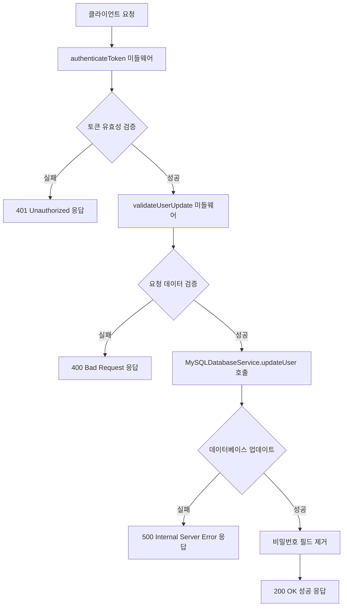
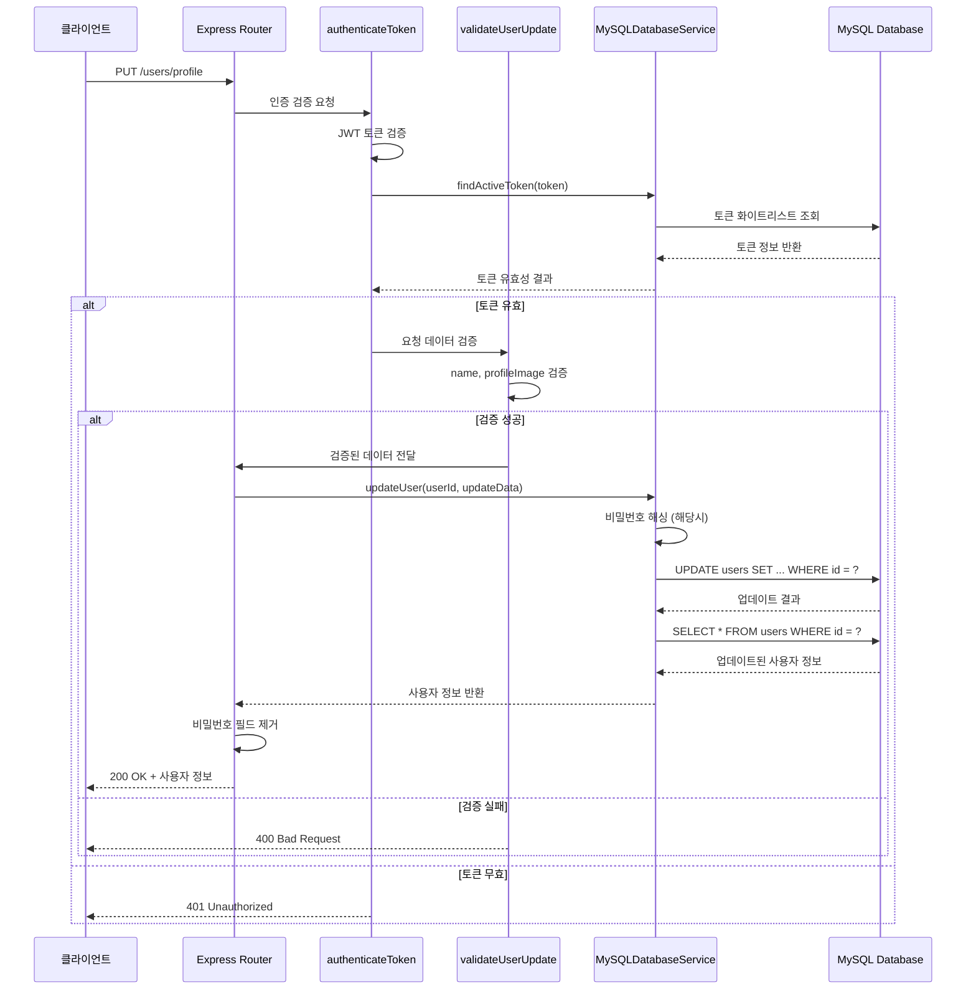
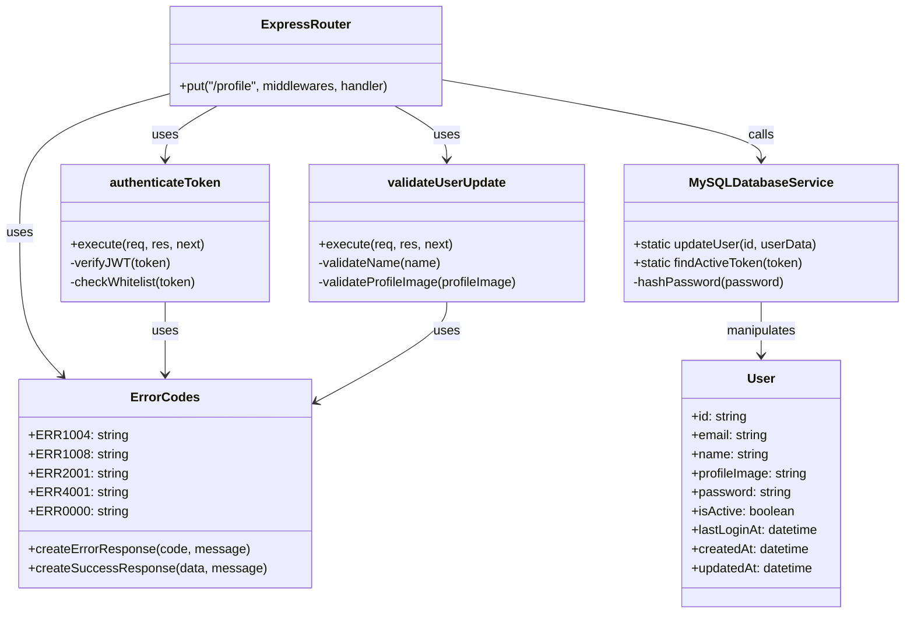

# Update User Profile API

## 개요

사용자의 프로필 정보를 업데이트하는 API입니다. 인증된 사용자만 자신의 프로필 정보를 수정할 수 있으며, 이름과 프로필 이미지를 선택적으로 업데이트할 수 있습니다. 업데이트 가능한 필드는 `name`과 `profileImage`이며, 각 필드는 선택사항으로 하나 또는 모든 필드를 포함하여 요청할 수 있습니다.

## Request

### Endpoint

| Method | Path |
|--------|------|
| PUT | /users/profile |

### Path Parameters

없음

### Query Parameters

없음

### Request Headers

| 헤더 | 필수 여부 | 설명 |
|------|----------|------|
| Authorization | 필수 | JWT 액세스 토큰 (Bearer {token} 형식) |
| Content-Type | 필수 | application/json |

### Request Body

| 파라미터 | 타입 | 필수 여부 | 설명 |
|----------|------|----------|------|
| name | string | 선택 | 사용자 이름 (2자 이상 50자 이하의 문자열) |
| profileImage | string | 선택 | 프로필 이미지 URL 또는 Base64 인코딩된 이미지 데이터 |

### 인증 방식

JWT(JSON Web Token) 기반 Bearer 토큰 인증을 사용합니다. 클라이언트는 로그인 시 받은 액세스 토큰을 Authorization 헤더에 `Bearer {token}` 형식으로 포함해야 합니다. 서버는 토큰의 유효성을 검증하고 화이트리스트에 등록된 토큰인지 확인합니다. 토큰이 유효하지 않거나 만료된 경우 401 Unauthorized 응답을 반환합니다.

## Response

### Response Status

| HTTP Status | 설명 |
|-------------|------|
| 200 | 사용자 정보 업데이트 성공 |
| 400 | 요청 데이터 검증 실패 (이름 길이 오류, 프로필 이미지 형식 오류) |
| 401 | 인증 실패 (토큰 없음, 토큰 만료, 토큰 무효) |
| 500 | 서버 내부 오류 (데이터베이스 업데이트 실패) |

### Response Headers

| 헤더 | 필수 여부 | 설명 |
|------|----------|------|
| Content-Type | 필수 | application/json |

### Response Body

**성공 응답 (200 OK):**

| 필드 | 타입 | 설명 |
|------|------|------|
| success | boolean | 요청 성공 여부 (true) |
| message | string | 성공 메시지 ("사용자 정보가 수정되었습니다.") |
| data | object | 응답 데이터 객체 |
| data.user | object | 업데이트된 사용자 정보 |
| data.user.id | string | 사용자 고유 ID (UUID 형식) |
| data.user.email | string | 사용자 이메일 |
| data.user.name | string | 업데이트된 사용자 이름 |
| data.user.profileImage | string | 업데이트된 프로필 이미지 URL |
| data.user.isActive | boolean | 사용자 활성 상태 |
| data.user.lastLoginAt | string | 마지막 로그인 시간 (ISO 8601 형식) |
| data.user.createdAt | string | 계정 생성 시간 (ISO 8601 형식) |
| data.user.updatedAt | string | 최근 업데이트 시간 (ISO 8601 형식) |

**오류 응답:**

| 필드 | 타입 | 설명 |
|------|------|------|
| success | boolean | 요청 성공 여부 (false) |
| errorCode | string | 오류 코드 |
| message | string | 오류 메시지 |

### Error Code

| 코드 | 설명 |
|------|------|
| ERR1004 | 이름 길이 오류 (2자 이상 50자 이하여야 함) |
| ERR1008 | 토큰 오류 (토큰 없음, 만료, 무효) |
| ERR2001 | 사용자 정보 업데이트 실패 |
| ERR4001 | 프로필 이미지 형식 오류 |
| ERR0000 | 일반 서버 오류 |

### Hooks(Callbacks)

이 API는 외부 시스템으로의 hook이나 callback을 발생시키지 않습니다.

## Flow

### Flow Chart

### Sequence Diagram

### Class Diagram

## 추가 정보

### 데이터 검증 규칙

1. **이름 검증**: 문자열 타입이며 trim 후 2자 이상 50자 이하여야 합니다.
2. **프로필 이미지 검증**: 문자열 타입이어야 하며, URL 형식이나 Base64 인코딩된 이미지 데이터를 허용합니다.

### 보안 고려사항

1. JWT 토큰은 Authorization 헤더의 Bearer 스키마를 통해 전달됩니다.
2. 모든 토큰은 서명 검증과 화이트리스트 검증을 거칩니다.
3. 응답에서 사용자의 비밀번호 필드는 제거되어 반환됩니다.
4. 사용자는 오직 자신의 프로필만 수정할 수 있습니다.

### 데이터베이스 동작

1. `MySQLDatabaseService.updateUser()` 메서드는 TypeORM을 사용하여 사용자 정보를 업데이트합니다.
2. 업데이트 후 변경된 사용자 정보를 다시 조회하여 반환합니다.
3. `updatedAt` 필드는 자동으로 현재 시간으로 업데이트됩니다.

### 에러 처리

모든 에러는 표준화된 에러 응답 형식을 따르며, 적절한 HTTP 상태 코드와 함께 반환됩니다. 클라이언트는 `errorCode` 필드를 통해 구체적인 에러 유형을 파악할 수 있습니다.