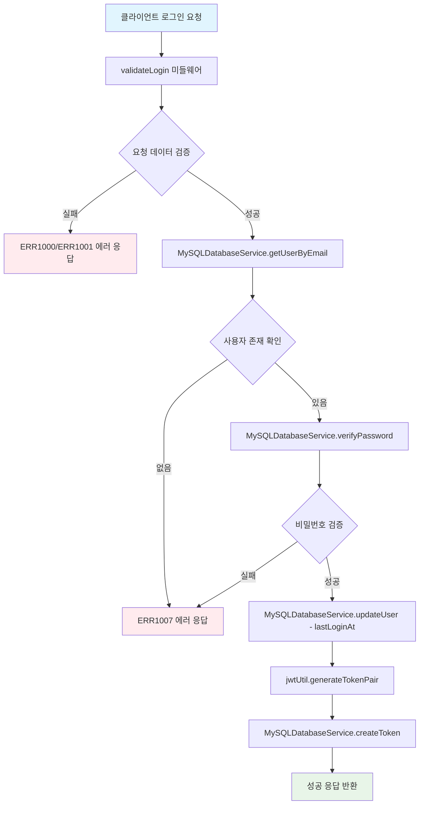
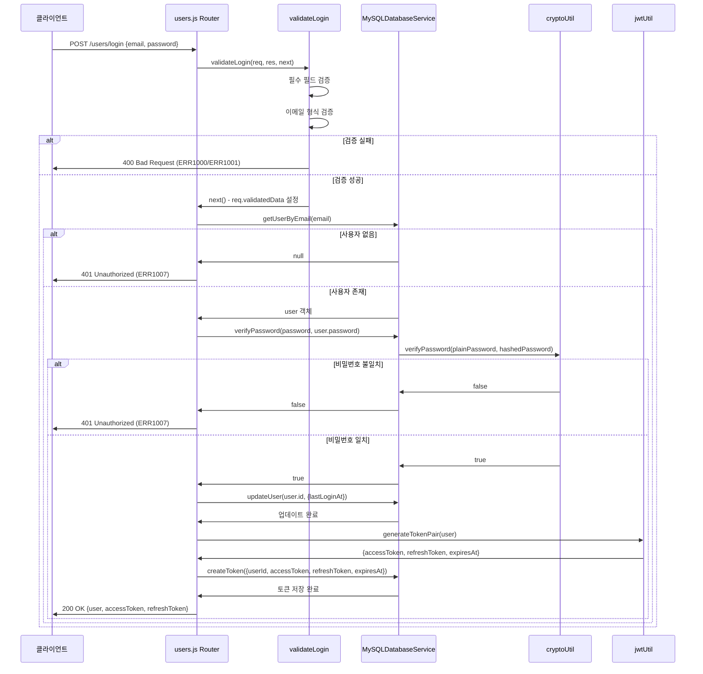
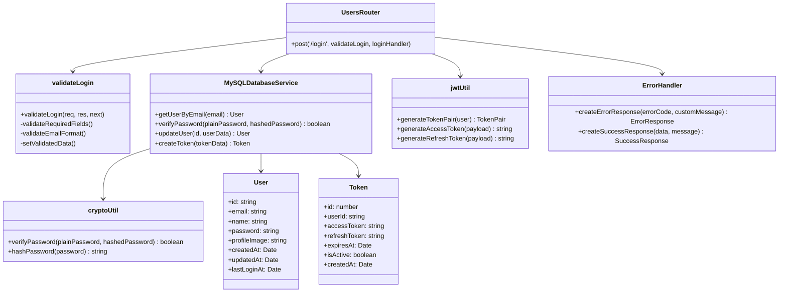

# 사용자 로그인 API

## 개요
사용자 로그인 API는 등록된 사용자가 이메일과 비밀번호를 사용하여 시스템에 로그인할 수 있도록 하는 기능을 제공합니다. 로그인 성공 시 JWT 기반의 Access Token과 Refresh Token을 발급하여 인증된 사용자의 세션을 관리합니다. 발급된 토큰은 데이터베이스의 화이트리스트에 저장되어 보안성을 강화하며, 사용자의 마지막 로그인 시간을 업데이트합니다.

## Request

### Endpoint
| Method | Path |
|--------|------|
| POST | /users/login |

### Path Parameters
| 파라미터 | 타입 | 필수 여부 | 설명 |
|---------|------|----------|------|
| 해당 없음 | - | - | - |

### Query Parameters
| 파라미터 | 타입 | 필수 여부 | 설명 |
|---------|------|----------|------|
| 해당 없음 | - | - | - |

### Request Headers
| 헤더 | 필수 여부 | 설명 |
|------|----------|------|
| Content-Type | 필수 | application/json |

### Request Body
| 파라미터 | 타입 | 필수 여부 | 설명 |
|---------|------|----------|------|
| email | string | 필수 | 사용자 이메일 주소 (이메일 형식 검증) |
| password | string | 필수 | 사용자 비밀번호 (평문) |

### 인증 방식
이 API는 로그인 API이므로 별도의 인증이 필요하지 않습니다. 사용자가 제공한 이메일과 비밀번호를 통해 사용자 신원을 확인하고, 성공 시 JWT 토큰을 발급합니다.

## Response

### Response Status
| HTTP Status | 설명 |
|-------------|------|
| 200 | 로그인 성공 |
| 400 | 요청 데이터 검증 실패 (필수 필드 누락, 이메일 형식 오류) |
| 401 | 인증 실패 (이메일 또는 비밀번호 불일치) |
| 404 | 사용자를 찾을 수 없음 |
| 500 | 서버 내부 오류 |

### Response Headers
| 헤더 | 필수 여부 | 설명 |
|------|----------|------|
| Content-Type | 필수 | application/json |

### Response Body
| 필드 | 타입 | 설명 |
|------|------|------|
| success | boolean | 요청 성공 여부 (true) |
| message | string | 응답 메시지 ("로그인이 완료되었습니다.") |
| data | object | 응답 데이터 |
| data.user | object | 사용자 정보 (비밀번호 제외) |
| data.user.id | string | 사용자 고유 ID (UUID) |
| data.user.email | string | 사용자 이메일 |
| data.user.name | string | 사용자 이름 |
| data.user.profileImage | string | 프로필 이미지 URL (nullable) |
| data.user.createdAt | string | 계정 생성 시간 (ISO 8601) |
| data.user.updatedAt | string | 마지막 업데이트 시간 (ISO 8601) |
| data.user.lastLoginAt | string | 마지막 로그인 시간 (ISO 8601) |
| data.accessToken | string | JWT Access Token (1시간 유효) |
| data.refreshToken | string | JWT Refresh Token (5시간 유효) |

### Error Code
| 코드 | 설명 |
|------|------|
| ERR1000 | 필수 필드 누락 (이메일 또는 비밀번호 누락) |
| ERR1001 | 이메일 형식 오류 |
| ERR1007 | 이메일 또는 비밀번호가 일치하지 않음 |
| ERR0000 | 서버 내부 오류 |

### Hooks(Callbacks)
해당 없음 - 이 API는 외부 시스템으로의 훅이나 콜백을 발생시키지 않습니다.

## Flow

### Flow Chart

### Sequence Diagram

### Class Diagram

## 상세 흐름 설명

1. **요청 수신**: 클라이언트가 POST /users/login으로 이메일과 비밀번호를 전송합니다.

2. **데이터 검증 (validateLogin)**: 
   - 필수 필드(email, password) 존재 여부 확인
   - 이메일 형식 유효성 검증 (정규식 사용)
   - 검증된 데이터를 req.validatedData에 저장

3. **사용자 조회 (getUserByEmail)**:
   - 데이터베이스에서 이메일로 사용자 검색
   - 사용자가 존재하지 않으면 ERR1007 에러 반환

4. **비밀번호 검증 (verifyPassword)**:
   - cryptoUtil.verifyPassword()를 통해 평문 비밀번호와 해시된 비밀번호 비교
   - 비밀번호가 일치하지 않으면 ERR1007 에러 반환

5. **로그인 시간 업데이트 (updateUser)**:
   - 성공적인 로그인 시 lastLoginAt 필드를 현재 시간으로 업데이트

6. **JWT 토큰 생성 (generateTokenPair)**:
   - Access Token (1시간 유효) 및 Refresh Token (5시간 유효) 생성
   - 토큰에는 userId, email, name이 포함됨
   - 각 토큰은 JWT 표준을 따르며 issuer, audience 정보 포함

7. **토큰 화이트리스트 저장 (createToken)**:
   - 생성된 토큰을 데이터베이스의 Token 테이블에 저장
   - 해당 사용자의 기존 활성 토큰은 자동으로 비활성화됨
   - 보안을 위한 토큰 추적 및 관리

8. **성공 응답 반환**:
   - 사용자 정보(비밀번호 제외), Access Token, Refresh Token 반환
   - HTTP 200 상태 코드와 함께 성공 메시지 전송

## 추가 정보

### 보안 특징
- **비밀번호 보안**: 비밀번호는 crypto 모듈을 사용하여 해시화되어 저장됩니다.
- **토큰 화이트리스트**: 발급된 모든 토큰은 데이터베이스에 저장되어 추적됩니다.
- **기존 토큰 무효화**: 새로운 로그인 시 기존 활성 토큰들이 자동으로 비활성화됩니다.
- **토큰 만료 관리**: Access Token은 1시간, Refresh Token은 5시간의 서로 다른 만료 시간을 가집니다.

### 데이터베이스 트랜잭션
- 로그인 과정에서 여러 데이터베이스 작업(사용자 업데이트, 토큰 저장)이 수행됩니다.
- 각 작업은 독립적으로 처리되며, 오류 발생 시 적절한 에러 응답을 반환합니다.

### 토큰 관리
- **Access Token**: API 인증에 사용되는 단기 토큰 (1시간)
- **Refresh Token**: Access Token 갱신에 사용되는 장기 토큰 (5시간)
- 만료된 토큰은 정기적으로 정리됩니다 (6시간마다 자동 실행)

### 에러 처리
- 모든 에러는 표준화된 에러 코드와 메시지로 반환됩니다.
- 보안상 이유로 사용자 존재 여부와 비밀번호 오류를 동일한 에러 코드(ERR1007)로 처리합니다.
- 서버 에러는 상세한 정보를 로그에 기록하되, 클라이언트에는 일반적인 에러 메시지만 반환합니다.