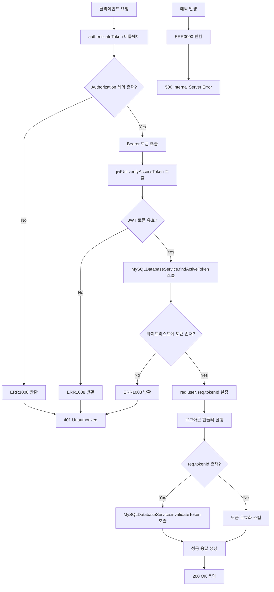
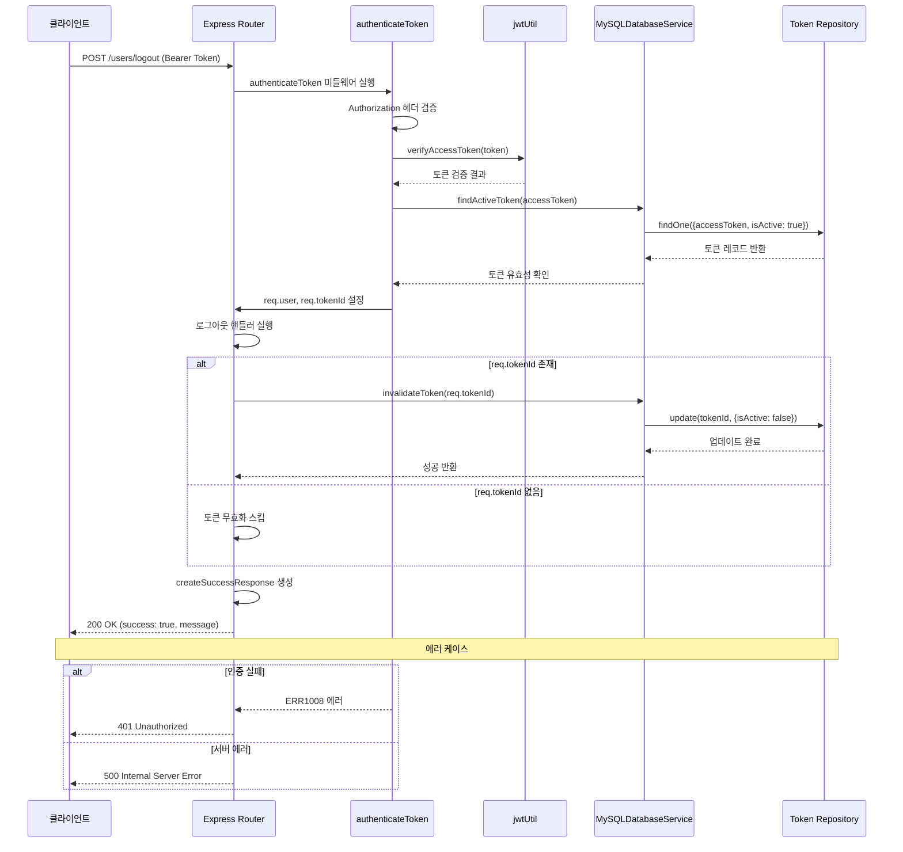
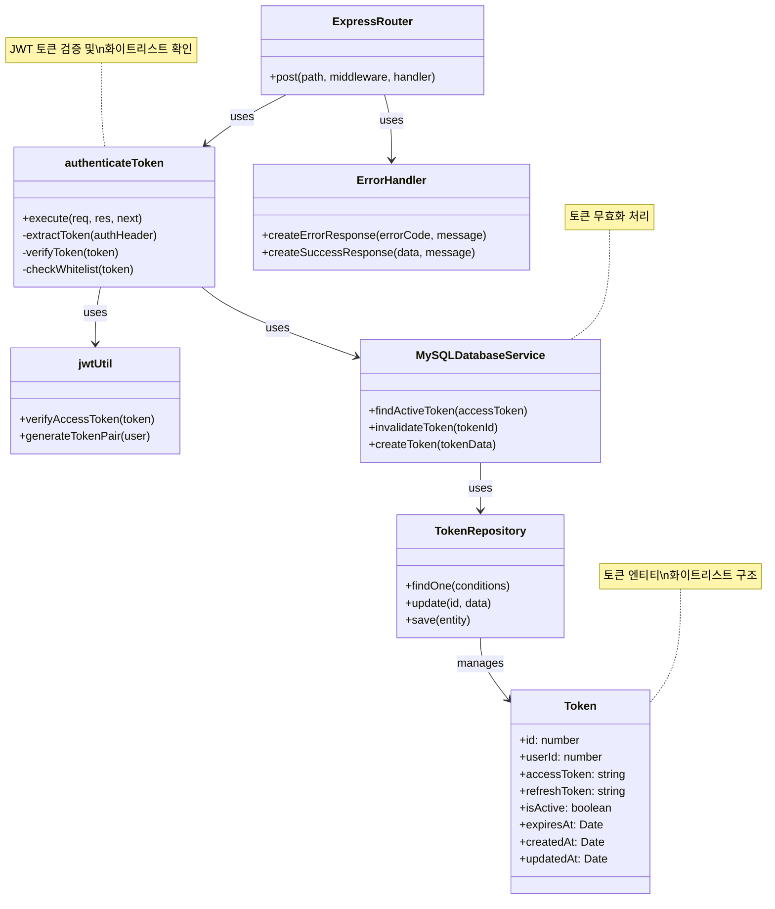

# 사용자 로그아웃

## 개요
사용자 로그아웃 API는 현재 로그인된 사용자의 세션을 종료하는 기능을 제공합니다. 이 API는 JWT 토큰 기반 인증 시스템에서 사용자의 액세스 토큰을 무효화하여 보안을 강화합니다. 사용자가 로그아웃을 요청하면 해당 토큰이 데이터베이스의 화이트리스트에서 비활성화되어 더 이상 인증에 사용될 수 없게 됩니다. 이는 토큰 탈취 공격을 방어하고 사용자의 계정 보안을 향상시키는 중요한 보안 메커니즘입니다.

## Request

### Endpoint
| Method | Path |
|--------|------|
| POST | /users/logout |

### Path Parameters
| 파라미터 | 타입 | 필수 여부 | 설명 |
|---------|------|-----------|------|
| - | - | - | 해당 없음 |

### Query Parameters
| 파라미터 | 타입 | 필수 여부 | 설명 |
|---------|------|-----------|------|
| - | - | - | 해당 없음 |

### Request Headers
| 헤더 | 필수 여부 | 설명 |
|------|-----------|------|
| Authorization | 필수 | Bearer 스키마를 사용한 JWT 액세스 토큰 ("Bearer {token}" 형태) |
| Content-Type | 선택적 | application/json (요청 본문이 없으므로 선택적) |

### Request Body
| 파라미터 | 타입 | 필수 여부 | 설명 |
|---------|------|-----------|------|
| - | - | - | 요청 본문 없음 |

### 인증 방식
이 API는 JWT 토큰 기반의 Bearer 인증을 사용합니다. `authenticateToken` 미들웨어를 통해 다음과 같은 인증 프로세스를 거칩니다:

1. **토큰 추출**: Authorization 헤더에서 "Bearer " 접두사를 제거하고 JWT 토큰을 추출합니다.
2. **JWT 서명 검증**: `jwtUtil.verifyAccessToken(token)` 함수를 통해 토큰의 서명과 만료 시간을 검증합니다.
3. **화이트리스트 검증**: 데이터베이스의 Token 테이블에서 해당 토큰이 활성 상태(`isActive: true`)인지 확인합니다.
4. **사용자 정보 설정**: 검증이 완료되면 요청 객체에 사용자 정보(`req.user`)와 토큰 ID(`req.tokenId`)를 설정합니다.

토큰이 유효하지 않거나 만료된 경우, 화이트리스트에 없는 경우 401 Unauthorized 에러가 반환됩니다.

## Response

### Response Status
| HTTP Status | 설명 |
|-------------|------|
| 200 | 로그아웃 성공 |
| 401 | 인증 실패 (토큰 없음, 유효하지 않은 토큰, 만료된 토큰) |
| 500 | 서버 내부 오류 |

### Response Headers
| 헤더 | 필수 여부 | 설명 |
|------|-----------|------|
| Content-Type | 필수 | application/json |

### Response Body
| 필드 | 타입 | 설명 |
|------|------|------|
| success | boolean | 요청 처리 성공 여부 (항상 true) |
| message | string | 응답 메시지 ("로그아웃이 완료되었습니다.") |
| data | null | 응답 데이터 (항상 null) |

### Error Code
| 코드 | 설명 |
|------|------|
| ERR1008 | 토큰 관련 오류 (토큰 없음, 유효하지 않은 토큰, 만료된 토큰) |
| ERR0000 | 일반 서버 오류 (로그아웃 처리 중 예외 발생) |

### Hooks(Callbacks)
해당 API는 외부 시스템으로의 Hook 이벤트를 발생시키지 않습니다. 모든 처리는 내부적으로 완료됩니다.

## Flow

### Flow Chart


### Sequence Diagram


### Class Diagram


## 추가 정보

### 보안 고려사항
1. **토큰 화이트리스트**: 모든 유효한 토큰은 데이터베이스에 저장되어 관리됩니다. 로그아웃 시 해당 토큰이 비활성화되어 재사용을 방지합니다.

2. **토큰 만료 처리**: JWT 토큰 자체의 만료 시간과 별도로 데이터베이스 레벨에서도 토큰 유효성을 관리합니다.

3. **예외 상황 처리**: `req.tokenId`가 없는 경우에도 에러를 발생시키지 않고 정상적으로 로그아웃 처리를 완료합니다.

### 데이터베이스 스키마
```sql
-- Token 테이블 구조
CREATE TABLE tokens (
    id INT PRIMARY KEY AUTO_INCREMENT,
    userId INT NOT NULL,
    accessToken TEXT NOT NULL,
    refreshToken TEXT NOT NULL,
    isActive BOOLEAN DEFAULT TRUE,
    expiresAt DATETIME NOT NULL,
    createdAt DATETIME DEFAULT CURRENT_TIMESTAMP,
    updatedAt DATETIME DEFAULT CURRENT_TIMESTAMP ON UPDATE CURRENT_TIMESTAMP,
    FOREIGN KEY (userId) REFERENCES users(id)
);
```

### 성능 최적화
- 데이터베이스 조회는 `isActive` 필드와 `accessToken` 필드에 인덱스를 설정하여 최적화됩니다.
- 토큰 무효화는 DELETE가 아닌 UPDATE 연산을 사용하여 감사 추적을 가능하게 합니다.

### 관련 API
- **로그인**: `/users/login` - 토큰 생성 및 화이트리스트 등록
- **토큰 갱신**: `/users/refresh` - 기존 토큰 무효화 및 새 토큰 발급
- **사용자 정보 조회**: `/users/me` - 동일한 인증 미들웨어 사용

### 클라이언트 사용 예시
```javascript
// 로그아웃 요청 예시
const response = await fetch('/users/logout', {
    method: 'POST',
    headers: {
        'Authorization': `Bearer ${accessToken}`,
        'Content-Type': 'application/json'
    }
});

const result = await response.json();
if (result.success) {
    // 로그아웃 성공 - 클라이언트에서 토큰 제거
    localStorage.removeItem('accessToken');
    localStorage.removeItem('refreshToken');
}
```