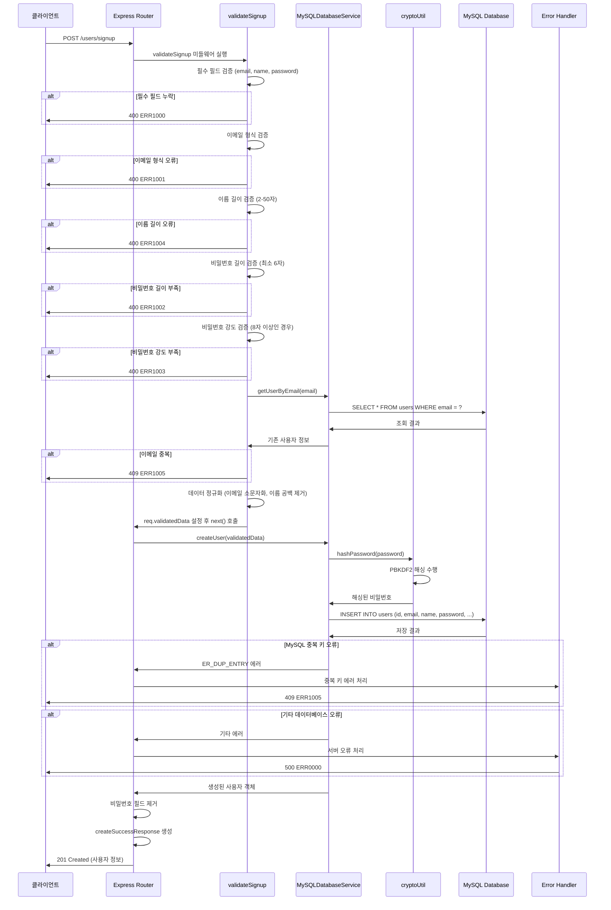
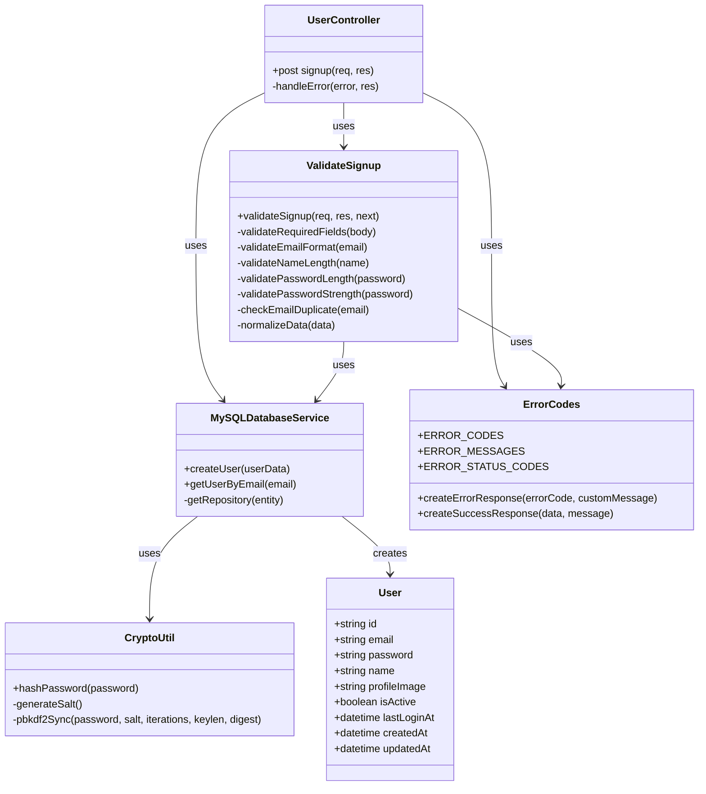

# User Registration API

## 개요

사용자 회원가입을 처리하는 API입니다. 이메일, 이름, 비밀번호를 받아 새로운 사용자 계정을 생성하며, 입력 데이터의 유효성 검증과 이메일 중복 확인을 수행합니다. 비밀번호는 PBKDF2 해싱 알고리즘을 사용하여 안전하게 암호화되어 저장됩니다. 회원가입 완료 후 사용자 정보를 반환하되, 보안을 위해 비밀번호는 응답에서 제외됩니다.

## Request

### Endpoint

| Method | Path |
|--------|------|
| POST | /users/signup |

### Path Parameters

이 API는 Path Parameter를 사용하지 않습니다.

| 파라미터 | 타입 | 필수 여부 | 설명 |
|----------|------|-----------|------|
| - | - | - | Path Parameter 없음 |

### Query Parameters

이 API는 Query Parameter를 사용하지 않습니다.

| 파라미터 | 타입 | 필수 여부 | 설명 |
|----------|------|-----------|------|
| - | - | - | Query Parameter 없음 |

### Request Headers

| 헤더 | 필수 여부 | 설명 |
|------|-----------|------|
| Content-Type | 필수 | application/json |
| Accept | 선택 | application/json |

### Request Body

| 파라미터 | 타입 | 필수 여부 | 설명 |
|----------|------|-----------|------|
| email | string | 필수 | 사용자 이메일 주소. 유효한 이메일 형식이어야 하며, 중복된 이메일은 사용할 수 없음 |
| name | string | 필수 | 사용자 이름. 2자 이상 50자 이하의 문자열 |
| password | string | 필수 | 사용자 비밀번호. 최소 6자 이상이어야 하며, 8자 이상인 경우 대문자, 소문자, 숫자, 특수문자를 포함해야 함 |

### 인증 방식

이 API는 인증이 필요하지 않습니다. 회원가입은 공개 API로서 누구나 접근할 수 있으며, JWT 토큰이나 기타 인증 정보 없이 호출할 수 있습니다.

## Response

### Response Status

| HTTP Status | 설명 |
|-------------|------|
| 201 | 회원가입 성공 |
| 400 | 잘못된 요청 (필수 필드 누락, 이메일 형식 오류, 비밀번호 조건 미충족, 이름 길이 오류) |
| 409 | 이메일 중복 |
| 500 | 서버 내부 오류 |

### Response Headers

| 헤더 | 필수 여부 | 설명 |
|------|-----------|------|
| Content-Type | 필수 | application/json |

### Response Body

#### 성공 응답 (201)

| 필드 | 타입 | 설명 |
|------|------|------|
| success | boolean | 요청 처리 성공 여부 (true) |
| message | string | 성공 메시지 ("회원가입이 완료되었습니다.") |
| data | object | 응답 데이터 |
| data.user | object | 생성된 사용자 정보 |
| data.user.id | string | 사용자 고유 ID (UUID 형식) |
| data.user.email | string | 사용자 이메일 주소 (소문자로 정규화됨) |
| data.user.name | string | 사용자 이름 (공백 제거됨) |
| data.user.profileImage | string/null | 프로필 이미지 URL (기본값: null) |
| data.user.isActive | boolean | 사용자 활성화 상태 (기본값: true) |
| data.user.lastLoginAt | string/null | 최종 로그인 시간 (기본값: null) |
| data.user.createdAt | string | 계정 생성 시간 (ISO 8601 형식) |
| data.user.updatedAt | string | 계정 최종 수정 시간 (ISO 8601 형식) |

#### 오류 응답

| 필드 | 타입 | 설명 |
|------|------|------|
| success | boolean | 요청 처리 성공 여부 (false) |
| errorCode | string | 오류 코드 |
| message | string | 오류 메시지 |

### Error Code

| 코드 | 설명 |
|------|------|
| ERR1000 | 필수 필드를 모두 입력해주세요. (email, name, password 중 누락) |
| ERR1001 | 올바른 이메일 형식을 입력해주세요. |
| ERR1002 | 비밀번호는 6자 이상이어야 합니다. |
| ERR1003 | 비밀번호는 대문자, 소문자, 숫자, 특수문자를 포함해야 합니다. (8자 이상인 경우) |
| ERR1004 | 이름은 2자 이상 50자 이하여야 합니다. |
| ERR1005 | 이미 존재하는 이메일입니다. |
| ERR0000 | 서버 오류가 발생했습니다. |

### Hooks(Callbacks)

이 API는 외부 시스템으로의 Hook이나 Callback을 발생시키지 않습니다. 회원가입 처리는 내부 데이터베이스 작업으로만 완료되며, 외부 서비스와의 연동은 없습니다.

## Flow

### Flow Chart

```mermaid
flowchart TD
    A[클라이언트 요청] --> B[validateSignup 미들웨어]
    B --> C{필수 필드 검증}
    C -->|실패| D[ERR1000 반환]
    C -->|성공| E{이메일 형식 검증}
    E -->|실패| F[ERR1001 반환]
    E -->|성공| G{이름 길이 검증}
    G -->|실패| H[ERR1004 반환]
    G -->|성공| I{비밀번호 길이 검증}
    I -->|실패| J[ERR1002 반환]
    I -->|성공| K{비밀번호 강도 검증}
    K -->|실패| L[ERR1003 반환]
    K -->|성공| M[MySQLDatabaseService.getUserByEmail]
    M --> N{이메일 중복 확인}
    N -->|중복 존재| O[ERR1005 반환]
    N -->|중복 없음| P[데이터 정규화 및 req.validatedData 저장]
    P --> Q[회원가입 라우터 핸들러]
    Q --> R[MySQLDatabaseService.createUser 호출]
    R --> S[cryptoUtil.hashPassword로 비밀번호 해싱]
    S --> T[User 엔티티 생성]
    T --> U[MySQL 데이터베이스에 저장]
    U --> V{저장 성공 여부}
    V -->|실패 (중복키)| W[ERR1005 반환]
    V -->|기타 실패| X[ERR0000 반환]
    V -->|성공| Y[비밀번호 필드 제거]
    Y --> Z[createSuccessResponse 생성]
    Z --> AA[201 상태로 응답 반환]
```

### Sequence Diagram



### Class Diagram



## 상세 처리 흐름 설명

1. **요청 접수**: 클라이언트가 POST /users/signup 엔드포인트로 회원가입 요청을 전송합니다.

2. **입력 검증 단계 (validateSignup 미들웨어)**:
   - **필수 필드 검증**: `email`, `name`, `password` 필드의 존재 여부를 확인합니다.
   - **이메일 형식 검증**: 정규표현식 `/^[^\s@]+@[^\s@]+\.[^\s@]+$/`을 사용하여 이메일 형식을 검증합니다.
   - **이름 길이 검증**: 이름의 길이가 2자 이상 50자 이하인지 확인합니다.
   - **비밀번호 길이 검증**: 비밀번호가 최소 6자 이상인지 확인합니다.
   - **비밀번호 강도 검증**: 8자 이상인 경우 대문자, 소문자, 숫자, 특수문자 포함 여부를 검증합니다.
   - **이메일 중복 확인**: `MySQLDatabaseService.getUserByEmail()` 함수를 호출하여 동일한 이메일이 이미 존재하는지 확인합니다.
   - **데이터 정규화**: 이메일을 소문자로 변환하고 이름의 앞뒤 공백을 제거합니다.

3. **사용자 생성 단계**:
   - **비밀번호 해싱**: `cryptoUtil.hashPassword()` 함수를 사용하여 PBKDF2 알고리즘으로 비밀번호를 해싱합니다.
   - **사용자 엔티티 생성**: TypeORM을 사용하여 User 엔티티 인스턴스를 생성합니다.
   - **데이터베이스 저장**: MySQL 데이터베이스에 사용자 정보를 저장합니다.

4. **응답 생성**:
   - **비밀번호 제거**: 보안을 위해 응답 객체에서 비밀번호 필드를 제거합니다.
   - **성공 응답 생성**: `createSuccessResponse()` 함수를 사용하여 표준화된 성공 응답을 생성합니다.
   - **클라이언트 응답**: HTTP 201 상태 코드와 함께 사용자 정보를 반환합니다.

5. **오류 처리**:
   - **MySQL 중복 키 오류**: `ER_DUP_ENTRY` 오류가 발생하면 ERR1005 코드로 처리합니다.
   - **기타 서버 오류**: 예상치 못한 오류는 ERR0000 코드로 처리합니다.

## 추가 정보

### 보안 고려사항

- **비밀번호 해싱**: PBKDF2 알고리즘을 사용하여 10,000회 반복으로 비밀번호를 해싱하며, 각 비밀번호마다 고유한 salt를 생성합니다.
- **입력 데이터 정규화**: 이메일은 소문자로 변환하고 이름은 공백을 제거하여 일관성을 보장합니다.
- **응답 데이터 필터링**: 비밀번호는 절대 응답에 포함되지 않습니다.

### 데이터베이스 스키마

- **User 테이블**: UUID를 기본 키로 사용하며, 이메일에 고유 인덱스가 설정되어 있습니다.
- **인덱스 최적화**: 이메일과 생성 시간에 인덱스가 설정되어 검색 성능을 향상시킵니다.

### 의존성

- **TypeORM**: 데이터베이스 ORM으로 사용됩니다.
- **Express.js**: 웹 프레임워크로 사용됩니다.
- **Node.js crypto 모듈**: 비밀번호 해싱에 사용됩니다.

### 성능 고려사항

- **이메일 중복 확인**: 데이터베이스 레벨과 애플리케이션 레벨에서 이중으로 중복을 확인합니다.
- **트랜잭션**: 사용자 생성 과정에서 데이터 일관성을 보장합니다.