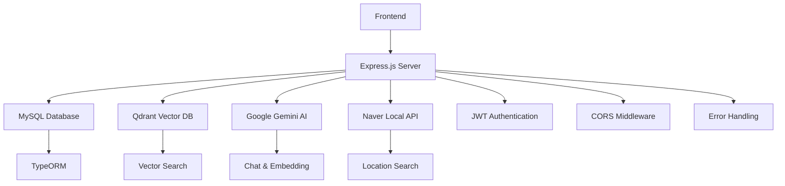

# AI 웹 채팅 서버 명세서

## 개요

AI 웹 채팅 서버는 **Google Gemini AI**와 **Qdrant 벡터 데이터베이스**를 활용한 지능형 채팅 시스템입니다. JWT 토큰 기반 인증, 벡터 기반 의미 검색, RAG(Retrieval-Augmented Generation) 기반 지식 베이스, 실시간 Function Calling 등의 고급 AI 기능을 제공하는 Express.js 기반 백엔드 서버입니다.

이 서버는 일반적인 다중 턴 AI 채팅뿐만 아니라, 실시간 정보 조회(날씨, 지역 검색), 사용자 맞춤형 지식 베이스 검색, 채팅방 관리, 사용자 인증 및 권한 관리까지 포괄하는 종합적인 AI 채팅 플랫폼의 백엔드 역할을 수행합니다.

## 주요 기능

### 사용자 인증 및 계정 관리

완전한 사용자 생명주기 관리를 제공하는 JWT 기반 인증 시스템:

- **회원가입 및 로그인**: 이메일 기반 사용자 등록과 PBKDF2 해시 알고리즘을 사용한 안전한 비밀번호 관리
- **이중 토큰 시스템**: Access Token(1시간)과 Refresh Token(5시간)을 통한 보안성과 사용자 편의성 균형
- **토큰 화이트리스트**: 데이터베이스 기반 토큰 관리로 로그아웃 시 즉시 토큰 무효화 및 중복 세션 방지
- **프로필 관리**: 사용자 정보 조회, 수정, 계정 삭제 기능
- **자동 토큰 정리**: 6시간 주기로 만료된 토큰 자동 삭제

### AI 채팅 대화 관리

Google Gemini 2.5-flash 모델을 활용한 다양한 형태의 AI 대화 서비스:

#### 다중 턴 기본 채팅
- 대화 컨텍스트를 유지하는 연속적인 대화 처리
- Frontend 메시지 형식을 Gemini API 형식으로 자동 변환
- 평균 1-2초의 빠른 응답 시간

#### Function Calling 기반 실시간 정보 조회
- **현재 시간 조회**: 전 세계 시간대별 실시간 시간 정보 제공
- **네이버 지역 검색**: 장소, 업체, 맛집 등 지역 정보 실시간 검색
- AI가 사용자 요청을 분석하여 적절한 도구를 자동 선택 및 실행
- 도구 실행 결과를 바탕으로 자연어 응답 생성

#### RAG 기반 지식 검색 채팅
- Happytalk 솔루션 전용 지식 베이스 구축 및 활용
- 최대 10개의 관련 문서를 참조한 정확한 답변 제공
- 마크다운 형식의 구조화된 응답과 참고 문서 ID 표시
- 의미적 유사도 기반 지능형 문서 검색

### 벡터 기반 의미 검색

Google Gemini 임베딩 모델과 Qdrant를 활용한 고도화된 검색 시스템:

- **임베딩 기술**: 1536차원 Google Gemini embedding 모델 사용
- **의미적 검색**: 키워드가 아닌 의미 기반 유사도 검색
- **메시지 벡터 저장**: 채팅 메시지를 벡터화하여 Qdrant에 저장
- **유사 메시지 검색**: 사용자 쿼리와 의미적으로 유사한 과거 메시지 검색
- **지식베이스 검색**: 벡터화된 문서에서 관련 정보 검색
- **컬렉션 관리**: 벡터 데이터베이스 상태 모니터링 및 관리 도구

### RAG 지식 관리

문서 기반 지식베이스 구축 및 관리 시스템:

- **다양한 지식 생성 방식**: 직접 텍스트 입력 또는 .txt 파일 업로드
- **지능형 문서 처리**: 500자 단위 청킹, 50자 겹침으로 문맥 보존
- **임베딩 변환**: Google Gemini를 통한 문서의 벡터 변환
- **하이브리드 저장**: MySQL(메타데이터) + Qdrant(벡터) 구조
- **의미 기반 검색**: 사용자 질의에 대한 관련 문서 자동 검색
- **AI 통합**: Function Calling을 통한 RAG 답변 생성

### 채팅방 관리

다양한 형태의 채팅방 생성 및 관리:

- **채팅방 생성**: public, private, group 타입 지원
- **채팅방 조회**: 모든 활성 채팅방 목록과 참여자 정보 제공
- **생성자 관리**: 채팅방 소유권 및 관리 권한 설정
- **참여자 관리**: 사용자별 채팅방 참여 상태 추적
- **권한 기반 접근**: JWT 인증 기반 채팅방 접근 제어

### 권한 기반 리소스 접근

강력한 보안과 세밀한 접근 제어 시스템:

- **역할 기반 접근 제어(RBAC)**: user, admin, moderator 역할별 권한 관리
- **다단계 인증**: JWT 서명 검증 + 데이터베이스 화이트리스트 확인
- **선택적 인증**: 일부 리소스에 대한 유연한 접근 제어
- **토큰 생명주기 관리**: 자동 토큰 갱신 및 무효화
- **보안 계층화**: 미들웨어 기반 계층적 보안 아키텍처

### 시스템 정보 조회

기본적인 서버 상태 및 정보 조회:

- **홈페이지**: 서버 기본 정보 및 상태 확인
- **헬스 체크**: 서비스 가용성 모니터링
- **API 문서**: 각 엔드포인트별 상세 스펙 제공

## 개선 필요사항

### Security

#### 1. 인증 미적용 공개 API
- **문제점**: AI 채팅 관련 API들(`/ai/chat`, `/ai/chat/tool`, `/ai/chat/rag`)이 인증 없이 공개되어 있음
- **위험성**: 무제한 API 호출로 인한 리소스 남용 및 비용 발생 가능
- **권장사항**: 
  - 최소한 Rate Limiting 구현
  - 선택적 인증(optionalAuth) 적용으로 사용자별 사용량 추적
  - API 키 기반 접근 제어 도입

#### 2. 환경변수 보안 관리
- **문제점**: API 키들이 환경변수로만 관리되어 노출 위험
- **권장사항**:
  - AWS Secrets Manager, Azure Key Vault 등 전용 비밀 관리 서비스 사용
  - 환경변수 암호화 및 런타임 복호화
  - API 키 로테이션 자동화

#### 3. 에러 정보 노출
- **문제점**: 에러 응답에서 내부 구조나 민감한 정보가 노출될 수 있음
- **권장사항**:
  - 프로덕션 환경에서 상세 에러 메시지 제한
  - 에러 로그와 사용자 응답 분리
  - 표준화된 에러 응답 형식 사용

#### 4. CORS 설정
- **문제점**: 모든 origin(`*`)에서의 접근 허용
- **권장사항**:
  - 허용 도메인을 명시적으로 지정
  - 환경별(개발/스테이징/프로덕션) 차별화된 CORS 정책

#### 5. 데이터 검증 강화
- **문제점**: 일부 API에서 입력 데이터 검증이 부족
- **권장사항**:
  - Joi, express-validator 등을 활용한 강력한 입력 검증
  - SQL Injection, XSS 방어 강화
  - 파일 업로드 보안 검증 강화

### Code Quality

#### 1. 일관성 없는 에러 처리
- **문제점**: 
  - 일부 파일에서 HTTP 상태 코드 불일치 (조회 API에서 201 반환)
  - 에러 로그 메시지 오류 (`"Create Room Error"` vs `"Get Rooms Error"`)
- **권장사항**:
  - REST API 표준에 맞는 HTTP 상태 코드 사용
  - 중앙집중식 에러 처리 미들웨어 구현
  - 일관된 로깅 포맷 적용

#### 2. 데이터베이스 쿼리 최적화
- **문제점**: 
  - `getChatRooms` 메서드에서 `findOne()` 사용으로 단일 결과만 반환
  - N+1 쿼리 문제 가능성
- **권장사항**:
  - 적절한 TypeORM 메서드 사용 (`find()` vs `findOne()`)
  - Eager loading 최적화
  - 데이터베이스 인덱스 최적화

#### 3. 코드 중복 및 모듈화
- **문제점**: 
  - 유사한 검증 로직의 중복
  - 하드코딩된 상수값들
- **권장사항**:
  - 공통 유틸리티 함수 분리
  - 상수값들을 별도 config 파일로 관리
  - 재사용 가능한 컴포넌트 설계

#### 4. 타입 안정성
- **문제점**: JavaScript 사용으로 인한 런타임 타입 에러 가능성
- **권장사항**:
  - TypeScript 도입으로 컴파일 타임 타입 검증
  - 강력한 타입 정의 및 인터페이스 활용
  - 타입 가드 함수 구현

#### 5. 테스트 커버리지
- **문제점**: 체계적인 테스트 코드 부재
- **권장사항**:
  - Jest를 활용한 단위 테스트 구현
  - API 통합 테스트 작성
  - 테스트 커버리지 90% 이상 목표

#### 6. 비동기 처리 최적화
- **문제점**: 일부 비동기 작업에서 순차 처리로 인한 성능 저하
- **권장사항**:
  - Promise.all()을 활용한 병렬 처리
  - 적절한 에러 핸들링과 타임아웃 설정
  - 배치 처리 최적화

#### 7. 설정 관리
- **문제점**: 환경별 설정이 하드코딩되어 관리가 어려움
- **권장사항**:
  - 환경별 설정 파일 분리
  - Config validation 구현
  - 기본값 설정 및 fallback 로직

## 추가 정보

### 기술 스택

### 데이터 아키텍처

- **MySQL**: 사용자, 토큰, 채팅방, 메시지, 지식 문서 메타데이터
- **Qdrant**: 1536차원 임베딩 벡터, 메타데이터 인덱싱
- **메모리**: 임시 파일 처리, 세션 관리

### API 설계 패턴

1. **RESTful API**: 표준 HTTP 메서드와 상태 코드 사용
2. **Middleware Pattern**: 인증, 검증, 에러 처리의 계층화
3. **Service Layer**: 비즈니스 로직과 데이터 접근 분리
4. **Error First**: Node.js 스타일 에러 처리

### 성능 고려사항

- **벡터 검색**: 평균 50-100ms (인덱스 크기에 따라 변동)
- **임베딩 생성**: 평균 100-500ms (Gemini API 의존)
- **AI 응답**: 평균 1-5초 (모드별 차이)
- **데이터베이스**: 커넥션 풀링을 통한 최적화

### 확장성 계획

1. **마이크로서비스 분리**: 인증, 채팅, 검색 서비스 독립화
2. **캐싱 계층**: Redis를 통한 토큰 및 검색 결과 캐싱
3. **로드 밸런싱**: 다중 인스턴스 운영
4. **CDN 통합**: 정적 자원 및 이미지 처리
5. **실시간 기능**: WebSocket을 통한 실시간 채팅
6. **모니터링**: ELK Stack을 통한 로그 분석 및 성능 모니터링

### 운영 고려사항

- **환경 분리**: 개발, 스테이징, 프로덕션 환경 구분
- **CI/CD**: 자동화된 빌드 및 배포 파이프라인
- **백업**: 데이터베이스 정기 백업 및 복구 절차
- **보안 패치**: 정기적인 의존성 업데이트
- **성능 모니터링**: APM 도구를 통한 실시간 모니터링

이 AI 웹 채팅 서버는 현대적인 AI 기술과 검증된 웹 기술을 결합하여 확장 가능하고 안전한 지능형 채팅 플랫폼을 제공합니다. 지속적인 개선과 최적화를 통해 더욱 강력하고 안정적인 서비스로 발전할 수 있는 기반을 갖추고 있습니다.