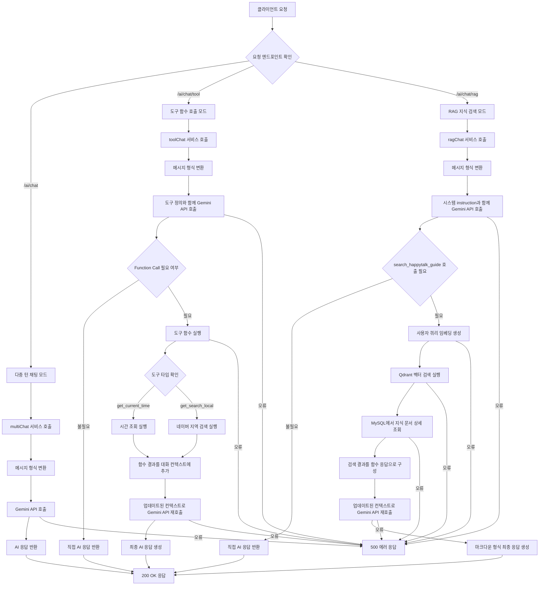
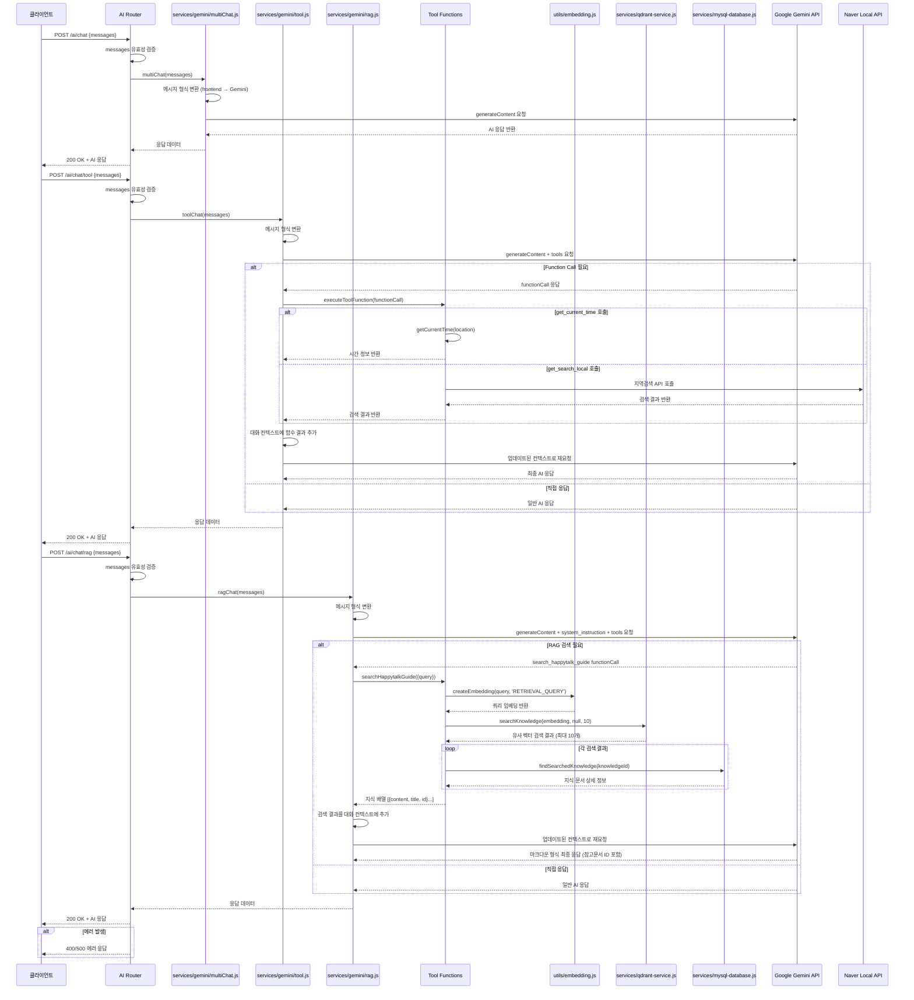

# AI 채팅 대화 관리

## 개요

AI 채팅 대화 관리 워크플로우는 Google Gemini AI를 활용하여 다중 턴 대화, 도구 함수 호출, RAG(Retrieval-Augmented Generation) 기반 대화 처리를 통합적으로 관리하는 시스템입니다. 사용자의 요청에 따라 일반 채팅, 실시간 정보 조회, 지식 베이스 검색 등 다양한 형태의 AI 대화 서비스를 제공합니다.

## 상세 설명

이 워크플로우는 세 가지 주요 대화 모드를 지원합니다:

### 1. 다중 턴 Gemini 채팅 (POST /ai/chat)
- Google Gemini 2.5-flash 모델을 사용한 기본 대화 처리
- 대화 컨텍스트를 유지하며 연속적인 대화 진행
- Frontend 메시지 형식을 Gemini API 형식으로 자동 변환
- 단순하고 빠른 AI 응답 제공

### 2. 도구 함수 호출 기반 채팅 (POST /ai/chat/tool)
- Function Calling 기능을 통한 실시간 정보 조회
- 지원 도구:
  - `get_current_time`: 전 세계 시간대별 현재 시간 조회
  - `get_search_local`: 네이버 지역 검색 API를 통한 장소/업체 검색
- AI가 필요에 따라 자동으로 적절한 도구를 선택하여 호출
- 도구 실행 결과를 바탕으로 최종 자연어 응답 생성

### 3. RAG 기반 지식 검색 채팅 (POST /ai/chat/rag)
- Happytalk 솔루션 전용 지식 베이스 검색 서비스
- 벡터 임베딩을 통한 의미적 유사도 검색
- Qdrant 벡터 데이터베이스와 MySQL을 활용한 하이브리드 검색
- 최대 10개의 관련 문서를 참조하여 정확한 답변 제공
- 마크다운 형식의 구조화된 응답과 참고 문서 ID 포함

### 공통 특징
- Express.js 기반 RESTful API 서비스
- 비동기 처리를 통한 효율적인 리소스 활용
- 체계적인 에러 처리 및 로깅 시스템
- CORS 설정을 통한 크로스 오리진 요청 지원

## Flow

### Flow Chart

### Sequence Diagram

## 추가 정보

### 사용 기술 스택
- **Backend Framework**: Express.js
- **AI Model**: Google Gemini 2.5-flash
- **Vector Database**: Qdrant (1536차원 벡터)
- **Database**: MySQL with TypeORM
- **Embedding**: Gemini Embedding (text-embedding-004)
- **External APIs**: Naver Local Search API

### 환경 변수 요구사항
- `GEMINI_API_KEY`: Google Gemini AI API 키 (필수)
- `NAVER_APPLICATION_CLIENT_ID`: 네이버 개발자센터 클라이언트 ID
- `NAVER_APPLICATION_CLIENT_SECRET`: 네이버 개발자센터 클라이언트 시크릿
- `QDRANT_URL`: Qdrant 벡터 데이터베이스 URL
- `QDRANT_API_KEY`: Qdrant API 키

### 성능 특성
- **일반 채팅**: 평균 응답 시간 1-2초
- **도구 함수 호출**: 평균 응답 시간 2-4초 (외부 API 호출 포함)
- **RAG 검색**: 평균 응답 시간 3-5초 (임베딩 생성 + 벡터 검색 + 문서 조회)
- **동시 요청 처리**: 비동기 처리로 다중 요청 지원

### 보안 고려사항
- 현재 인증 미들웨어가 적용되지 않아 공개 API로 운영
- API 키는 환경변수로 관리하여 소스코드 노출 방지
- CORS 설정으로 크로스 오리진 요청 제어
- 입력 데이터 유효성 검증을 통한 기본적인 보안 처리

### 확장 가능성
- 새로운 도구 함수 추가 용이 (llm-tools.json 수정)
- 다양한 지식 베이스 통합 가능
- 사용자별 개인화 기능 추가 가능
- 실시간 스트리밍 응답 지원 가능

### 모니터링 및 로깅
- 모든 API 호출과 응답이 콘솔에 로깅
- 에러 발생 시 상세한 스택 트레이스 기록
- Gemini API 사용량 메타데이터 제공
- 함수 호출 및 RAG 검색 과정 추적 가능

### 데이터 흐름 특징
1. **메시지 형식 표준화**: Frontend 형식 → Gemini API 형식 자동 변환
2. **컨텍스트 유지**: 다중 턴 대화에서 이전 메시지 히스토리 보존
3. **단계적 처리**: Function Call 및 RAG 검색 시 단계별 컨텍스트 업데이트
4. **에러 복구**: 부분적 실패 시에도 가능한 범위에서 응답 제공