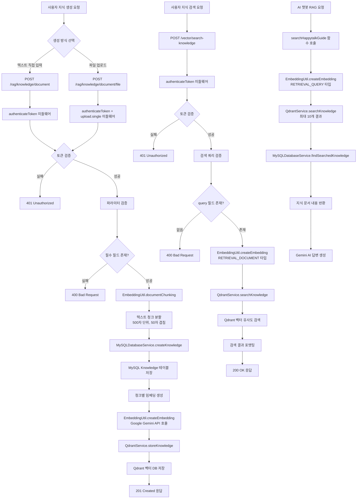
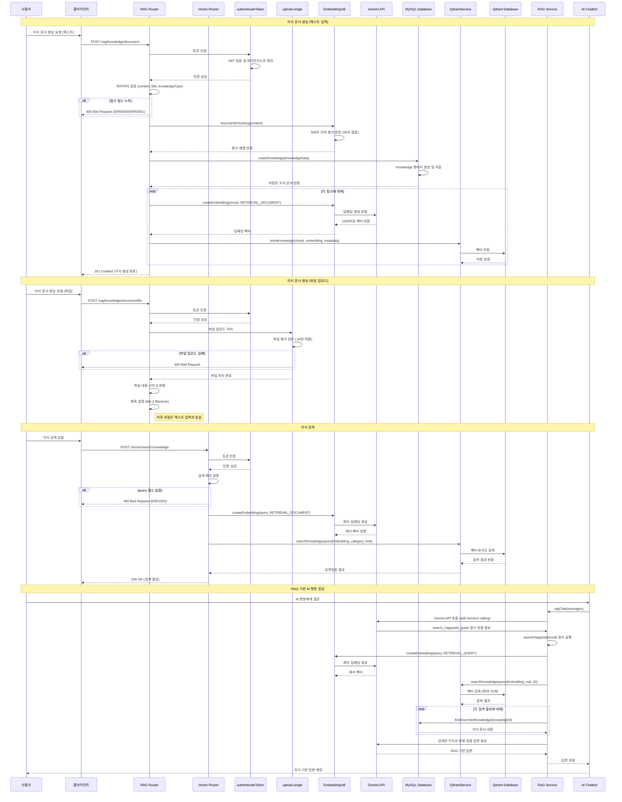
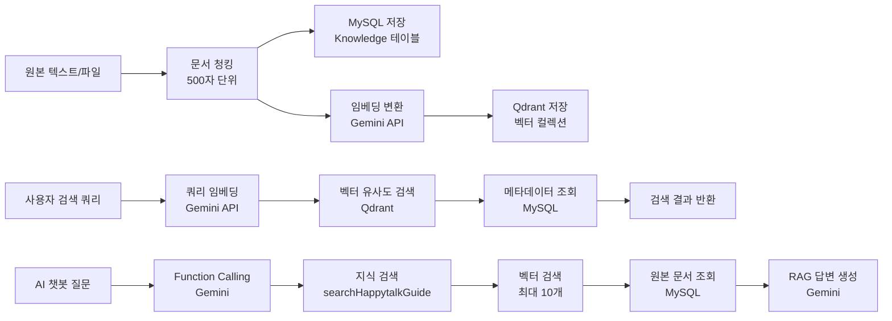

# RAG 지식 관리

## 개요

RAG(Retrieval-Augmented Generation) 지식 관리 워크플로우는 문서 기반 지식베이스를 구축하고 관리하는 시스템입니다. 사용자가 텍스트나 파일을 통해 지식 문서를 생성하고, 이를 벡터 데이터베이스에 저장하여 의미 기반 검색과 AI 챗봇의 RAG 기능에 활용할 수 있도록 합니다. 이 워크플로우는 지식 문서 생성, 임베딩 벡터 변환, 저장, 검색의 전체 과정을 포괄합니다.

## 상세 설명

RAG 지식 관리 워크플로우는 다음과 같은 핵심 기능들을 제공합니다:

1. **지식 문서 생성**: 사용자가 직접 텍스트를 입력하여 지식 문서를 생성하거나, 텍스트 파일(.txt)을 업로드하여 지식 문서를 생성할 수 있습니다.

2. **문서 청킹**: 입력된 텍스트는 500자 단위로 분할되며, 인접한 청크 간 50자씩 겹치도록 처리하여 문맥을 보존합니다.

3. **임베딩 변환**: Google Gemini의 embedding-exp-03-07 모델을 사용하여 텍스트를 1536차원의 벡터로 변환합니다.

4. **저장**: 원본 지식 문서는 MySQL 데이터베이스에 저장되고, 청크 단위로 분할된 내용은 임베딩 벡터와 함께 Qdrant 벡터 데이터베이스에 저장됩니다.

5. **검색**: 사용자의 검색 쿼리를 임베딩으로 변환하여 유사도 기반으로 관련 지식을 검색합니다.

6. **RAG 통합**: AI 챗봇이 function calling을 통해 관련 지식을 검색하여 답변에 활용합니다.

이 시스템은 JWT 기반 인증을 통해 사용자별로 지식 관리가 가능하며, 카테고리별 분류와 필터링을 지원합니다.

## Flow

### Flow Chart



### Sequence Diagram



### Class Diagram

```mermaid
classDiagram
    class RAGRouter {
        +post() createKnowledgeDocument
        +post() createKnowledgeFromFile
        -validateParams()
        -processFileContent()
    }
    
    class VectorRouter {
        +post() searchKnowledge
        -validateQuery()
        -formatResults()
    }
    
    class AuthMiddleware {
        +authenticateToken()
        -verifyJWT()
        -checkWhitelist()
    }
    
    class UploadMiddleware {
        +single(fieldname)
        -fileFilter()
        -storage: memoryStorage
        -limits: {fileSize: 10MB}
    }
    
    class EmbeddingUtil {
        +createEmbedding(text, taskType)
        +documentChunking(document)
        +createBatchEmbeddings()
        -chunkSize: 500
        -overlapSize: 50
        -stepSize: 450
    }
    
    class MySQLDatabaseService {
        +createKnowledge(knowledgeData)
        +findSearchedKnowledge(knowledgeId)
        -getRepository()
    }
    
    class QdrantService {
        +storeKnowledge(content, embedding, metadata)
        +searchKnowledge(queryEmbedding, category, limit)
        +storeVector(vector, payload)
        +searchSimilar(queryVector, limit, filter)
    }
    
    class Knowledge {
        +id: string
        +content: string
        +title: string
        +category: string
        +source: string
        +knowledgeType: enum
        +chunk: json
        +uploaderId: string
        +isDeleted: boolean
        +createdAt: datetime
        +updatedAt: datetime
        +isSync: boolean
    }
    
    class RAGService {
        +ragChat(messages)
        +executeToolFunction(functionCall)
        -callGeminiAPI()
        -handleFunctionCall()
    }
    
    class SearchHappytalkGuide {
        +searchHappytalkGuide(query)
        -processResults()
    }
    
    class GeminiAPI {
        +generateContent()
        +createEmbedding()
        +functionCalling()
    }
    
    class QdrantDatabase {
        +collection: ai_chat_embeddings
        +dimensions: 1536
        +indexedFields: [room_id, user_id, type]
    }
    
    RAGRouter --> AuthMiddleware : uses
    RAGRouter --> UploadMiddleware : uses
    RAGRouter --> EmbeddingUtil : uses
    RAGRouter --> MySQLDatabaseService : uses
    RAGRouter --> QdrantService : uses
    
    VectorRouter --> AuthMiddleware : uses
    VectorRouter --> EmbeddingUtil : uses
    VectorRouter --> QdrantService : uses
    
    EmbeddingUtil --> GeminiAPI : calls
    MySQLDatabaseService --> Knowledge : manages
    QdrantService --> QdrantDatabase : stores
    
    RAGService --> EmbeddingUtil : uses
    RAGService --> QdrantService : uses
    RAGService --> MySQLDatabaseService : uses
    RAGService --> SearchHappytalkGuide : uses
    RAGService --> GeminiAPI : calls
    
    SearchHappytalkGuide --> EmbeddingUtil : uses
    SearchHappytalkGuide --> QdrantService : uses
    SearchHappytalkGuide --> MySQLDatabaseService : uses
```

### 데이터 흐름도



## 추가 정보

### 지원하는 지식 문서 유형

- **텍스트 입력**: 직접 텍스트를 입력하여 지식 문서 생성
- **파일 업로드**: .txt 파일 업로드 (최대 10MB, UTF-8 인코딩)
- **지식 타입**: 현재 'text' 타입만 지원
- **카테고리**: 사용자 정의 카테고리 분류 지원
- **출처**: 지식 문서의 출처 정보 관리

### 문서 청킹 알고리즘 세부사항

- **청크 크기**: 500자 기준으로 분할
- **겹침 크기**: 인접한 청크 간 50자씩 겹침으로 문맥 보존
- **이동 간격**: 450자씩 이동 (chunkSize - overlapSize)
- **마지막 청크 처리**: 50자 미만인 경우 이전 청크와 병합
- **텍스트 정리**: 연속된 공백 문자를 단일 공백으로 정리

### 임베딩 모델 설정

- **사용 모델**: Google Gemini embedding-exp-03-07
- **벡터 차원**: 1536차원
- **태스크 타입**: 
  - RETRIEVAL_DOCUMENT: 문서 저장용
  - RETRIEVAL_QUERY: 검색 쿼리용
- **출력 차원**: 1536차원으로 고정

### 벡터 데이터베이스 구조

- **컬렉션**: ai_chat_embeddings
- **인덱스 필드**: room_id, user_id, type
- **메타데이터**: knowledgeId, title, category, source, uploaderId
- **검색 방식**: 코사인 유사도 기반

### 보안 및 접근 제어

- **인증**: JWT Bearer 토큰 기반
- **토큰 검증**: 화이트리스트 기반 이중 검증
- **사용자 격리**: uploaderId를 통한 사용자별 지식 관리
- **파일 업로드 보안**: 
  - 파일 형식 제한 (.txt만 허용)
  - 파일 크기 제한 (최대 10MB)
  - 메모리 저장으로 임시 파일 생성 방지

### 성능 최적화

- **배치 임베딩**: 여러 청크를 동시에 처리
- **벡터 인덱싱**: Qdrant의 HNSW 인덱스 활용
- **데이터베이스 인덱스**: uploaderId, createdAt 필드 인덱싱
- **청크 기반 검색**: 문서 전체가 아닌 관련 청크만 검색

### RAG 통합 방식

- **Function Calling**: Gemini AI의 function calling 기능 활용
- **도구 정의**: llm-rag-tools.json에 검색 도구 정의
- **시스템 프롬프트**: Happytalk 솔루션 전용 어시스턴트 역할 정의
- **검색 결과 활용**: 최대 10개의 관련 문서를 기반으로 답변 생성
- **참고 문서 표시**: 답변에 참고한 문서의 ID 포함

### 에러 처리 및 모니터링

- **에러 코드**: 
  - ERR5000: 필수 필드 누락
  - ERR5001: 학습 타입 미정의
  - ERR1001: 검색 쿼리 누락
  - ERR1008: 인증 토큰 오류
- **로깅**: 각 단계별 상세 로그 기록
- **모니터링**: API 호출, 임베딩 생성, 벡터 저장 성공률 추적