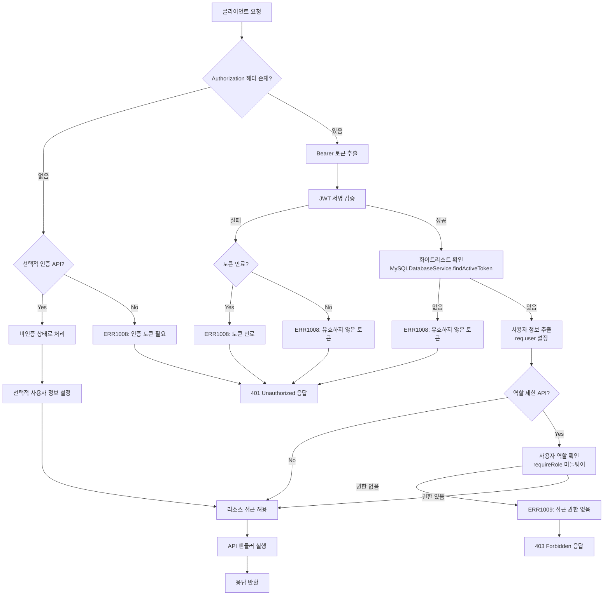
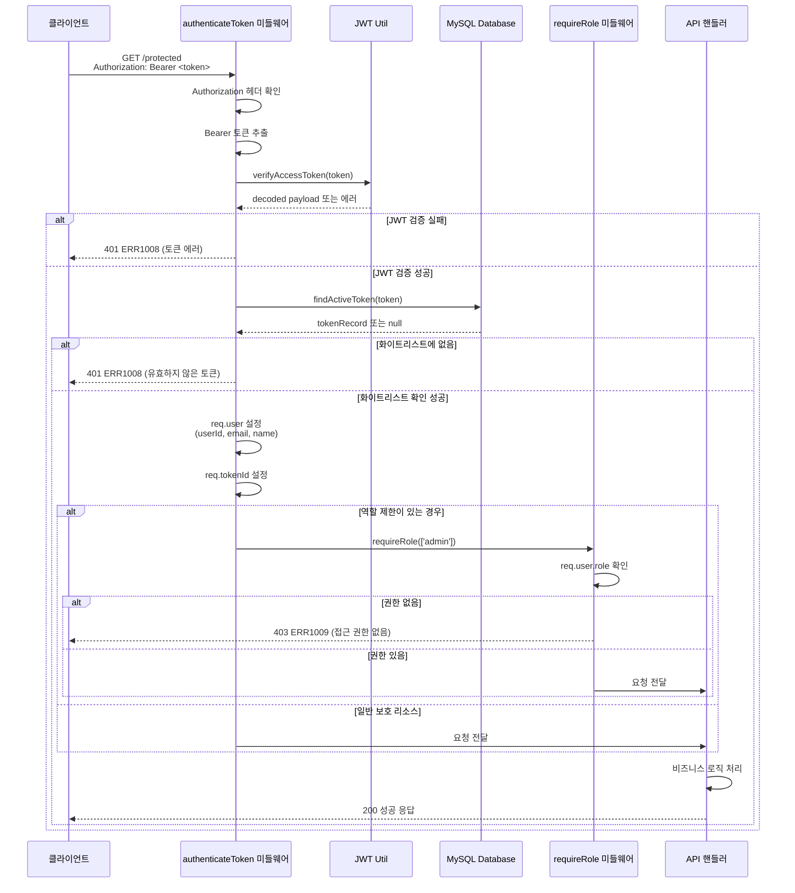
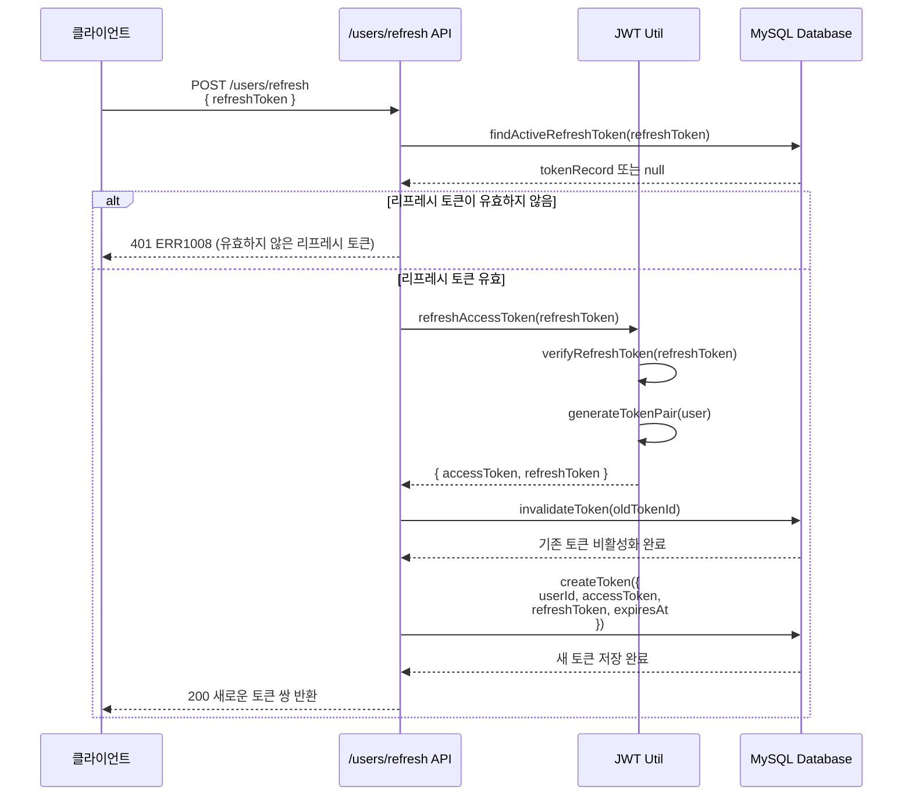

# 권한 기반 리소스 접근

## 개요
AI 웹 채팅 서버에서 JWT 토큰 기반 인증과 역할 기반 접근 제어(RBAC)를 통해 보호된 리소스에 대한 접근을 관리하는 워크플로우입니다. 이 시스템은 다단계 인증 검증과 화이트리스트 기반 토큰 관리를 통해 강력한 보안을 제공합니다.

## 상세 설명
권한 기반 리소스 접근 워크플로우는 다음과 같은 주요 구성 요소로 이루어집니다:

### 1. 인증 시스템
- **JWT 토큰 기반 인증**: Access Token(1시간)과 Refresh Token(5시간)을 사용한 이중 토큰 시스템
- **화이트리스트 기반 토큰 관리**: 모든 유효한 토큰을 데이터베이스에 저장하여 관리
- **토큰 검증**: JWT 서명 검증과 데이터베이스 화이트리스트 확인을 통한 이중 검증

### 2. 권한 제어 시스템
- **역할 기반 접근 제어**: 사용자의 역할(user, admin, moderator)에 따른 접근 권한 관리
- **미들웨어 기반 보호**: `authenticateToken`, `optionalAuth`, `requireRole` 미들웨어를 통한 계층적 보안
- **선택적 인증**: 일부 리소스에 대해서는 인증된 사용자와 비인증 사용자 모두 접근 가능

### 3. API 보호 수준
- **공개 리소스**: 인증 없이 접근 가능한 리소스
- **인증 필요 리소스**: 유효한 JWT 토큰이 필요한 일반 사용자 리소스
- **관리자 전용 리소스**: 특정 역할(admin)이 필요한 고급 권한 리소스

## Flow

### Flow Chart - 권한 기반 리소스 접근 처리 흐름

### Sequence Diagram - 인증된 사용자의 보호된 리소스 접근

### Sequence Diagram - 토큰 갱신 프로세스

### 텍스트 설명

#### 1. 기본 인증 흐름
1. **요청 수신**: 클라이언트가 보호된 리소스에 대한 요청을 전송 (`Authorization: Bearer <token>`)
2. **헤더 검증**: `authenticateToken` 미들웨어가 Authorization 헤더의 존재와 형식을 확인
3. **JWT 검증**: `jwtUtil.verifyAccessToken()`을 통해 토큰의 서명과 만료 시간을 검증
4. **화이트리스트 확인**: `MySQLDatabaseService.findActiveToken()`을 통해 데이터베이스의 화이트리스트에서 토큰 유효성 확인
5. **사용자 정보 설정**: 검증된 토큰에서 사용자 정보를 추출하여 `req.user`에 설정
6. **리소스 접근**: 검증이 완료되면 요청된 API 핸들러로 제어권 이동

#### 2. 역할 기반 접근 제어
- **역할 확인**: `requireRole` 미들웨어가 사용자의 역할이 요구되는 권한과 일치하는지 확인
- **권한 검증**: 허용된 역할 목록(`allowedRoles`)과 사용자 역할(`req.user.role`) 비교
- **접근 승인/거부**: 권한이 있으면 다음 미들웨어로, 없으면 403 Forbidden 에러 반환

#### 3. 선택적 인증
- **유연한 접근**: `optionalAuth` 미들웨어를 통해 토큰이 있으면 인증하고, 없어도 통과
- **사용자 경험 개선**: 로그인한 사용자에게는 개인화된 서비스를, 비로그인 사용자에게는 기본 서비스 제공

#### 4. 토큰 생명주기 관리
- **토큰 발급**: 로그인 시 Access Token(1시간)과 Refresh Token(5시간) 쌍 생성
- **토큰 갱신**: Access Token 만료 시 Refresh Token을 사용하여 새로운 토큰 쌍 발급
- **토큰 무효화**: 로그아웃 시 또는 보안상 필요 시 `invalidateToken()`을 통해 토큰 비활성화

#### 5. 보안 계층
- **다중 검증**: JWT 서명 검증 + 데이터베이스 화이트리스트 확인
- **토큰 격리**: 사용자별로 기존 활성 토큰을 비활성화하여 중복 세션 방지
- **자동 정리**: 6시간마다 만료된 토큰을 자동으로 정리하여 데이터베이스 최적화

## 추가 정보

### API 엔드포인트별 권한 매트릭스

| API 경로 | 인증 필요 | 역할 제한 | 미들웨어 |
|----------|-----------|-----------|----------|
| `POST /users/signup` | ❌ | - | - |
| `POST /users/login` | ❌ | - | - |
| `POST /users/refresh` | ❌ | - | - |
| `GET /users/me` | ✅ | - | `authenticateToken` |
| `POST /users/logout` | ✅ | - | `authenticateToken` |
| `PUT /users/profile` | ✅ | - | `authenticateToken` |
| `DELETE /users/account` | ✅ | - | `authenticateToken` |
| `GET /protected-example/protected` | ✅ | - | `authenticateToken` |
| `GET /protected-example/admin` | ✅ | admin | `authenticateToken`, `requireRole(['admin'])` |
| `GET /protected-example/api/data` | ✅ | - | `authenticateToken` (via router.use) |
| `POST /vector/store-message` | ✅ | - | `authenticateToken` |
| `POST /vector/search-similar` | ✅ | - | `authenticateToken` |
| `POST /vector/search-knowledge` | ✅ | - | `authenticateToken` |
| `GET /vector/collection-info` | ✅ | - | `authenticateToken` |
| `POST /vector/test-embedding` | ❌ | - | - |
| `POST /room` | ✅ | - | `authenticateToken` |
| `GET /room` | ✅ | - | `authenticateToken` |
| `POST /ai/chat` | ❌ | - | - |
| `POST /ai/chat/tool` | ❌ | - | - |
| `POST /ai/chat/rag` | ❌ | - | - |

### 에러 코드 정의

| 에러 코드 | HTTP 상태 | 설명 |
|-----------|-----------|------|
| ERR1008 | 401 | 토큰 관련 에러 (누락, 만료, 유효하지 않음) |
| ERR1009 | 403 | 접근 권한 없음 (역할 부족) |

### 보안 고려사항

1. **토큰 보안**
   - JWT Secret은 환경변수로 관리하며 충분히 복잡한 문자열 사용
   - 토큰에는 민감한 개인정보 포함 금지
   - Refresh Token에는 최소한의 정보만 포함

2. **화이트리스트 관리**
   - 모든 유효한 토큰을 데이터베이스에 저장하여 중앙 집중식 관리
   - 로그인 시 기존 활성 토큰을 모두 비활성화하여 세션 중복 방지
   - 주기적인 만료 토큰 정리로 데이터베이스 성능 최적화

3. **역할 관리**
   - 역할 정보는 JWT 토큰이 아닌 데이터베이스에서 실시간 확인 권장
   - 최소 권한 원칙 적용으로 필요한 최소한의 권한만 부여
   - 역할 변경 시 기존 토큰 무효화 고려

4. **네트워크 보안**
   - HTTPS 사용 필수로 토큰 전송 중 보호
   - CORS 설정을 통한 크로스 오리진 요청 제어
   - Rate Limiting 구현으로 무차별 공격 방지

### 성능 최적화

1. **토큰 캐싱**: Redis 등을 활용한 토큰 화이트리스트 캐싱으로 데이터베이스 부하 감소
2. **배치 정리**: 만료된 토큰의 주기적 배치 삭제로 데이터베이스 성능 유지
3. **인덱스 최적화**: 토큰 검색을 위한 데이터베이스 인덱스 설정
4. **연결 풀링**: 데이터베이스 연결 풀을 통한 효율적인 커넥션 관리