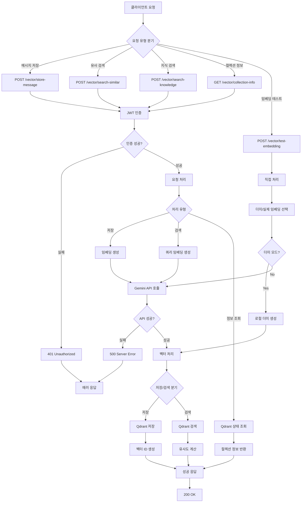
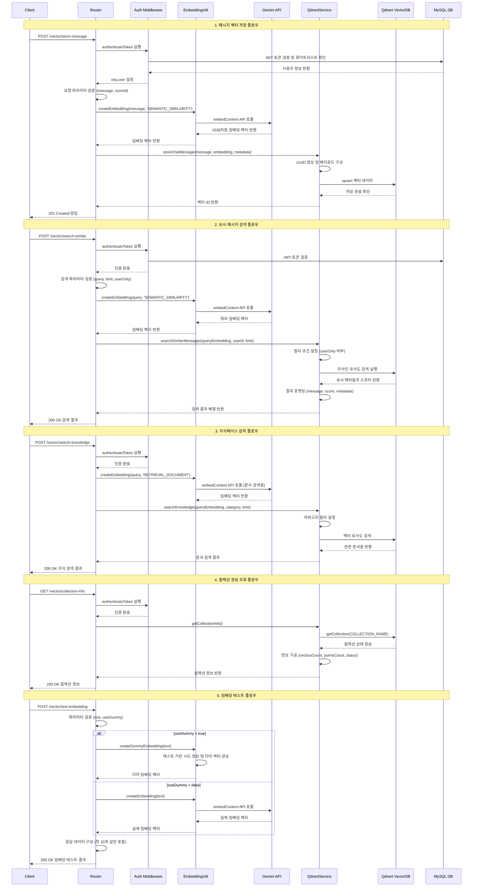

# 벡터 기반 의미 검색

## 개요

벡터 기반 의미 검색 워크플로우는 Google Gemini AI의 임베딩 모델과 Qdrant 벡터 데이터베이스를 활용하여 텍스트의 의미적 유사성을 기반으로 한 고도화된 검색 시스템을 제공합니다. 이 워크플로우는 채팅 메시지의 벡터 저장, 유사도 기반 메시지 검색, 지식베이스 문서 검색, 임베딩 테스트 등의 기능을 포함하며, RAG(Retrieval-Augmented Generation) 시스템의 핵심 구성 요소로 활용됩니다.

## 상세 설명

벡터 기반 의미 검색 워크플로우는 다음과 같은 주요 구성 요소들로 이루어져 있습니다:

### 핵심 기술 스택
- **임베딩 모델**: Google Gemini `gemini-embedding-001` (1536차원)
- **벡터 데이터베이스**: Qdrant (코사인 유사도 기반)
- **인증 시스템**: JWT 토큰 기반 사용자 인증
- **데이터 저장**: MySQL과 Qdrant 하이브리드 구조

### 주요 기능
1. **메시지 벡터 저장**: 채팅 메시지를 임베딩 벡터로 변환하여 Qdrant에 저장
2. **유사 메시지 검색**: 입력 쿼리와 의미적으로 유사한 메시지들을 검색
3. **지식베이스 검색**: 저장된 문서에서 관련 정보를 검색하는 RAG 시스템
4. **컬렉션 관리**: 벡터 데이터베이스 상태 모니터링 및 관리
5. **임베딩 테스트**: 개발 및 디버깅을 위한 임베딩 생성 테스트

### 데이터 구조
- **벡터 차원**: 1536차원 부동소수점 배열
- **메타데이터**: 사용자 정보, 채팅방 정보, 타입, 생성 시간 포함
- **유사도 측정**: 코사인 유사도 알고리즘 사용
- **인덱싱**: `room_id`, `user_id`, `type` 필드 기반 필터링 지원

## Flow

### Flow Chart



### Sequence Diagram



### 플로우 상세 설명

#### 1. 메시지 벡터 저장 플로우 (`POST /vector/store-message`)
1. 클라이언트가 채팅 메시지 저장 요청 전송
2. JWT 인증 미들웨어에서 토큰 검증 및 사용자 정보 추출
3. Google Gemini API를 통해 메시지 텍스트를 1536차원 벡터로 변환
4. 사용자 정보, 채팅방 정보 등 메타데이터와 함께 Qdrant에 저장
5. 생성된 벡터 ID를 포함한 성공 응답 반환

#### 2. 유사 메시지 검색 플로우 (`POST /vector/search-similar`)
1. 검색 쿼리와 필터 옵션(limit, userOnly) 수신
2. 사용자 인증 및 권한 확인
3. 검색 쿼리를 임베딩 벡터로 변환
4. Qdrant에서 코사인 유사도 기반 벡터 검색 수행
5. 유사도 점수와 함께 관련 메시지들을 정렬하여 반환

#### 3. 지식베이스 검색 플로우 (`POST /vector/search-knowledge`)
1. 지식 검색 쿼리와 카테고리 필터 수신
2. `RETRIEVAL_DOCUMENT` 태스크 타입으로 쿼리 임베딩 생성
3. 카테고리 필터 적용하여 관련 문서 검색
4. 유사도 기반으로 정렬된 문서 결과 반환

#### 4. 컬렉션 정보 조회 플로우 (`GET /vector/collection-info`)
1. 벡터 데이터베이스 상태 조회 요청
2. Qdrant 컬렉션의 현재 상태 정보 수집
3. 벡터 개수, 포인트 개수, 인덱싱 상태 등 종합 정보 반환

#### 5. 임베딩 테스트 플로우 (`POST /vector/test-embedding`)
1. 테스트용 텍스트와 더미 모드 옵션 수신
2. 더미 모드인 경우 로컬에서 일관된 테스트 벡터 생성
3. 실제 모드인 경우 Gemini API를 통한 실제 임베딩 생성
4. 생성된 벡터의 첫 10개 값과 메타정보 반환

## 추가 정보

### 기술적 세부사항

#### 임베딩 모델 설정
- **모델명**: `gemini-embedding-001`
- **벡터 차원**: 1536차원
- **지원 태스크 타입**:
  - `SEMANTIC_SIMILARITY`: 일반적인 의미 유사도 검색
  - `RETRIEVAL_DOCUMENT`: 문서 검색 최적화
  - `RETRIEVAL_QUERY`: 쿼리 검색 최적화
- **정규화**: 모든 벡터는 L2 정규화 적용

#### Qdrant 벡터 데이터베이스 구성
- **컬렉션명**: `awc_embeddings`
- **벡터 크기**: 1536차원
- **거리 함수**: 코사인 유사도
- **인덱싱 필드**: `room_id`, `user_id`, `type`
- **페이로드 구조**:
  ```json
  {
    "message": "원본 메시지 텍스트",
    "type": "chat_message | knowledge",
    "userId": "사용자 ID",
    "roomId": "채팅방 ID",
    "userName": "사용자 이름",
    "role": "user | assistant",
    "category": "카테고리 (지식베이스용)",
    "createdAt": "ISO 8601 형식 시간"
  }
  ```

#### 인증 및 보안
- **인증 방식**: JWT Bearer 토큰
- **토큰 검증**: 화이트리스트 기반 이중 검증
- **접근 제어**: 사용자별 메시지 필터링 지원
- **데이터 보호**: 개인 정보를 포함한 메타데이터 암호화 고려

### 성능 최적화 고려사항

#### 응답 시간 최적화
- **임베딩 생성**: 평균 100-500ms (Gemini API 의존)
- **벡터 검색**: 평균 10-50ms (인덱스 크기에 따라 변동)
- **캐싱 전략**: 자주 사용되는 쿼리 임베딩 캐싱 검토
- **배치 처리**: 여러 텍스트 동시 임베딩 생성 지원

#### 확장성 고려사항
- **벡터 저장 용량**: 벡터당 약 6KB (1536 * 4바이트)
- **검색 성능**: 백만 개 벡터 기준 서브초 검색 가능
- **수평 확장**: Qdrant 클러스터링 지원
- **데이터 파티셔닝**: 채팅방별 또는 사용자별 컬렉션 분할 검토

### 오류 처리 및 복구

#### 일반적인 오류 상황
1. **Gemini API 장애**: 임베딩 생성 실패 시 재시도 로직
2. **Qdrant 연결 실패**: 벡터 저장/검색 실패 시 대체 방안
3. **메모리 부족**: 대용량 텍스트 처리 시 청킹 처리
4. **네트워크 지연**: 타임아웃 설정 및 비동기 처리

#### 복구 전략
- **백업 및 복구**: 정기적인 벡터 데이터베이스 백업
- **상태 모니터링**: 컬렉션 상태 주기적 점검
- **장애 대응**: 서비스 다운 시 우아한 성능 저하(graceful degradation)

### 확장 가능성

#### 추가 기능 개발 방향
1. **다국어 지원**: 언어별 최적화된 임베딩 모델 적용
2. **멀티모달 검색**: 이미지, 오디오 등 다양한 데이터 타입 지원
3. **실시간 검색**: 스트리밍 기반 실시간 유사도 검색
4. **개인화 검색**: 사용자 선호도 기반 검색 결과 개인화
5. **분석 기능**: 검색 패턴 분석 및 인사이트 제공

#### API 확장 계획
- **배치 저장**: 여러 메시지 동시 저장 API
- **고급 필터링**: 시간 범위, 감정 분석 등 추가 필터 옵션
- **검색 히스토리**: 사용자별 검색 기록 관리
- **자동 카테고리화**: AI 기반 문서 자동 분류 시스템
- **품질 평가**: 검색 결과 품질 측정 및 개선 도구

### 모니터링 및 운영

#### 핵심 메트릭
- **임베딩 생성 성공률**: Gemini API 호출 성공/실패 비율
- **검색 응답 시간**: 평균/최대 검색 응답 시간
- **벡터 데이터베이스 사용량**: 저장 용량 및 증가율
- **사용자 활동**: API 호출 빈도 및 패턴

#### 알림 및 대응
- **API 장애 알림**: Gemini API 또는 Qdrant 연결 실패 시
- **성능 저하 알림**: 응답 시간 임계값 초과 시
- **용량 알림**: 저장 공간 사용률 80% 초과 시
- **보안 알림**: 비정상적인 접근 패턴 감지 시

이 벡터 기반 의미 검색 워크플로우는 현대적인 AI 기반 채팅 시스템의 핵심 구성 요소로서, 사용자에게 정확하고 맥락적으로 관련성 높은 정보를 제공하는 지능형 검색 경험을 실현합니다.