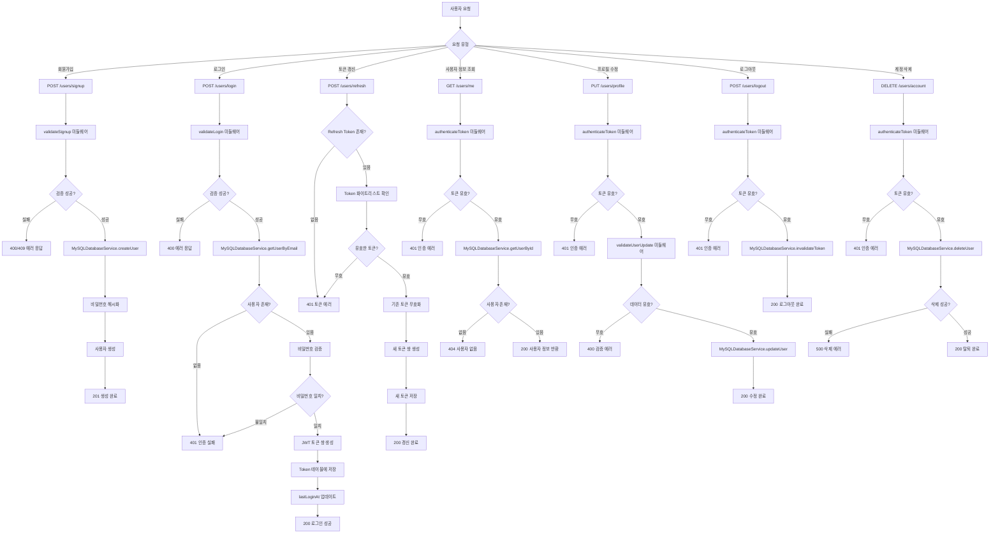
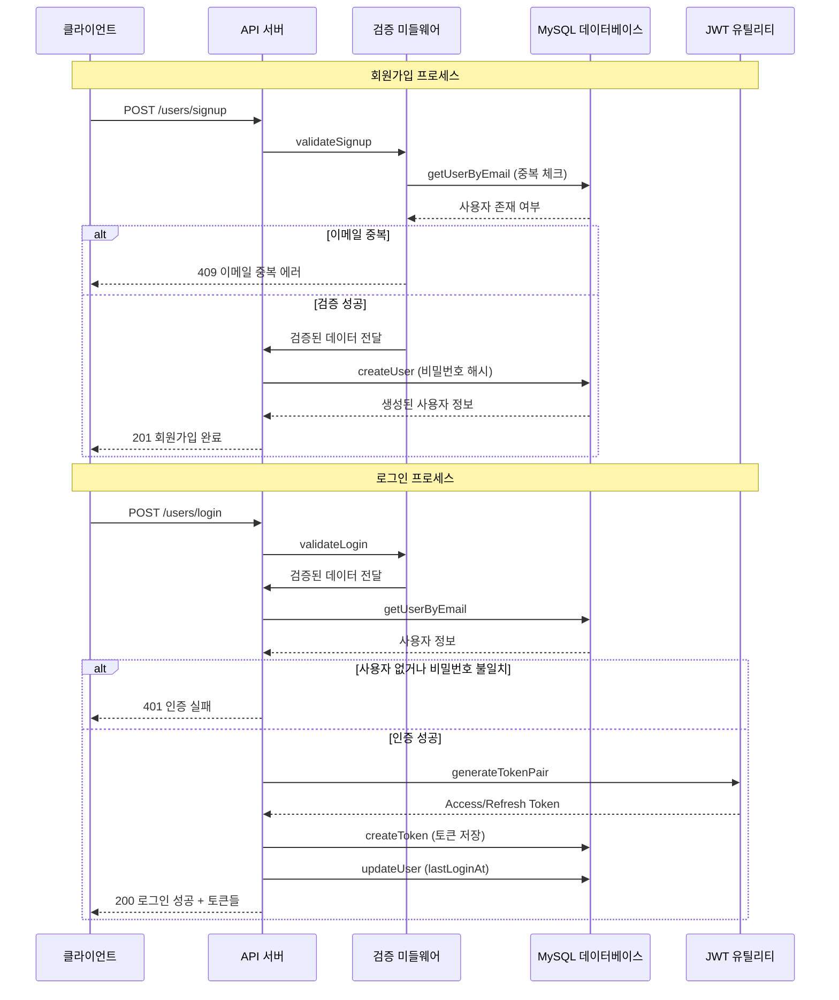
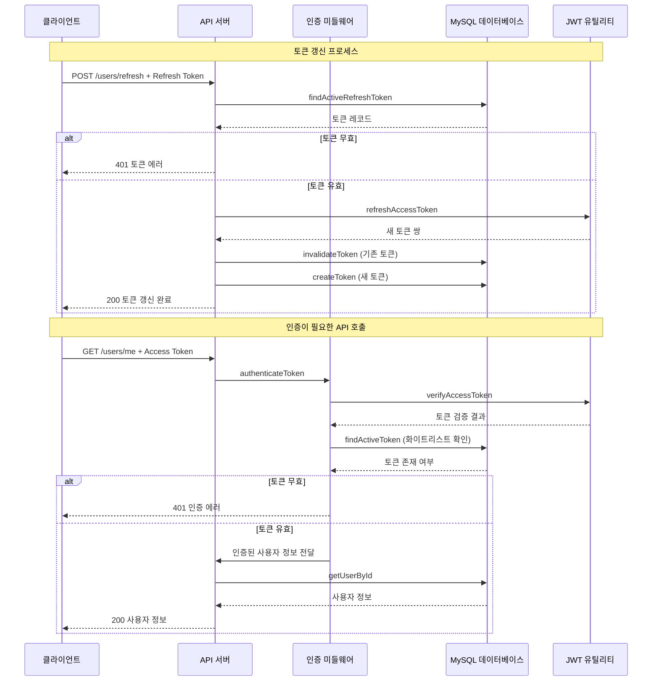
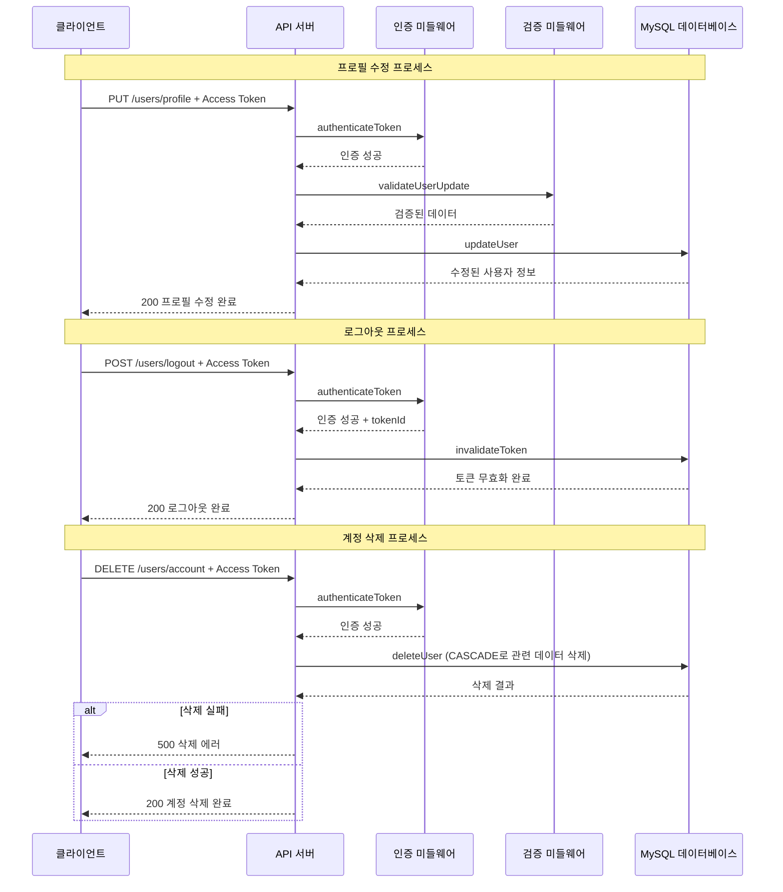

# 사용자 인증 및 계정 관리

## 개요

사용자 인증 및 계정 관리 워크플로우는 사용자의 전체 생명주기를 관리하는 핵심 비즈니스 프로세스입니다. 회원가입부터 시작하여 로그인, 토큰 갱신, 프로필 관리, 계정 삭제까지의 모든 사용자 관련 기능을 포함하며, JWT 기반의 토큰 화이트리스트 인증 시스템을 통해 보안성을 보장합니다.

## 상세 설명

### 주요 기능
- **회원가입**: 이메일, 이름, 비밀번호를 통한 신규 사용자 등록
- **로그인**: 이메일/비밀번호 인증 및 JWT 토큰 발급
- **토큰 갱신**: Refresh Token을 통한 Access Token 갱신
- **사용자 정보 조회**: 인증된 사용자의 프로필 정보 조회
- **프로필 수정**: 사용자 이름, 프로필 이미지 등 정보 업데이트
- **로그아웃**: 토큰 무효화를 통한 안전한 로그아웃
- **계정 삭제**: 사용자 계정 및 관련 데이터 영구 삭제

### 보안 특징
- **JWT 토큰 화이트리스트**: 발급된 토큰을 DB에 저장하여 유효성 검증
- **이중 토큰 시스템**: Access Token(1시간) + Refresh Token(5시간)
- **비밀번호 암호화**: bcrypt 기반 해시 암호화
- **토큰 자동 정리**: 만료된 토큰 자동 삭제 (6시간 주기)
- **입력 데이터 검증**: 미들웨어를 통한 데이터 유효성 검사

### 데이터베이스 스키마
- **User 테이블**: 사용자 기본 정보 (id, email, password, name, profileImage, isActive)
- **Token 테이블**: JWT 토큰 화이트리스트 (accessToken, refreshToken, expiresAt, isActive)

## Flow

### 플로우 차트

### 시퀀스 다이어그램

#### 1. 회원가입 및 로그인 시퀀스

#### 2. 토큰 갱신 및 인증 시퀀스

#### 3. 프로필 관리 및 계정 삭제 시퀀스

### 상세 처리 흐름 설명

#### 1. 회원가입 처리 흐름 (POST /users/signup)
1. 클라이언트에서 이메일, 이름, 비밀번호 전송
2. `validateSignup` 미들웨어에서 데이터 검증
   - 필수 필드 확인
   - 이메일 형식 검증 (정규식)
   - 이름 길이 검증 (2-50자)
   - 비밀번호 길이 검증 (6자 이상)
   - 비밀번호 강도 검증 (8자 이상일 경우)
   - 이메일 중복 확인 (DB 조회)
3. 검증 성공 시 `MySQLDatabaseService.createUser` 호출
4. 비밀번호 해시화 후 사용자 생성
5. 201 상태 코드와 함께 생성된 사용자 정보 반환

#### 2. 로그인 처리 흐름 (POST /users/login)
1. 클라이언트에서 이메일, 비밀번호 전송
2. `validateLogin` 미들웨어에서 기본 검증
3. `MySQLDatabaseService.getUserByEmail`로 사용자 조회
4. 사용자 존재 및 비밀번호 일치 확인
5. `jwtUtil.generateTokenPair`로 JWT 토큰 쌍 생성
6. `MySQLDatabaseService.createToken`으로 토큰 화이트리스트에 저장
7. 마지막 로그인 시간 업데이트
8. 200 상태 코드와 함께 토큰들 반환

#### 3. 토큰 갱신 처리 흐름 (POST /users/refresh)
1. 클라이언트에서 Refresh Token 전송
2. `MySQLDatabaseService.findActiveRefreshToken`으로 토큰 유효성 확인
3. `jwtUtil.refreshAccessToken`으로 새 토큰 쌍 생성
4. 기존 토큰 무효화 및 새 토큰 저장
5. 200 상태 코드와 함께 새 토큰들 반환

#### 4. 사용자 정보 조회 처리 흐름 (GET /users/me)
1. 클라이언트에서 Authorization 헤더에 Bearer Token 전송
2. `authenticateToken` 미들웨어에서 토큰 검증
   - JWT 서명 검증
   - 화이트리스트 확인 (DB 조회)
3. 검증 성공 시 사용자 정보를 request 객체에 추가
4. `MySQLDatabaseService.getUserById`로 최신 사용자 정보 조회
5. 200 상태 코드와 함께 사용자 정보 반환

#### 5. 프로필 수정 처리 흐름 (PUT /users/profile)
1. 클라이언트에서 Access Token과 수정할 데이터 전송
2. `authenticateToken` 미들웨어에서 인증 확인
3. `validateUserUpdate` 미들웨어에서 데이터 검증
4. `MySQLDatabaseService.updateUser`로 사용자 정보 업데이트
5. 200 상태 코드와 함께 수정된 사용자 정보 반환

#### 6. 로그아웃 처리 흐름 (POST /users/logout)
1. 클라이언트에서 Access Token 전송
2. `authenticateToken` 미들웨어에서 인증 확인
3. `MySQLDatabaseService.invalidateToken`으로 현재 토큰 무효화
4. 200 상태 코드와 함께 로그아웃 완료 메시지 반환

#### 7. 계정 삭제 처리 흐름 (DELETE /users/account)
1. 클라이언트에서 Access Token 전송
2. `authenticateToken` 미들웨어에서 인증 확인
3. `MySQLDatabaseService.deleteUser`로 사용자 계정 삭제
4. CASCADE 설정으로 관련 토큰 데이터도 자동 삭제
5. 200 상태 코드와 함께 계정 삭제 완료 메시지 반환

## 추가 정보

### 에러 코드 체계
- **ERR1000**: 필수 필드 누락 (400)
- **ERR1001**: 이메일 형식 오류 (400)
- **ERR1002**: 비밀번호 길이 부족 (400)
- **ERR1003**: 비밀번호 강도 부족 (400)
- **ERR1004**: 이름 길이 오류 (400)
- **ERR1005**: 이메일 중복 (409)
- **ERR1006**: 사용자를 찾을 수 없음 (404)
- **ERR1007**: 비밀번호 불일치 (401)
- **ERR1008**: 토큰 오류 (401)
- **ERR1009**: 권한 없음 (403)
- **ERR2001**: 사용자 정보 업데이트 실패 (500)
- **ERR2002**: 사용자 삭제 실패 (500)

### 보안 고려사항
1. **토큰 만료 시간**: Access Token 1시간, Refresh Token 5시간
2. **토큰 화이트리스트**: DB에 저장된 토큰만 유효로 인정
3. **자동 토큰 정리**: 6시간마다 만료된 토큰 자동 삭제
4. **비밀번호 보안**: bcrypt 해시 알고리즘 사용
5. **CASCADE 삭제**: 사용자 삭제 시 관련 토큰 자동 삭제

### 성능 최적화
1. **인덱스 활용**: 이메일, 토큰, 사용자 ID에 인덱스 설정
2. **토큰 조회 최적화**: isActive 필드를 통한 효율적인 쿼리
3. **비밀번호 검증**: 해시 비교를 통한 안전한 인증

### API 엔드포인트 요약
- `POST /users/signup`: 사용자 회원가입
- `POST /users/login`: 사용자 로그인
- `POST /users/refresh`: 토큰 갱신
- `GET /users/me`: 현재 사용자 정보 조회
- `PUT /users/profile`: 사용자 프로필 수정
- `POST /users/logout`: 사용자 로그아웃
- `DELETE /users/account`: 사용자 계정 삭제

### 의존성 관계
- **Express.js**: 웹 프레임워크
- **TypeORM**: 데이터베이스 ORM
- **MySQL**: 관계형 데이터베이스
- **JWT**: 토큰 기반 인증
- **bcrypt**: 비밀번호 암호화
- **crypto**: 추가 암호화 유틸리티