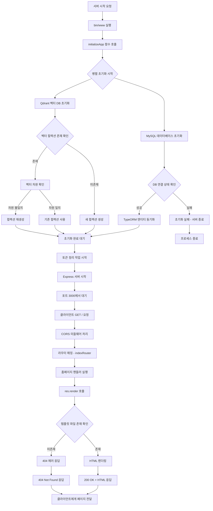
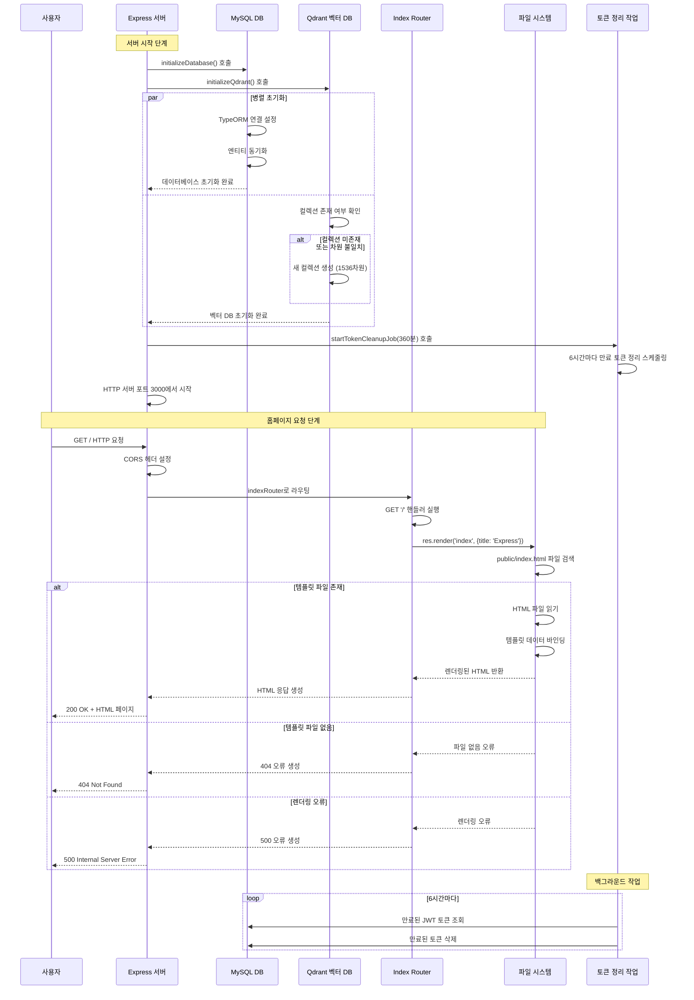

# 시스템 정보 조회

## 개요

시스템 정보 조회 워크플로우는 AI 웹 채팅 애플리케이션의 기본 홈페이지 제공 및 시스템 상태 확인을 위한 워크플로우입니다. 사용자가 루트 경로(`/`)에 접근할 때 Express 템플릿 시스템을 통해 정적 HTML 페이지를 렌더링하여 제공하며, 서버의 기본 동작 상태를 확인할 수 있는 진입점 역할을 수행합니다.

## 상세 설명

이 워크플로우는 단순한 정적 페이지 제공을 넘어서 다음과 같은 시스템 초기화 과정을 포함합니다:

### 시스템 초기화 구성요소
1. **데이터베이스 연결 초기화**: MySQL 데이터베이스 연결 설정 및 TypeORM을 통한 엔티티 동기화
2. **벡터 데이터베이스 초기화**: Qdrant 벡터 데이터베이스 연결 및 컬렉션 설정
3. **토큰 정리 작업 시작**: JWT 토큰 화이트리스트의 만료된 토큰을 주기적으로 정리하는 백그라운드 작업 시작
4. **CORS 설정**: 크로스 오리진 요청 허용을 위한 헤더 설정
5. **정적 파일 서빙**: public 디렉토리의 정적 파일들에 대한 접근 제공

### 홈페이지 제공 특징
- **템플릿 렌더링**: Express의 기본 템플릿 시스템을 사용하여 `index` 템플릿을 렌더링
- **데이터 바인딩**: `{ title: 'Express' }` 데이터를 템플릿에 전달
- **정적 HTML 제공**: `public/index.html` 파일을 기반으로 한 간단한 환영 페이지
- **인증 불필요**: 공개 엔드포인트로 별도의 인증 절차 없이 접근 가능

## Flow

### Flow Chart



### Sequence Diagram



## 텍스트 기반 상세 흐름 설명

### 1. 서버 초기화 단계

**1.1 서버 시작 (`bin/www:18-44`)**
- `startServer()` 함수가 실행되어 애플리케이션 초기화를 시작합니다.
- `initializeApp()` 함수를 호출하여 모든 서비스를 초기화합니다.

**1.2 병렬 초기화 (`app.js:25-28`)**
- `Promise.all()`을 사용하여 데이터베이스와 벡터 DB를 병렬로 초기화합니다.
- MySQL 데이터베이스 초기화: `initializeDatabase()` 함수 실행
- Qdrant 벡터 DB 초기화: `initializeQdrant()` 함수 실행

**1.3 데이터베이스 초기화 (`config/db-connect.js:5-22`)**
- TypeORM을 통한 MySQL 연결 설정
- 엔티티 동기화 및 연결 상태 확인
- 성공 시 연결 플래그 설정 및 로그 출력

**1.4 벡터 DB 초기화 (`config/qdrant.js:15-49`)**
- Qdrant 클라이언트를 통한 컬렉션 존재 여부 확인
- 컬렉션이 없거나 벡터 차원이 맞지 않는 경우 새로 생성
- 1536차원의 코사인 유사도 기반 컬렉션 설정

**1.5 토큰 정리 작업 시작 (`app.js:31`)**
- `startTokenCleanupJob(360)` 호출로 6시간마다 실행되는 백그라운드 작업 시작
- 만료된 JWT 토큰을 데이터베이스에서 자동 삭제

### 2. 홈페이지 요청 처리 단계

**2.1 요청 수신 및 CORS 처리 (`app.js:42-52`)**
- 클라이언트의 GET / 요청을 서버가 수신합니다.
- CORS 미들웨어가 적절한 헤더를 설정합니다.
- OPTIONS 프리플라이트 요청의 경우 200 상태코드로 즉시 응답합니다.

**2.2 라우팅 처리 (`app.js:60`)**
- `app.use('/', indexRouter)`에 의해 루트 경로 요청이 indexRouter로 전달됩니다.

**2.3 핸들러 실행 (`routes/index.js:5-7`)**
- `router.get('/', function(req, res, next))` 핸들러가 실행됩니다.
- `res.render('index', { title: 'Express' })` 호출로 템플릿 렌더링을 시작합니다.

**2.4 템플릿 렌더링**
- Express 기본 템플릿 엔진이 'index' 템플릿을 검색합니다.
- `public/index.html` 파일을 로드하고 템플릿 데이터를 바인딩합니다.
- 성공 시 HTML 응답을 생성하여 클라이언트에게 전송합니다.

**2.5 응답 전송**
- HTTP 200 OK 상태코드와 함께 렌더링된 HTML이 클라이언트에게 전송됩니다.
- CORS 헤더가 포함된 완전한 HTTP 응답이 생성됩니다.

### 3. 오류 처리

**3.1 초기화 실패 (`app.js:35-38`)**
- 데이터베이스나 벡터 DB 초기화 실패 시 에러 로그 출력 후 서버 종료

**3.2 템플릿 렌더링 실패**
- 템플릿 파일이 없는 경우: 404 Not Found 응답
- 렌더링 과정에서 오류 발생: 500 Internal Server Error 응답

## 호출되는 주요 API 및 함수

### 서버 초기화 관련
- `initializeApp()` - 애플리케이션 전체 초기화
- `initializeDatabase()` - MySQL 데이터베이스 연결 초기화
- `initializeQdrant()` - Qdrant 벡터 데이터베이스 초기화
- `startTokenCleanupJob()` - 토큰 정리 백그라운드 작업 시작

### 홈페이지 제공 관련
- `GET /` - 홈페이지 요청 엔드포인트
- `res.render()` - Express 템플릿 렌더링 함수
- `express.static()` - 정적 파일 서빙 미들웨어

## 추가 정보

### 환경 설정 의존성

워크플로우의 정상 동작을 위해 다음 환경변수들이 필요합니다:

```env
# 데이터베이스 설정
DB_HOST=localhost
DB_PORT=3306
DB_USER=root
DB_PASSWORD=password
DB_NAME=ai_web_chatting

# 벡터 데이터베이스 설정
QDRANT_URL=http://localhost:6333
QDRANT_API_KEY=your_api_key

# 서버 설정
PORT=3000 (선택적, 기본값 3000)
```

### 성능 특성

1. **초기화 시간**: 데이터베이스와 벡터 DB의 병렬 초기화로 시작 시간 최적화
2. **메모리 사용량**: 정적 HTML 파일 기반으로 최소한의 메모리 사용
3. **응답 시간**: 템플릿 렌더링 기반으로 빠른 응답 시간 보장
4. **백그라운드 작업**: 6시간마다 실행되는 토큰 정리로 메모리 누수 방지

### 보안 고려사항

1. **CORS 설정**: 모든 오리진에 대해 허용되어 있어 프로덕션 환경에서는 제한 필요
2. **인증 불필요**: 홈페이지는 공개 엔드포인트로 별도 보안 조치 불필요
3. **정적 파일 접근**: public 디렉토리의 모든 파일이 공개적으로 접근 가능

### 모니터링 포인트

1. **데이터베이스 연결 상태**: 초기화 성공/실패 모니터링
2. **벡터 DB 상태**: 컬렉션 생성 및 차원 정합성 확인
3. **토큰 정리 작업**: 백그라운드 작업의 정상 동작 여부
4. **응답 시간**: 홈페이지 로드 시간 측정
5. **에러율**: 404, 500 에러 발생 빈도 추적

### 확장 가능성

1. **템플릿 엔진 교체**: 현재 기본 템플릿에서 EJS, Handlebars 등으로 변경 가능
2. **동적 콘텐츠 추가**: 시스템 상태 정보를 실시간으로 표시하는 대시보드 구현 가능
3. **헬스체크 엔드포인트**: `/health` 경로 추가로 시스템 상태 API 제공 가능
4. **캐싱 전략**: Redis 등을 활용한 정적 콘텐츠 캐싱 구현 가능