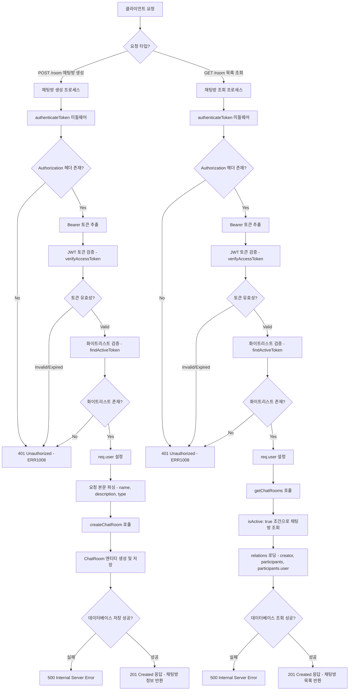
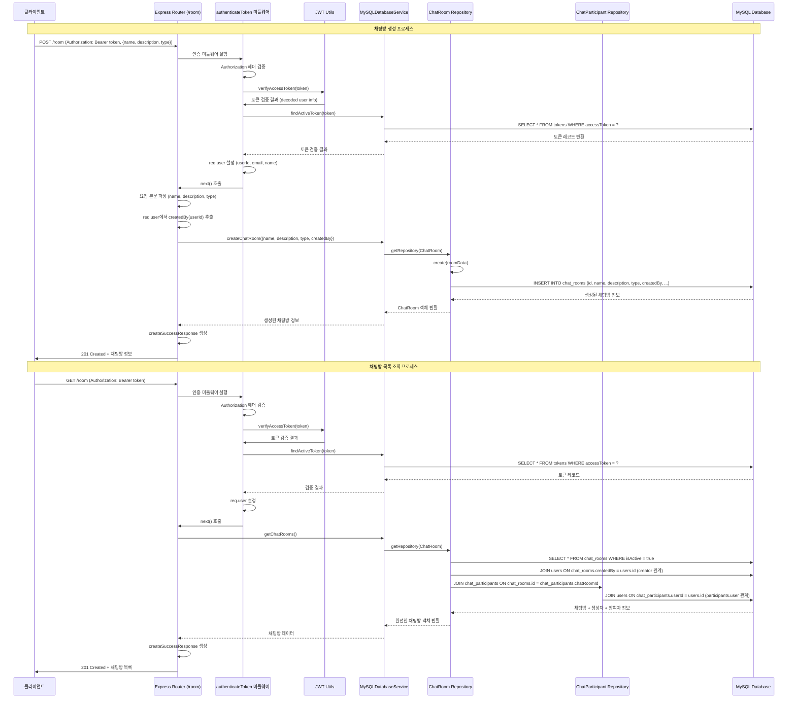

# 채팅방 관리

## 개요

채팅방 관리 워크플로우는 인증된 사용자가 새로운 채팅방을 생성하고, 시스템의 모든 활성 채팅방 목록을 조회할 수 있게 하는 기능을 제공합니다. 이 워크플로우는 JWT 토큰 기반의 인증 시스템을 사용하며, MySQL 데이터베이스에 채팅방 정보를 저장하고 TypeORM을 통해 관리합니다.

## 상세 설명

채팅방 관리 워크플로우는 두 가지 주요 기능으로 구성됩니다:

### 1. 채팅방 생성 (POST /room)
- **목적**: 인증된 사용자가 새로운 채팅방을 생성
- **인증 방식**: JWT Bearer 토큰 인증 (화이트리스트 검증 포함)
- **지원 채팅방 타입**: public, private, group (기본값: public)
- **데이터 저장**: MySQL의 `chat_rooms` 테이블에 UUID 기반으로 저장
- **생성자 자동 설정**: 요청한 사용자가 자동으로 채팅방 생성자(createdBy)로 설정

### 2. 채팅방 목록 조회 (GET /room)
- **목적**: 시스템의 모든 활성 채팅방 목록 조회
- **조회 범위**: `isActive: true` 상태의 모든 채팅방
- **포함 정보**: 채팅방 기본 정보, 생성자 정보, 참여자 목록 및 참여자 사용자 정보
- **관계 로딩**: creator, participants, participants.user 관계를 eager loading으로 조회

### 핵심 구성 요소
- **라우터**: `/routes/room.js` - Express.js 라우터로 POST, GET 엔드포인트 정의
- **인증 미들웨어**: `/middleware/auth.js` - JWT 토큰 검증 및 화이트리스트 확인
- **데이터베이스 서비스**: `/services/mysql-database.js` - TypeORM 기반 데이터 접근 계층
- **엔티티**: ChatRoom, ChatParticipant, User - MySQL 테이블 구조 정의

### 보안 특징
- JWT 토큰 기반 인증 (액세스 토큰 1시간 유효)
- 토큰 화이트리스트 검증으로 로그아웃된 토큰 차단
- 이중 인증 구조 (JWT 서명 검증 + 데이터베이스 화이트리스트 확인)

## Flow

### Flow Chart

### Sequence Diagram

### API 흐름 상세 설명

#### 1. 채팅방 생성 API (POST /room) 흐름

1. **요청 접수**: 클라이언트가 POST /room 엔드포인트로 요청 전송 (routes/room.js:8)
2. **인증 검증**: authenticateToken 미들웨어 실행
   - Authorization 헤더에서 Bearer 토큰 추출 (middleware/auth.js:16-21)
   - JWT 토큰 서명 및 만료시간 검증 (middleware/auth.js:24)
   - 데이터베이스 화이트리스트에서 토큰 존재 확인 (middleware/auth.js:27-31)
   - 검증 성공 시 req.user에 사용자 정보 저장 (middleware/auth.js:34-38)
3. **데이터 추출**: 요청 본문에서 name, description, type 추출, req.user에서 createdBy 추출 (routes/room.js:10-11)
4. **채팅방 생성**: MySQLDatabaseService.createChatRoom 호출 (routes/room.js:13)
   - ChatRoom 리포지터리 획득 (services/mysql-database.js:81)
   - 엔티티 생성 및 데이터베이스 저장 (services/mysql-database.js:82-83)
5. **응답 반환**: 생성된 채팅방 정보와 함께 201 Created 응답 (routes/room.js:14-19)

#### 2. 채팅방 목록 조회 API (GET /room) 흐름

1. **요청 접수**: 클라이언트가 GET /room 엔드포인트로 요청 전송 (routes/room.js:26)
2. **인증 검증**: 동일한 authenticateToken 미들웨어 프로세스
3. **데이터 조회**: MySQLDatabaseService.getChatRooms 호출 (routes/room.js:28)
   - ChatRoom 리포지터리 획득 (services/mysql-database.js:105)
   - isActive: true 조건으로 채팅방 조회 (services/mysql-database.js:106-109)
   - creator, participants, participants.user 관계 eager loading
4. **응답 반환**: 채팅방 목록과 함께 201 Created 응답 (routes/room.js:29-34)

## 추가 정보

### 데이터베이스 스키마 세부사항

#### ChatRoom 엔티티 (entities/ChatRoom.js)
- **id**: VARCHAR(36) PRIMARY KEY, UUID 자동 생성
- **name**: VARCHAR(255) NOT NULL, 채팅방 이름
- **description**: TEXT NULL, 채팅방 설명
- **type**: ENUM('public', 'private', 'group') DEFAULT 'public'
- **maxParticipants**: INT NULL, 최대 참여자 수 제한
- **isActive**: BOOLEAN DEFAULT true, 활성 상태
- **createdBy**: VARCHAR(36) NOT NULL, 생성자 사용자 ID (외래키)
- **createdAt/updatedAt**: DATETIME, 생성/수정 시간
- **인덱스**: IDX_CHAT_ROOM_TYPE, IDX_CHAT_ROOM_CREATED_BY

#### ChatParticipant 엔티티 (entities/ChatParticipant.js)
- **id**: VARCHAR(36) PRIMARY KEY, UUID 자동 생성
- **chatRoomId**: VARCHAR(36) NOT NULL, 채팅방 ID (외래키)
- **userId**: VARCHAR(36) NOT NULL, 사용자 ID (외래키)
- **role**: ENUM('admin', 'moderator', 'member') DEFAULT 'member'
- **nickname**: VARCHAR(100) NULL, 채팅방 내 닉네임
- **isActive**: BOOLEAN DEFAULT true, 참여 활성 상태
- **lastReadAt**: DATETIME NULL, 마지막 읽기 시간
- **joinedAt/leftAt**: DATETIME, 참여/퇴장 시간
- **유니크 인덱스**: IDX_CHAT_PARTICIPANT_ROOM_USER (chatRoomId, userId)

### 보안 고려사항

#### JWT 이중 검증 시스템
- **1차 검증**: JWT 서명 및 만료시간 검증 (utils/jwt.js)
- **2차 검증**: 데이터베이스 토큰 화이트리스트 확인
- **토큰 무효화**: 로그아웃 시 화이트리스트에서 토큰 제거
- **토큰 만료**: 액세스 토큰 1시간, 리프레시 토큰 7일

#### 인증 에러 처리
- **ERR1008**: 토큰 없음, 형식 오류, 만료, 화이트리스트 없음
- **401 Unauthorized**: 모든 인증 실패 상황
- **500 Internal Server Error**: 데이터베이스 연결/쿼리 오류

### 성능 최적화 요소

#### 데이터베이스 인덱스
- ChatRoom: type, createdBy 필드 인덱스
- ChatParticipant: (chatRoomId, userId) 복합 유니크 인덱스, userId 인덱스
- User: email, createdAt 인덱스

#### 쿼리 최적화
- Relations eager loading으로 N+1 쿼리 문제 방지
- TypeORM 커넥션 풀을 통한 데이터베이스 연결 관리

### 현재 코드의 알려진 이슈

#### 1. getChatRooms 메서드 이슈
- 현재 `findOne()` 사용으로 단일 채팅방만 반환 (services/mysql-database.js:106)
- 실제로는 `find()` 메서드를 사용하여 모든 활성 채팅방을 반환해야 함

#### 2. HTTP 상태 코드 이슈
- 조회 API임에도 201 Created 반환 (routes/room.js:34)
- 일반적으로 200 OK가 더 적절함

#### 3. 에러 로그 메시지 오류
- GET /room 에러 처리에서 "Create Room Error" 로그 출력 (routes/room.js:36)
- 실제로는 "Get Rooms Error"가 더 적절함

### 확장 가능성

#### 기능 확장 계획
- 채팅방 참가자 초대/제거 API
- 채팅방 권한 관리 (admin, moderator 역할 활용)
- 채팅방 검색 및 필터링 기능
- 채팅방 카테고리/태그 시스템
- 채팅방 통계 및 분석 기능

#### 아키텍처 확장성
- 마이크로서비스 분리 (채팅방 관리 서비스 독립화)
- Redis 캐싱을 통한 조회 성능 향상
- WebSocket을 통한 실시간 알림 기능
- 파일 업로드 및 미디어 공유 기능